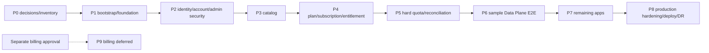

# Build plan Talosmine

> **Trạng thái bộ kế hoạch:** P0 mở cổng cho P1 (2026-07-17). Repo chưa được bootstrap; các path, package, script và capability nêu dưới đây là **mục tiêu dự kiến**, không phải implementation đang tồn tại.

## Mục tiêu và nguồn sự thật

Bộ build plan chuyển kiến trúc đã duyệt thành các phase implementation có dependency, ownership, contract freeze, kiểm thử và exit gate rõ ràng. Plan không thay thế các nguồn sự thật sau:

- [Kiến trúc logic](../index.md)
- [Đặc tả module và application port](../modular.md)
- [Physical schema PostgreSQL](../database-schema.md)
- [Tech stack đã duyệt](../stack-tech.md)
- [**Decision register**](./decision-register.md) — nguồn sự thật cho mọi quyết định, version pin và tên script
- [Quy trình agent và giới hạn ba vòng kiểm chứng](../../AGENTS.md)

Khi có mâu thuẫn, dừng phase và đồng bộ tài liệu nguồn trước khi implementation. Không dùng build plan để tự chọn business value, library hoặc thay đổi stack.

**File phase không được tự chọn tool, version hay giá trị nghiệp vụ.** Phase chỉ tham chiếu `decisionId` tại decision register. Version chỉ lấy từ bảng D; tên lệnh chỉ lấy từ DEC-T15.

## Mô hình phê duyệt

Dự án là **solo dev + AI agents** (DEC-G01). Không có Product owner, Security officer, Legal/Privacy hay Operations team riêng biệt.

- **Chủ dự án** là approver duy nhất cho quyết định nghiệp vụ, bảo mật, vận hành.
- **Agent** đề xuất và thực thi, nhưng không tự approve thay con người. Ngoại lệ đã ủy quyền: nhóm quyết định **kỹ thuật** (tooling/version) tại register nhóm A.
- **`qa` và `reviewer` vẫn tách khỏi lane viết code** và giữ read-only. Đây không phải nghi thức thừa: theo `../../AGENTS.md` mục 4b, agent viết code không được tự tuyên bố code mình đạt chuẩn.

## Canonical phases và trạng thái

Chỉ dùng bốn trạng thái: `not_started`, `blocked`, `in_progress`, `verified`. Không đánh dấu `verified` trước khi exit gate có bằng chứng và cả QA lẫn reviewer sign-off.

| Phase | Phạm vi canonical | Trạng thái | Dependency/blocker hiện tại |
|---|---|---|---|
| [Phase 0](./phase-0-decisions-inventory.md) | Decisions và inventory | `in_progress` | Cổng P0→P1 `verified`. Các cổng còn lại chờ quyết định nghiệp vụ; blocker lớn nhất là **DEC-B01 — danh sách app chưa tồn tại**. |
| [Phase 1](./phase-1.md) | Bootstrap và foundation | `not_started` | **Đã được mở.** Cổng P0→P1 đạt; toàn bộ technical decision đã chốt tại register nhóm A. |
| [Phase 2](./phase-2-identity-account-admin-security.md) | Identity, account và admin security | `blocked` | Phase 1 + DEC-B03 (Auth0 tenant), DEC-B04, DEC-B10. |
| [Phase 3](./phase-3-application-catalog.md) | Application catalog | `blocked` | Phase 2 + DEC-B01, DEC-B05. |
| [Phase 4](./phase-4-plan-subscription-entitlement.md) | Plan, subscription và entitlement | `blocked` | Phase 3 + DEC-B04, DEC-B09, DEC-B10. |
| [Phase 5](./phase-5-hard-quota-reconciliation.md) | Hard quota và reconciliation | `blocked` | Phase 4 + DEC-B05…B08. Ngoài ra cần **spike Supavisor ở P1.5 pass**. |
| [Phase 6](./phase-6-sample-data-plane-e2e.md) | Sample Data Plane E2E | `blocked` | Phase 5 + DEC-B01, DEC-B02 (sample app). |
| [Phase 7](./phase-7-onboarding-remaining-apps.md) | Các ứng dụng còn lại | `blocked` | Phase 6 verified + DEC-B01, DEC-B05. |
| [Phase 8](./phase-8-production-hardening-deploy-dr.md) | Production hardening, deploy và DR | `blocked` | Phase 7 + DEC-B11, DEC-B12. |
| [Phase 9](./phase-9-billing-deferred.md) | Billing deferred | `blocked` | Chỉ bắt đầu sau approval riêng (DEC-B13). Không nằm trên critical path Phase 0–8. |

Một file phase hoặc link kế hoạch không chứng minh capability tương ứng đã được implementation; trạng thái chỉ thay đổi theo exit gate và evidence.

### P0 dùng cổng tăng dần, không phải một exit gate

P0 **không** là một cổng nguyên khối. Bản trước gộp mọi quyết định vào một exit gate duy nhất, khiến P0 tự khóa chính nó: bootstrap không thể bắt đầu chỉ vì chưa chốt quota window — hai thứ không liên quan gì nhau.

Nay mỗi cổng `P0→Pn` mở độc lập khi đúng tập quyết định chặn `Pn` được approve. Bảng cổng nằm ở [`phase-0`](./phase-0-decisions-inventory.md) mục 1; truy vết `decision -> phase` nằm ở [register mục C](./decision-register.md). Việc P0 chưa `verified` **không** chặn phase đã có cổng mở.

## Dependency graph



Dạng text: `P0 -> P1 -> P2 -> P3 -> P4 -> P5 -> P6 -> P7 -> P8`. `P9` chỉ được mở sau approval riêng; không kéo billing vào Phase 0–8 để lấp chỗ trống.

## Mapping architecture phases sang implementation phases

Các phase cũ trong `docs/index.md` và `docs/modular.md` mô tả rollout kiến trúc theo capability, không phải numbering implementation canonical của bộ plan này.

| Architecture phase hiện có | Implementation phase canonical | Cách tách |
|---|---|---|
| Phase 0 — quyết định/inventory | P0 | Giữ nguyên vai trò prerequisite; bổ sung decision record, owner, approver và blocker mapping. |
| Phase 1 — SSO với app mẫu | P2 và P6 | P2 xây identity/account/admin security của Control Plane và Hub; P6 mới chứng minh cross-domain/direct URL với sample Data Plane. |
| Phase 2 — entitlement | P3, P4 và P6 | P3 catalog; P4 plan/subscription/entitlement; P6 tích hợp enforcement tại app mẫu. |
| Phase 3 — hard quota | P5 và P6 | P5 xây transaction/reconciliation; P6 chứng minh `reserve -> action -> commit/cancel` E2E. |
| Phase 4 — onboard app còn lại | P7 | Onboard từng app sau khi sample integration đã verified. |
| Phase 5 — paid subscription và hardening | P8 và P9 | P8 xử lý production/DR; P9 tách billing và yêu cầu approval riêng. |
| Không có phase bootstrap riêng trong mapping cũ | P1 | Bổ sung foundation trước mọi capability nghiệp vụ. |

## Target monorepo layout — P1 tạo

Đây là **target**, chưa phải cấu trúc hiện hữu. Workspace đã chốt là **pnpm** (DEC-T02) nên layout không còn chờ decision gate; P1.7 tạo thật.

```text
.nvmrc                    # 24.18.0 (DEC-T01)
package.json              # root, packageManager: pnpm@11.13.1
pnpm-workspace.yaml
tsconfig.base.json        # strict
biome.json                # DEC-T04
apps/
  web/                    # user + admin + BFF trong một Next.js codebase
  control-plane/
    src/main-api.ts       # API entrypoint canonical
    src/main-worker.ts    # worker entrypoint canonical, dùng cùng code với API
    drizzle/migrations/   # migration root canonical
contracts/
  openapi/                # OpenAPI 3.1 viết tay, là nguồn sự thật (DEC-T07)
integrations/             # adapter/SDK boundary cho Data Plane, không sở hữu domain
tests/                    # integration, E2E và các suite xuyên workspace
infra/
  compose/                # Supabase rút gọn: postgres + supavisor + studio (DEC-T10)
  caddy/                  # reverse proxy/TLS, điểm expose duy nhất (DEC-T11)
.github/workflows/        # physical path canonical của GitHub Actions
```

Mọi phase dùng canonical migration root `apps/control-plane/drizzle/migrations/`, API entrypoint `apps/control-plane/src/main-api.ts`, worker entrypoint `apps/control-plane/src/main-worker.ts` và GitHub Actions path `.github/workflows/`. Không biến worker thành microservice: API và worker là hai entrypoint/deployment role của **cùng** codebase Control Plane, dùng chung module/application port.

Migration triển khai **theo phase**, không tạo toàn bộ 25 bảng cùng lúc. P1 chỉ tạo schema `control_plane` + role/grant nền. Đặc biệt, dependency FK của service actor trong audit ở P2 cần phased migration P2/P3 theo phase file; implementation không được giả định Catalog/Service Identity schema đầy đủ đã tồn tại trong P2.

## Lệnh

Tên lệnh canonical nằm ở [DEC-T15](./decision-register.md). Mọi ô **Verify** của mọi phase dùng đúng các tên đó; không phase nào được tự đặt tên lệnh khác hay ghi `‹cần chốt: script thật›`.

Script được tạo thật ở **P1.7**. Trước đó, lệnh tồn tại trên giấy nhưng chưa chạy được — và một tên lệnh trong bảng **không** chứng minh nó đã chạy. Chỉ QA chạy từ clean clone mới tạo evidence (P1.12, P1.13).

### Web routes

`apps/web` là một responsive Next.js codebase cho trình duyệt desktop, điện thoại và máy tính bảng; không có mobile/native app.

- `(user)`: route group cho trải nghiệm user.
- `admin`: route dành cho quản trị trong cùng codebase.
- `auth`: browser flow login/callback/logout của BFF.
- BFF: giữ session server-side và gọi Control Plane; browser không giữ M2M credential.
- Admin guard phải chạy server-side trên mọi route/action/handler quản trị. Ẩn menu hoặc client-side redirect không phải authorization.

## Quy ước contract xuyên phase

- **REST/OpenAPI:** REST JSON có version, target prefix `/v1`; mọi public/service/admin operation nằm trong OpenAPI 3.1 trước implementation. Browser OIDC routes được tài liệu hóa riêng về redirect, cookie, CSRF và error.
- **BFF:** user/admin browser đi qua Next.js BFF với server-side session; cookie theo policy `HttpOnly`, `Secure`, `SameSite`. Không đưa token/secret vào browser log hoặc URL lâu dài.
- **M2M:** mỗi backend ứng dụng có Auth0 M2M identity riêng, audience cụ thể và exact resource scope. Không dùng credential chung; Control Plane không lưu client secret.
- **Identity:** Data Plane gửi full verified `issuer + subject`; API không tin internal `accountId` do browser/Data Plane tự khai.
- **Quantity:** PostgreSQL dùng `bigint`; REST JSON biểu diễn quantity/limit/counter/amount bằng **decimal string**, không phải JSON number.
- **Timestamp:** API dùng timestamp chuẩn có timezone; business time/expiry/window dựa DB clock và lưu `timestamptz` UTC.
- **Error:** envelope ổn định gồm `code`, `message`, `correlationId`, và `details` theo allowlist; không trả stack trace, secret hoặc existence signal vượt scope.
- **Correlation:** nhận hoặc tạo `X-Correlation-Id`, truyền xuyên BFF, API, worker, integration và audit; không dùng correlation ID thay idempotency key.
- **Idempotency:** mutation retry-sensitive nhận `Idempotency-Key`; namespace theo authenticated caller + operation, fingerprint tương đương được replay, fingerprint khác trả conflict. Timeout retry cùng key; không tạo logical operation mới.
- **Authorization:** user session, admin permission và M2M scope là ba audience khác nhau. Backend, action và worker đều enforce; frontend visibility không cấp quyền.

## Workflow bắt buộc cho mỗi phase

1. **Decisions:** giải quyết prerequisite/human decision; ghi record tại [`decision-register.md`](./decision-register.md) với lý do và evidence. Quyết định kỹ thuật (tool/version) agent được chốt; quyết định nghiệp vụ chỉ chủ dự án chốt. Vượt ranh giới này là lỗi nghiêm trọng nhất của bộ plan.
2. **Contract freeze:** orchestrator lập manifest file-level owner; architect chỉ review/freeze API/schema/port/error/test fixtures, không write file. Shared/root file và OpenAPI chỉ có một writer có quyền.
3. **Parallel implementation:** `frontend`, `backend`, `tester` làm song song đúng ownership, không sửa lane của nhau.
4. **Integration:** ghép artifact theo contract đã khóa; contract đổi phải quay lại freeze và thông báo mọi lane.
5. **QA/reviewer:** QA chạy gate từ clean state; reviewer kiểm kiến trúc, bảo mật, correctness và tài liệu.
6. **Fixes:** chủ lane sửa code; không sửa test chỉ để pass. Chạy lại gate liên quan.
7. **Docs:** cập nhật README/API/runbook/build plan theo behavior đã xác minh, không theo dự định chưa triển khai.

### Định dạng runbook cho `## 15. Ordered steps`

Mục `## 15. Ordered steps` của **mọi** phase phải viết dưới dạng runbook thực thi, không phải danh sách ý định chung chung. Mỗi bước là một khối có ID `P{phase}.{n}` (ví dụ `P1.3`) theo đúng thứ tự phụ thuộc thật, và đủ **5 thành phần bắt buộc**:

1. **Hành động** — việc cụ thể phải làm, đủ rõ để một lane bắt tay vào được (ví dụ "khởi tạo workspace", "viết docker-compose cho PostgreSQL + Supavisor", "tạo migration baseline tạo schema `control_plane`").
2. **Sản phẩm** — đường dẫn file/thư mục/artifact được tạo hoặc sửa, dùng canonical path của plan.
3. **Phụ thuộc** — bước `P{phase}.{n}` trước đó và/hoặc decision gate cần xong trước; ghi `—` nếu không có.
4. **Verify** — cách kiểm chứng cụ thể, quan sát được (lệnh chạy và output kỳ vọng, endpoint trả gì, migration apply từ DB sạch, review completeness…). Không ghi lệnh giả: nếu công cụ chưa được chốt thì ghi rõ "sau khi ‹cần chốt: …› xong mới có lệnh thật".
5. **Lane/owner** — một trong `backend` / `frontend` / `tester` / `orchestrator(infra,CI)` / `document` / `architect` / `qa` / `reviewer`, theo ownership manifest ở mục Ownership lanes.

Quy tắc kèm theo:

- Bước phụ thuộc một quyết định chưa chốt phải đánh dấu `‹cần chốt: X›` ngay tại chỗ; không tự điền giá trị, version, package hay tag.
- Giữ trật tự phụ thuộc thật: bước tuần tự ghi phụ thuộc tường minh; bước chạy đồng thời (ví dụ `frontend ║ backend ║ tester` sau contract freeze) phải ghi rõ "chạy song song".
- Verify phải là điều kiện quan sát được, không phải lời hứa. Nếu phase không tạo code (ví dụ P0), verify là review/completeness/sign-off tài liệu, không phải chạy lệnh.

## Ownership lanes

| Lane | Ownership chính | Không được làm |
|---|---|---|
| `architect` | Review decision closure, threat model, boundary và contract freeze | Write/sửa implementation, contract artifact hoặc tự chọn quyết định của con người. |
| `frontend` | `apps/web` user/admin/BFF surface theo contract | Sửa backend/domain/test để tự làm pass. |
| `backend` | `apps/control-plane`, DB migration, contract implementation và worker entrypoint theo file-level manifest | Tự nhận shared/root/OpenAPI file chưa được manifest giao hoặc sửa frontend/test kỳ vọng. |
| `tester` | Test fixtures/suites và contract/concurrency/E2E checks | Bẻ test theo bug implementation. |
| `qa` | Chạy command/gate thật, lưu evidence | Sửa file hoặc tuyên bố pass khi command chưa tồn tại/chưa chạy. |
| `reviewer` | Review độc lập, phân loại mục phải sửa | Sửa implementation rồi tự sign-off. |
| `document` | Markdown/docs và documentation comments | Sửa logic sản phẩm. |
| `orchestrator` | Điều phối dependency/integration/vòng sửa; sở hữu có điều kiện `infra/**`, `.github/workflows/**` và root workspace/config | Sửa các path điều kiện trước khi người dùng phê duyệt cụ thể ở đầu phase, cho lane lấn ownership hoặc bỏ qua blocker. |

Không có agent `Infrastructure`. Mặc định, `infra/**`, `.github/workflows/**` và root workspace/config được giao cho `orchestrator` và chỉ được thực hiện sau khi người dùng phê duyệt cụ thể ở đầu phase. Orchestrator có thể giao một path chính xác cho một agent hiện hữu nếu path phù hợp quyền của agent đó; việc giao phải nằm trong manifest và không được tạo owner/lane hư cấu.

Contract freeze bắt buộc có manifest file-level owner. Mỗi shared/root file và `contracts/openapi/**` phải có đúng **một writer có quyền**; workspace manifest/lockfile, root TypeScript config và CI workflow không được nhiều lane sửa song song. Architect chỉ review/freeze manifest và contract, không write; các lane khác gửi yêu cầu thay đổi qua writer đã ghi trong manifest.

## Phase template bắt buộc

Mọi file phase dùng **đúng chính tả** 20 heading sau; mục không áp dụng phải ghi `N/A` kèm lý do:

```markdown
## 1. Trạng thái
## 2. Mục tiêu
## 3. Prerequisites và human decisions
## 4. Phạm vi
## 5. Ngoài phạm vi
## 6. Deliverables
## 7. Target paths
## 8. DB/migration
## 9. Backend API
## 10. User web
## 11. Admin web
## 12. Integration/security
## 13. Contract freeze
## 14. Tests
## 15. Ordered steps
## 16. Parallel lanes và ownership
## 17. Checklist
## 18. Exit gate
## 19. Stop/rollback
## 20. QA/reviewer sign-off
```

## Checklist, exit gate và stop conditions

- Checklist chỉ chuyển `[ ]` sang `[x]` khi có evidence kiểm chứng được; decision chưa chốt giữ `[ ]`, không điền giá trị giả.
- `in_progress` chỉ dùng khi prerequisite và contract cho phần đang làm đã được duyệt. `verified` yêu cầu toàn bộ exit gate pass, QA `PASS`, reviewer không còn mục “phải sửa”, và docs phản ánh behavior thực tế.
- Mỗi phase chạy vòng **làm → tự kiểm → sửa → kiểm lại**, tối đa **3 vòng** theo `AGENTS.md`.
- **TẮC** là verification outcome metadata khi thiếu human decision, credential/service/quyền truy cập, yêu cầu mâu thuẫn/bất khả thi, hoặc cùng lỗi lặp lần thứ hai. Báo rõ chỗ tắc, đã thử gì và cần quyết định gì; phase status vẫn là một trong bốn giá trị canonical.
- **CẠN LƯỢT** là verification outcome metadata khi hết ba vòng chưa đạt. Báo evidence và mục còn fail; không ghi outcome này vào phase status, vốn chỉ nhận `not_started|blocked|in_progress|verified`.
- Khi migration/contract đã nhận dữ liệu hoặc consumer, ưu tiên forward-fix theo `database-schema.md`; không “rollback” bằng xóa usage/audit/history hay sửa published snapshot.
