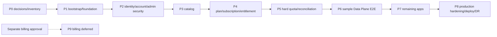

# Build plan Talosmine

> **Trạng thái bộ kế hoạch:** chưa bắt đầu. Repo chưa được bootstrap; các path, package, script và capability được nêu dưới đây là **mục tiêu dự kiến**, không phải implementation đang tồn tại.

## Mục tiêu và nguồn sự thật

Bộ build plan chuyển kiến trúc đã duyệt thành các phase implementation có dependency, ownership, contract freeze, kiểm thử và exit gate rõ ràng. Plan không thay thế các nguồn sự thật sau:

- [Kiến trúc logic](../index.md)
- [Đặc tả module và application port](../modular.md)
- [Physical schema PostgreSQL](../database-schema.md)
- [Tech stack đã duyệt](../stack-tech.md)
- [Quy trình agent và giới hạn ba vòng kiểm chứng](../../AGENTS.md)

Khi có mâu thuẫn, dừng phase và đồng bộ tài liệu nguồn trước khi implementation. Không dùng build plan để tự chọn business value, library hoặc thay đổi stack.

## Canonical phases và trạng thái

Chỉ dùng bốn trạng thái: `not_started`, `blocked`, `in_progress`, `verified`. Không đánh dấu `verified` trước khi exit gate có bằng chứng và cả QA lẫn reviewer sign-off.

| Phase | Phạm vi canonical | Trạng thái | Dependency/blocker hiện tại |
|---|---|---|---|
| [Phase 0](./phase-0-decisions-inventory.md) | Decisions và inventory | `blocked` | Cần owner/approver chốt các quyết định nghiệp vụ, bảo mật và vận hành. |
| [Phase 1](./phase-1.md) | Bootstrap và foundation | `blocked` | Phụ thuộc exit gate Phase 0 và các technical decision gate của Phase 1. |
| [Phase 2](./phase-2-identity-account-admin-security.md) | Identity, account và admin security | `blocked` | Phụ thuộc Phase 1. |
| [Phase 3](./phase-3-application-catalog.md) | Application catalog | `blocked` | Phụ thuộc Phase 2. |
| [Phase 4](./phase-4-plan-subscription-entitlement.md) | Plan, subscription và entitlement | `blocked` | Phụ thuộc Phase 3 và business decisions liên quan. |
| [Phase 5](./phase-5-hard-quota-reconciliation.md) | Hard quota và reconciliation | `blocked` | Phụ thuộc Phase 4 và metric/window/TTL semantics đã duyệt. |
| [Phase 6](./phase-6-sample-data-plane-e2e.md) | Sample Data Plane E2E | `blocked` | Phụ thuộc Phase 5 và sample app đã được chọn. |
| [Phase 7](./phase-7-onboarding-remaining-apps.md) | Các ứng dụng còn lại | `blocked` | Phụ thuộc sample app Phase 6 đã verified và inventory từng app. |
| [Phase 8](./phase-8-production-hardening-deploy-dr.md) | Production hardening, deploy và DR | `blocked` | Phụ thuộc Phase 7 cùng RPO/RTO, retention và operational policy đã duyệt. |
| [Phase 9](./phase-9-billing-deferred.md) | Billing deferred | `blocked` | Chỉ bắt đầu sau approval riêng về provider, payment/refund semantics và phạm vi. Không nằm trên critical path Phase 0–8. |

Một file phase hoặc link kế hoạch không chứng minh capability tương ứng đã được implementation; trạng thái chỉ thay đổi theo exit gate và evidence.

## Dependency graph



Dạng text: `P0 -> P1 -> P2 -> P3 -> P4 -> P5 -> P6 -> P7 -> P8`. `P9` chỉ được mở sau approval riêng; không kéo billing vào Phase 0–8 để lấp chỗ trống.

## Mapping architecture phases sang implementation phases

Các phase cũ trong `docs/index.md` và `docs/modular.md` mô tả rollout kiến trúc theo capability, không phải numbering implementation canonical của bộ plan này.

| Architecture phase hiện có | Implementation phase canonical | Cách tách |
|---|---|---|
| Phase 0 — quyết định/inventory | P0 | Giữ nguyên vai trò prerequisite; bổ sung decision record, owner, approver và blocker mapping. |
| Phase 1 — SSO với app mẫu | P2 và P6 | P2 xây identity/account/admin security của Control Plane và Hub; P6 mới chứng minh cross-domain/direct URL với sample Data Plane. |
| Phase 2 — entitlement | P3, P4 và P6 | P3 catalog; P4 plan/subscription/entitlement; P6 tích hợp enforcement tại app mẫu. |
| Phase 3 — hard quota | P5 và P6 | P5 xây transaction/reconciliation; P6 chứng minh `reserve -> action -> commit/cancel` E2E. |
| Phase 4 — onboard app còn lại | P7 | Onboard từng app sau khi sample integration đã verified. |
| Phase 5 — paid subscription và hardening | P8 và P9 | P8 xử lý production/DR; P9 tách billing và yêu cầu approval riêng. |
| Không có phase bootstrap riêng trong mapping cũ | P1 | Bổ sung foundation trước mọi capability nghiệp vụ. |

## Target monorepo layout cần finalize ở Phase 1

Đây là **đề xuất target**, chưa phải cấu trúc hiện hữu. Phase 1 phải duyệt/finalize sau khi chốt package manager/workspace; không được tạo tùy ý trước decision gate.

```text
apps/
  web/                    # user + admin + BFF trong một Next.js codebase
  control-plane/
    src/main-api.*        # API entrypoint canonical
    src/main-worker.*     # worker entrypoint canonical, dùng cùng code với API
    drizzle/migrations/   # migration root canonical được P1 approve/finalize
contracts/
  openapi/                # OpenAPI 3.1 và artifact contract được duyệt
integrations/             # adapter/SDK boundary cho Data Plane, không sở hữu domain
tests/                    # integration, E2E và các suite xuyên workspace đã chọn
infra/                    # Docker Compose, Caddy, Supabase self-hosted, deploy assets
.github/workflows/        # physical path canonical của GitHub Actions
```

P1 vẫn phải approve/finalize layout, nhưng mọi phase dùng canonical migration root `apps/control-plane/drizzle/migrations/`, API entrypoint `apps/control-plane/src/main-api.*`, worker entrypoint `apps/control-plane/src/main-worker.*` và GitHub Actions path `.github/workflows/`. Không biến worker thành microservice: API và worker là hai entrypoint/deployment role của cùng codebase Control Plane, dùng cùng module/application ports.

Migration được triển khai theo phase, không tạo toàn bộ 25 bảng cùng lúc. Đặc biệt, dependency FK của service actor trong audit ở P2 cần phased migration P2/P3 theo phase files; implementation không được giả định Catalog/Service Identity schema đầy đủ đã tồn tại trong P2.

### Web routes

`apps/web` là một responsive Next.js codebase cho trình duyệt desktop, điện thoại và máy tính bảng; không có mobile/native app.

- `(user)`: route group cho trải nghiệm user.
- `admin`: route dành cho quản trị trong cùng codebase.
- `auth`: browser flow login/callback/logout của BFF.
- BFF: giữ session server-side và gọi Control Plane; browser không giữ M2M credential.
- Admin guard phải chạy server-side trên mọi route/action/handler quản trị. Ẩn menu hoặc client-side redirect không phải authorization.

## Quy ước contract xuyên phase

- **REST/OpenAPI:** REST JSON có version, target prefix `/v1`; mọi public/service/admin operation nằm trong OpenAPI 3.1 trước implementation. Browser OIDC routes được tài liệu hóa riêng về redirect, cookie, CSRF và error.
- **BFF:** user/admin browser đi qua Next.js BFF với server-side session; cookie theo policy `HttpOnly`, `Secure`, `SameSite`. Không đưa token/secret vào browser log hoặc URL lâu dài.
- **M2M:** mỗi backend ứng dụng có Auth0 M2M identity riêng, audience cụ thể và exact resource scope. Không dùng credential chung; Control Plane không lưu client secret.
- **Identity:** Data Plane gửi full verified `issuer + subject`; API không tin internal `accountId` do browser/Data Plane tự khai.
- **Quantity:** PostgreSQL dùng `bigint`; REST JSON biểu diễn quantity/limit/counter/amount bằng **decimal string**, không phải JSON number.
- **Timestamp:** API dùng timestamp chuẩn có timezone; business time/expiry/window dựa DB clock và lưu `timestamptz` UTC.
- **Error:** envelope ổn định gồm `code`, `message`, `correlationId`, và `details` theo allowlist; không trả stack trace, secret hoặc existence signal vượt scope.
- **Correlation:** nhận hoặc tạo `X-Correlation-Id`, truyền xuyên BFF, API, worker, integration và audit; không dùng correlation ID thay idempotency key.
- **Idempotency:** mutation retry-sensitive nhận `Idempotency-Key`; namespace theo authenticated caller + operation, fingerprint tương đương được replay, fingerprint khác trả conflict. Timeout retry cùng key; không tạo logical operation mới.
- **Authorization:** user session, admin permission và M2M scope là ba audience khác nhau. Backend, action và worker đều enforce; frontend visibility không cấp quyền.

## Workflow bắt buộc cho mỗi phase

1. **Decisions:** giải quyết prerequisite/human decision; ghi owner, approver và evidence.
2. **Contract freeze:** orchestrator lập manifest file-level owner; architect chỉ review/freeze API/schema/port/error/test fixtures, không write file. Shared/root file và OpenAPI chỉ có một writer có quyền.
3. **Parallel implementation:** `frontend`, `backend`, `tester` làm song song đúng ownership, không sửa lane của nhau.
4. **Integration:** ghép artifact theo contract đã khóa; contract đổi phải quay lại freeze và thông báo mọi lane.
5. **QA/reviewer:** QA chạy gate từ clean state; reviewer kiểm kiến trúc, bảo mật, correctness và tài liệu.
6. **Fixes:** chủ lane sửa code; không sửa test chỉ để pass. Chạy lại gate liên quan.
7. **Docs:** cập nhật README/API/runbook/build plan theo behavior đã xác minh, không theo dự định chưa triển khai.

## Ownership lanes

| Lane | Ownership chính | Không được làm |
|---|---|---|
| `architect` | Review decision closure, threat model, boundary và contract freeze | Write/sửa implementation, contract artifact hoặc tự chọn quyết định của con người. |
| `frontend` | `apps/web` user/admin/BFF surface theo contract | Sửa backend/domain/test để tự làm pass. |
| `backend` | `apps/control-plane`, DB migration, contract implementation và worker entrypoint theo file-level manifest | Tự nhận shared/root/OpenAPI file chưa được manifest giao hoặc sửa frontend/test kỳ vọng. |
| `tester` | Test fixtures/suites và contract/concurrency/E2E checks | Bẻ test theo bug implementation. |
| `qa` | Chạy command/gate thật, lưu evidence | Sửa file hoặc tuyên bố pass khi command chưa tồn tại/chưa chạy. |
| `reviewer` | Review độc lập, phân loại mục phải sửa | Sửa implementation rồi tự sign-off. |
| `document` | Markdown/docs và documentation comments | Sửa logic sản phẩm. |
| `orchestrator` | Điều phối dependency/integration/vòng sửa; sở hữu có điều kiện `infra/**`, `.github/workflows/**` và root workspace/config | Sửa các path điều kiện trước khi người dùng phê duyệt cụ thể ở đầu phase, cho lane lấn ownership hoặc bỏ qua blocker. |

Không có agent `Infrastructure`. Mặc định, `infra/**`, `.github/workflows/**` và root workspace/config được giao cho `orchestrator` và chỉ được thực hiện sau khi người dùng phê duyệt cụ thể ở đầu phase. Orchestrator có thể giao một path chính xác cho một agent hiện hữu nếu path phù hợp quyền của agent đó; việc giao phải nằm trong manifest và không được tạo owner/lane hư cấu.

Contract freeze bắt buộc có manifest file-level owner. Mỗi shared/root file và `contracts/openapi/**` phải có đúng **một writer có quyền**; workspace manifest/lockfile, root TypeScript config và CI workflow không được nhiều lane sửa song song. Architect chỉ review/freeze manifest và contract, không write; các lane khác gửi yêu cầu thay đổi qua writer đã ghi trong manifest.

## Phase template bắt buộc

Mọi file phase dùng **đúng chính tả** 20 heading sau; mục không áp dụng phải ghi `N/A` kèm lý do:

```markdown
## 1. Trạng thái
## 2. Mục tiêu
## 3. Prerequisites và human decisions
## 4. Phạm vi
## 5. Ngoài phạm vi
## 6. Deliverables
## 7. Target paths
## 8. DB/migration
## 9. Backend API
## 10. User web
## 11. Admin web
## 12. Integration/security
## 13. Contract freeze
## 14. Tests
## 15. Ordered steps
## 16. Parallel lanes và ownership
## 17. Checklist
## 18. Exit gate
## 19. Stop/rollback
## 20. QA/reviewer sign-off
```

## Checklist, exit gate và stop conditions

- Checklist chỉ chuyển `[ ]` sang `[x]` khi có evidence kiểm chứng được; decision chưa chốt giữ `[ ]`, không điền giá trị giả.
- `in_progress` chỉ dùng khi prerequisite và contract cho phần đang làm đã được duyệt. `verified` yêu cầu toàn bộ exit gate pass, QA `PASS`, reviewer không còn mục “phải sửa”, và docs phản ánh behavior thực tế.
- Mỗi phase chạy vòng **làm → tự kiểm → sửa → kiểm lại**, tối đa **3 vòng** theo `AGENTS.md`.
- **TẮC** là verification outcome metadata khi thiếu human decision, credential/service/quyền truy cập, yêu cầu mâu thuẫn/bất khả thi, hoặc cùng lỗi lặp lần thứ hai. Báo rõ chỗ tắc, đã thử gì và cần quyết định gì; phase status vẫn là một trong bốn giá trị canonical.
- **CẠN LƯỢT** là verification outcome metadata khi hết ba vòng chưa đạt. Báo evidence và mục còn fail; không ghi outcome này vào phase status, vốn chỉ nhận `not_started|blocked|in_progress|verified`.
- Khi migration/contract đã nhận dữ liệu hoặc consumer, ưu tiên forward-fix theo `database-schema.md`; không “rollback” bằng xóa usage/audit/history hay sửa published snapshot.
