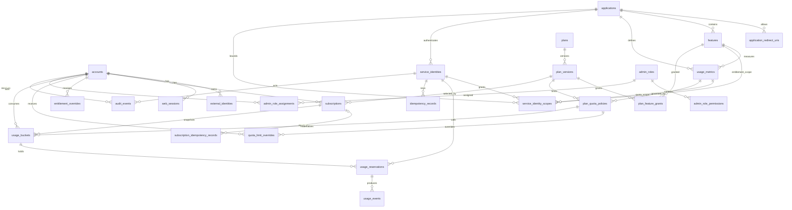

# Physical schema PostgreSQL cho Control Plane

> **Trạng thái:** Thiết kế đề xuất để hiện thực migration. Tài liệu này không khẳng định database, schema, bảng, migration hoặc trigger đã tồn tại. Các quyết định nghiệp vụ được đánh dấu còn mở phải được chốt trước khi kích hoạt dữ liệu tương ứng.

## 1. Phạm vi và nguyên tắc

- Domain tables nằm trong PostgreSQL schema `control_plane`. Chỉ repository của Node/Nest Control Plane được đọc/ghi domain tables; background worker gọi application port của module và không truy cập repository/table trực tiếp. Migration task và Supabase Studio là ngoại lệ quản trị có kiểm soát.
- PostgreSQL chạy trong Supabase self-hosted; runtime kết nối qua Supavisor. Không dùng API Data của Supabase để truy cập domain tables.
- Tên bảng/cột dùng `snake_case`; bảng dùng danh từ số nhiều.
- Mọi `id uuid` do application sinh, định hướng UUIDv7 để có locality tốt hơn. Không yêu cầu PostgreSQL extension; package sinh UUID cụ thể chỉ được chọn khi bootstrap.
- Mọi thời điểm dùng `timestamptz` và được hiểu là UTC. Quyết định hiệu lực, cửa sổ quota và expiry dùng DB clock (`CURRENT_TIMESTAMP`/`transaction_timestamp()`), không tin clock từ client.
- Mọi quantity/limit/counter dùng `bigint`; REST JSON biểu diễn bằng decimal string. Không dùng floating point cho quota.
- Trạng thái dùng `text` với named `CHECK`, không dùng PostgreSQL enum.
- `jsonb` chỉ dành cho response replay hoặc audit details có kích thước giới hạn; không chứa secret, token, credential hay payload nghiệp vụ không giới hạn.
- FK mặc định `ON DELETE RESTRICT`. Chỉ dùng cascade khi được nêu rõ cho cấu hình con chưa phát hành. History, audit và usage không hard delete; catalog đổi `status` thay vì xóa.
- Drizzle Kit tạo forward migration. Trigger, partial/expression index và constraint mà DSL chưa diễn đạt đủ được viết trong custom SQL migration.
- `EffectiveEntitlement` là kết quả tính tại thời điểm yêu cầu từ account, subscription, plan snapshot và overrides; MVP không lưu bảng `effective_entitlements` và không dùng Redis làm quota ledger.

### 1.1. Quy ước chung cho cột

`created_at` mặc định `CURRENT_TIMESTAMP`. Bảng mutable có `updated_at` cùng mặc định lúc insert, nhưng service phải gán lại bằng DB clock trong mỗi `UPDATE`; không dựa vào application clock. Các bảng append-only không có `updated_at`. Email chỉ là thuộc tính liên hệ, không unique và không dùng để liên kết identity.

Hồ sơ account trong MVP dùng các cột typed `display_name`, `email`, `email_verified`, `locale` và `timezone`; không tạo profile JSONB tùy ý. Không lưu avatar hoặc số điện thoại khi chưa có use case. `display_name` và `email` không unique; `locale`/`timezone` chỉ là tùy chọn hiển thị, không quyết định quota window.

## 2. Module → table

| Module | Tables sở hữu |
|---|---|
| Account | `accounts` |
| Identity | `external_identities`, `web_sessions` |
| Catalog | `applications`, `application_redirect_uris`, `features`, `usage_metrics` |
| Plan | `plans`, `plan_versions`, `plan_feature_grants`, `plan_quota_policies` |
| Subscription | `subscriptions`, `subscription_idempotency_records` |
| Entitlement | `entitlement_overrides`, `quota_limit_overrides` |
| Service Identity | `service_identities`, `service_identity_scopes` |
| Quota | `usage_buckets`, `usage_reservations`, `usage_events`, `idempotency_records` |
| Audit/Admin | `admin_roles`, `admin_role_permissions`, `admin_role_assignments`, `audit_events` |
| Site Content | `nav_menus`, `nav_items`, `nav_item_translations` |
| Reconciliation | Không sở hữu bảng và không truy cập bảng trực tiếp; chỉ gọi `QuotaReconciliationPort` |

Thiết kế gồm **25 domain tables**. Billing, outbox, provider-specific data và `reconciliation_runs` được hoãn, không tạo trong MVP.

## 3. ER overview

Sơ đồ giản lược cột để nhấn mạnh ownership và relationship:



## 4. Account và Identity

### 4.1. `accounts`

| Column | Type | Null | Default | Constraints | Ý nghĩa |
|---|---|---:|---|---|---|
| `id` | `uuid` | không | application | PK | Account nội bộ, không phải Auth0 subject. |
| `status` | `text` | không | — | `pending`, `active`, `disabled` | Trạng thái truy cập. |
| `display_name` | `text` | có | — | — | Tên hồ sơ; không dùng làm identity. |
| `email` | `text` | có | — | — | Thông tin liên hệ không unique; không dùng để link account. |
| `email_verified` | `boolean` | không | `false` | — | Trạng thái xác minh của email gần nhất nhận từ nguồn danh tính tin cậy. |
| `locale` | `text` | có | — | non-empty nếu có | Ngôn ngữ/định dạng hiển thị ưu tiên, ví dụ BCP 47; application kiểm tra giá trị hỗ trợ. |
| `timezone` | `text` | có | — | non-empty nếu có | IANA timezone ưu tiên để hiển thị thời gian; không dùng làm timezone của quota policy. |
| `disabled_at` | `timestamptz` | có | — | state consistency | Thời điểm vô hiệu hóa. |
| `created_at` | `timestamptz` | không | DB clock | — | Thời điểm tạo. |
| `updated_at` | `timestamptz` | không | DB clock | — | Lần cập nhật gần nhất. |

- **PK:** `accounts_pkey (id)`.
- **FK/unique:** không có FK; không có unique ngoài PK. Email và tên hồ sơ cố ý không unique.
- **Check:** `accounts_status_check`; `accounts_disabled_state_check` yêu cầu `disabled_at IS NOT NULL` đúng và chỉ đúng khi `status = 'disabled'`; `accounts_email_verified_check` yêu cầu `email IS NOT NULL OR email_verified = false`; `accounts_locale_check` và `accounts_timezone_check` từ chối chuỗi rỗng khi có giá trị.
- **Index:** `accounts_status_idx (status)` phục vụ vận hành. Không tạo unique index trên `email` hoặc `display_name`.

`email` và `email_verified` phải được cập nhật nguyên tử. Khi giá trị email thay đổi, service mặc định đặt `email_verified = false`; chỉ đặt `true` khi **chính email đó** đi kèm claim boolean `email_verified = true` từ token/UserInfo đã được Auth0 xác minh. Claim thiếu, null hoặc chỉ có scope `email` không chứng minh email đã được xác minh.

### 4.2. `external_identities`

| Column | Type | Null | Default | Constraints | Ý nghĩa |
|---|---|---:|---|---|---|
| `id` | `uuid` | không | application | PK | Identity link nội bộ. |
| `account_id` | `uuid` | không | — | FK | Account sở hữu. |
| `provider` | `text` | không | — | `auth0` | Provider được hỗ trợ trong baseline. |
| `issuer` | `text` | không | — | non-empty | OIDC issuer canonical. |
| `subject` | `text` | không | — | non-empty | OIDC subject ổn định. |
| `last_seen_at` | `timestamptz` | có | — | — | Lần xác thực thành công gần nhất. |
| `created_at` | `timestamptz` | không | DB clock | — | Thời điểm link. |
| `updated_at` | `timestamptz` | không | DB clock | — | Lần cập nhật gần nhất. |

- **PK/FK:** `external_identities_pkey`; `external_identities_account_fk (account_id) REFERENCES accounts(id) ON DELETE RESTRICT`.
- **Unique:** `external_identities_issuer_subject_key (issuer, subject)`. Không có cơ chế link theo email.
- **Check:** `external_identities_provider_check`; `external_identities_issuer_check`; `external_identities_subject_check`.
- **Index:** `external_identities_account_idx (account_id)`.

Identity orchestration resolve duy nhất bằng `(issuer, subject)`. Khi mapping chưa tồn tại, Identity gọi Account qua các port và shared Unit of Work để insert `accounts` cùng `external_identities` trong **một PostgreSQL transaction**. Nếu unique constraint bị transaction cạnh tranh thắng, toàn bộ transaction thua—including account vừa insert—phải rollback; retry mở transaction mới và đọc mapping của winner. Không commit account trước mapping, vì như vậy có thể tạo orphan account.

#### Google Login qua Auth0

Google Login không cần thêm bảng hoặc thay đổi khóa identity. Auth0 vẫn là issuer tin cậy, vì vậy `external_identities.provider` tiếp tục là `auth0` và account vẫn được resolve bằng `(issuer, subject)` dù upstream connection là Google.

- Cấu hình Google social connection trong Auth0 bằng Google OAuth client ID/secret và callback URL do Auth0 cung cấp; secret chỉ nằm trong Auth0/secret manager, không lưu trong schema này.
- Bật connection cho đúng Auth0 Application và yêu cầu tối thiểu các scope OIDC `openid profile email`.
- Khi provision lần đầu, có thể khởi tạo `display_name`, `email` và `email_verified` từ claims đã được Auth0 xác minh. Các lần login sau chỉ đồng bộ theo profile-sync policy đã phê duyệt; không âm thầm ghi đè dữ liệu user đã chỉnh sửa.
- Không tự liên kết hai account chỉ vì Google trả cùng email. Account linking, nếu cần sau này, phải là luồng riêng có xác minh lại danh tính và audit.
- Tắt mọi Auth0 Action/Management API thực hiện automatic hoặc email-based account linking. Luồng linking tương lai phải do Talosmine kiểm soát, re-authenticate cả hai identity, khóa và kiểm tra cả hai mapping trong một transaction, từ chối nếu chúng đã thuộc hai account khác nhau cho tới khi có quy trình merge dữ liệu riêng, và luôn ghi audit.
- `locale` và `timezone` là preference của Talosmine; không bắt buộc lấy từ Google và không dùng làm identity claim.

### 4.3. `web_sessions`

| Column | Type | Null | Default | Constraints | Ý nghĩa |
|---|---|---:|---|---|---|
| `id` | `uuid` | không | application | PK | Session nội bộ của BFF. |
| `account_id` | `uuid` | không | — | FK | Account đã đăng nhập. |
| `session_token_hash` | `bytea` | không | — | unique | Hash mật mã của opaque session token; không lưu token thô. |
| `csrf_token_hash` | `bytea` | không | — | — | Hash token chống CSRF; không lưu token thô. |
| `auth0_sid` | `text` | có | — | — | Session identifier từ Auth0 nếu có. |
| `last_seen_at` | `timestamptz` | không | DB clock | — | Hoạt động gần nhất. |
| `expires_at` | `timestamptz` | không | — | after creation | Hạn tuyệt đối. |
| `revoked_at` | `timestamptz` | có | — | — | Thời điểm thu hồi. |
| `revocation_reason` | `text` | có | — | paired with revoke | Lý do máy/người vận hành. |
| `created_at` | `timestamptz` | không | DB clock | — | Thời điểm tạo. |
| `updated_at` | `timestamptz` | không | DB clock | — | Lần cập nhật gần nhất. |

- **PK/FK:** `web_sessions_pkey`; `web_sessions_account_fk` tới `accounts(id)`.
- **Unique:** `web_sessions_token_hash_key (session_token_hash)`.
- **Check:** `web_sessions_expiry_check (expires_at > created_at)`; `web_sessions_revocation_check` yêu cầu `revoked_at` và `revocation_reason` cùng có hoặc cùng không.
- **Index:** `web_sessions_account_active_idx (account_id, expires_at) WHERE revoked_at IS NULL`; `web_sessions_auth0_sid_idx (auth0_sid) WHERE auth0_sid IS NOT NULL`.

## 5. Catalog

### 5.1. `applications`

| Column | Type | Null | Default | Constraints | Ý nghĩa |
|---|---|---:|---|---|---|
| `id` | `uuid` | không | application | PK | Application nội bộ. |
| `key` | `text` | không | — | unique, stable | Định danh machine-readable không tái sử dụng. |
| `display_name` | `text` | không | — | non-empty | Tên hiển thị. |
| `description` | `text` | có | — | — | Mô tả catalog. |
| `image_url` | `text` | có | — | non-empty nếu có | URL ảnh/icon của ứng dụng trên object storage, CDN hoặc static host; không lưu binary/base64 trong PostgreSQL. |
| `launch_url` | `text` | không | — | non-empty | URL mở ứng dụng; service kiểm tra URL hợp lệ. |
| `status` | `text` | không | — | `draft`, `active`, `inactive` | Vòng đời catalog. |
| `created_at` | `timestamptz` | không | DB clock | — | Thời điểm tạo. |
| `updated_at` | `timestamptz` | không | DB clock | — | Lần cập nhật. |

- **PK/unique:** `applications_pkey`; `applications_key_key (key)`.
- **FK:** không có.
- **Check:** `applications_status_check`, các check non-empty cho `key`, `display_name`, `launch_url`; `applications_image_url_check` từ chối chuỗi rỗng khi `image_url` có giá trị. Cú pháp URL, scheme HTTPS và host allowlist được kiểm tra ở application layer.
- **Index:** `applications_status_idx (status)`.

`image_url` chỉ được lưu URL public, ổn định thuộc CDN/object-storage domain do dự án kiểm soát; không lưu URL có userinfo, credential trong query hoặc presigned token ngắn hạn. Ưu tiên URL sinh từ asset key do hệ thống quản lý. Nếu Next.js/BFF fetch hoặc tối ưu ảnh phía server, cấu hình allowlist tĩnh, kiểm tra lại mọi redirect và chặn loopback/private/link-local address sau DNS resolution; nếu không cần proxy ảnh thì browser tải trực tiếp theo CSP allowlist.

### 5.2. `application_redirect_uris`

| Column | Type | Null | Default | Constraints | Ý nghĩa |
|---|---|---:|---|---|---|
| `id` | `uuid` | không | application | PK | Allowlist entry. |
| `application_id` | `uuid` | không | — | FK | Application sở hữu URI. |
| `purpose` | `text` | không | — | `login`, `logout` | Loại redirect. |
| `uri` | `text` | không | — | non-empty | URI exact-match đã canonicalize. Không hỗ trợ wildcard. |
| `created_at` | `timestamptz` | không | DB clock | — | Thời điểm tạo. |

- **PK/FK:** `application_redirect_uris_pkey`; `application_redirect_uris_application_fk` tới `applications(id)`.
- **Unique:** `application_redirect_uris_exact_key (application_id, purpose, uri)`.
- **Check/index:** `application_redirect_uris_purpose_check`, `application_redirect_uris_uri_check`; index FK `(application_id)` được phủ bởi unique index.

### 5.3. `features`

| Column | Type | Null | Default | Constraints | Ý nghĩa |
|---|---|---:|---|---|---|
| `id` | `uuid` | không | application | PK | Feature nội bộ. |
| `application_id` | `uuid` | không | — | FK | Application chứa feature. |
| `key` | `text` | không | — | stable trong app | Định danh app sử dụng trong policy request. |
| `display_name` | `text` | không | — | non-empty | Tên hiển thị. |
| `description` | `text` | có | — | — | Mô tả. |
| `status` | `text` | không | — | `draft`, `active`, `inactive` | Vòng đời feature. |
| `created_at` | `timestamptz` | không | DB clock | — | Thời điểm tạo. |
| `updated_at` | `timestamptz` | không | DB clock | — | Lần cập nhật. |

- **PK/FK:** `features_pkey`; `features_application_fk`.
- **Unique:** `features_application_key_key (application_id, key)` và `features_id_application_key (id, application_id)` để làm composite FK target.
- **Check/index:** `features_status_check`, non-empty checks; `features_application_status_idx (application_id, status)`.

### 5.4. `usage_metrics`

| Column | Type | Null | Default | Constraints | Ý nghĩa |
|---|---|---:|---|---|---|
| `id` | `uuid` | không | application | PK | Metric nội bộ. |
| `application_id` | `uuid` | không | — | FK | Application sở hữu. |
| `feature_id` | `uuid` | không | — | composite FK | Feature được đo, bắt buộc cùng application. |
| `key` | `text` | không | — | stable trong app | Định danh metric trong API. |
| `display_name` | `text` | không | — | non-empty | Tên hiển thị. |
| `unit` | `text` | không | — | non-empty | Đơn vị logic; giá trị cụ thể cần product duyệt. |
| `counting_point` | `text` | có | — | `start`, `milestone`, `success` | Mốc tính lượt; để null tới khi được duyệt. |
| `failure_treatment` | `text` | có | — | `commit`, `cancel`, `policy_defined` | Xử lý thất bại; để null tới khi được duyệt. |
| `status` | `text` | không | — | `draft`, `active`, `inactive` | Vòng đời metric. |
| `created_at` | `timestamptz` | không | DB clock | — | Thời điểm tạo. |
| `updated_at` | `timestamptz` | không | DB clock | — | Lần cập nhật. |

- **PK/FK:** `usage_metrics_pkey`; `usage_metrics_application_fk`; `usage_metrics_feature_application_fk (feature_id, application_id) REFERENCES features(id, application_id)` bảo đảm metric và feature cùng app.
- **Unique:** `usage_metrics_application_key_key (application_id, key)`; `usage_metrics_id_application_key (id, application_id)`; `usage_metrics_id_feature_application_key (id, feature_id, application_id)`.
- **Check:** `usage_metrics_counting_point_check`, `usage_metrics_failure_treatment_check`, `usage_metrics_status_check`, non-empty checks.
- **Index:** `usage_metrics_feature_idx (feature_id)` và `(application_id, status)`.

## 6. Plan và Subscription

### 6.1. `plans`

| Column | Type | Null | Default | Constraints | Ý nghĩa |
|---|---|---:|---|---|---|
| `id` | `uuid` | không | application | PK | Product identity ổn định. |
| `key` | `text` | không | — | unique, stable | Machine key; app không được suy luận entitlement từ key này. |
| `display_name` | `text` | không | — | non-empty | Tên hiển thị. |
| `description` | `text` | có | — | — | Mô tả. |
| `status` | `text` | không | — | `draft`, `active`, `inactive` | Vòng đời catalog, không xóa plan cũ. |
| `created_at` | `timestamptz` | không | DB clock | — | Thời điểm tạo. |
| `updated_at` | `timestamptz` | không | DB clock | — | Lần cập nhật. |

- **PK:** `plans_pkey`.
- **FK:** không có.
- **Unique/check/index:** `plans_key_key`; `plans_status_check`; `plans_status_idx (status)`.

`plans`, `applications`, `features` và `usage_metrics` nhất quán dùng catalog lifecycle `draft -> active -> inactive`; không có business default cho trạng thái insert. Reactivation, nếu API quản trị cho phép, phải là transition có authorization/audit, không phải tạo key mới hay hard delete. `plan_versions` dùng state machine snapshot riêng ở mục 11.2.

### 6.2. `plan_versions`

| Column | Type | Null | Default | Constraints | Ý nghĩa |
|---|---|---:|---|---|---|
| `id` | `uuid` | không | application | PK | Snapshot version. |
| `plan_id` | `uuid` | không | — | FK | Plan cha. |
| `version` | `integer` | không | — | positive, unique trong plan | Số thứ tự version; đây không phải quantity nên không dùng `bigint`. |
| `status` | `text` | không | — | `draft`, `published`, `retired` | Vòng đời snapshot. |
| `effective_from` | `timestamptz` | có | — | — | Mốc nghiệp vụ dự kiến/áp dụng. |
| `effective_until` | `timestamptz` | có | — | range check | Kết thúc hiệu lực nếu được quyết định. |
| `published_at` | `timestamptz` | có | — | state consistency | DB time khi publish. |
| `created_at` | `timestamptz` | không | DB clock | — | Thời điểm tạo. |
| `updated_at` | `timestamptz` | không | DB clock | — | Lần cập nhật metadata được phép. |

- **PK/FK:** `plan_versions_pkey`; `plan_versions_plan_fk`.
- **Unique:** `plan_versions_plan_version_key (plan_id, version)` và `plan_versions_id_status_key (id, status)` để hỗ trợ composite FK/kiểm tra ở transaction.
- **Check:** `plan_versions_version_check (version > 0)`; `plan_versions_status_check`; `plan_versions_effective_range_check`; `plan_versions_published_state_check` yêu cầu `published_at` có ở `published`/`retired` và không có ở `draft`.
- **Index:** `plan_versions_plan_status_idx (plan_id, status)`; `(effective_from, effective_until)` phục vụ lookup.

### 6.3. `plan_feature_grants`

| Column | Type | Null | Default | Constraints | Ý nghĩa |
|---|---|---:|---|---|---|
| `id` | `uuid` | không | application | PK | Grant trong snapshot. |
| `plan_version_id` | `uuid` | không | — | FK | Version sở hữu. |
| `feature_id` | `uuid` | không | — | FK | Feature được cấp. |
| `is_allowed` | `boolean` | không | — | explicit | Quyết định allow/deny rõ ràng, không có business default. |
| `created_at` | `timestamptz` | không | DB clock | — | Thời điểm tạo. |

- **PK/FK:** `plan_feature_grants_pkey`; FK tới `plan_versions(id)` và `features(id)`.
- **Unique:** `plan_feature_grants_version_feature_key (plan_version_id, feature_id)`.
- **Check:** không cần check riêng ngoài kiểu `boolean`; giá trị `is_allowed` bắt buộc được ghi rõ.
- **Index:** `plan_feature_grants_feature_idx (feature_id)`.
- Trigger bất biến tại mục 13 chặn sửa/xóa khi version đã published hoặc retired.

### 6.4. `plan_quota_policies`

| Column | Type | Null | Default | Constraints | Ý nghĩa |
|---|---|---:|---|---|---|
| `id` | `uuid` | không | application | PK | Quota policy trong snapshot. |
| `plan_version_id` | `uuid` | không | — | FK | Version sở hữu. |
| `application_id` | `uuid` | không | — | FK | App áp dụng. |
| `usage_metric_id` | `uuid` | không | — | composite FK | Metric bắt buộc thuộc app trên. |
| `limit_quantity` | `bigint` | không | — | `>= 0` | Hard limit; không có giá trị giả/default. |
| `window_type` | `text` | không | — | `calendar`, `rolling` | Kiểu cửa sổ đã được product duyệt. |
| `calendar_unit` | `text` | có | — | `day`, `week`, `month` | Chỉ dùng cho calendar. |
| `calendar_timezone` | `text` | có | — | non-empty | IANA timezone text; validity được service/migration seed kiểm tra. |
| `rolling_interval_seconds` | `bigint` | có | — | positive | Chỉ dùng cho rolling. |
| `rolling_anchor_at` | `timestamptz` | có | — | — | Anchor nếu semantics rolling được duyệt là window có mốc; không tự suy luận cách dùng. |
| `reservation_ttl_seconds` | `bigint` | không | — | positive | TTL đã duyệt, không có business default. |
| `created_at` | `timestamptz` | không | DB clock | — | Thời điểm tạo. |

- **PK/FK:** `plan_quota_policies_pkey`; FK version và application; `plan_quota_policies_metric_application_fk (usage_metric_id, application_id) REFERENCES usage_metrics(id, application_id)` bảo đảm policy/metric/app binding.
- **Unique:** `plan_quota_policies_version_metric_key (plan_version_id, usage_metric_id)`; `plan_quota_policies_id_application_metric_key (id, application_id, usage_metric_id)`.
- **Check:** `plan_quota_policies_limit_check`; `plan_quota_policies_ttl_check`; `plan_quota_policies_window_type_check`; `plan_quota_policies_window_shape_check` yêu cầu calendar có `calendar_unit` + timezone và mọi rolling field null, hoặc rolling có interval và mọi calendar field null. `rolling_anchor_at` có thể null cho tới khi semantics được chốt; policy chưa đủ dữ liệu không được publish.
- **Index:** `(application_id, usage_metric_id)` và `(plan_version_id)` (unique đã phủ trường hợp sau).

Không kích hoạt policy trước khi chốt calendar/rolling semantics, timezone và DST. Nếu “rolling” được duyệt là exact sliding window thay vì các window canonical không chồng lấp, transaction/bucket model phải được review và migration mở rộng trước khi dùng; schema này không âm thầm coi hai khái niệm là một.

### 6.5. `subscriptions`

| Column | Type | Null | Default | Constraints | Ý nghĩa |
|---|---|---:|---|---|---|
| `id` | `uuid` | không | application | PK | Subscription. |
| `account_id` | `uuid` | không | — | FK | Chủ sở hữu cá nhân trong MVP. |
| `plan_version_id` | `uuid` | không | — | FK | Snapshot phải đã published/retired sau khi từng được publish. |
| `status` | `text` | không | — | state list | Trạng thái vòng đời. |
| `starts_at` | `timestamptz` | không | — | — | Bắt đầu khoảng hiệu lực. |
| `ends_at` | `timestamptz` | có | — | range check | Kết thúc exclusive. |
| `cancel_at` | `timestamptz` | có | — | — | Thời điểm hủy đã lên lịch nếu có. |
| `source` | `text` | không | — | non-empty | Nguồn tạo đã kiểm soát; không chọn payment provider. |
| `source_reference` | `text` | có | — | paired unique | Reference idempotent trong nguồn nếu có. |
| `supersedes_subscription_id` | `uuid` | có | — | self FK | Subscription trước được thay thế. |
| `created_at` | `timestamptz` | không | DB clock | — | Thời điểm tạo. |
| `updated_at` | `timestamptz` | không | DB clock | — | Lần cập nhật. |

- **PK/FK:** `subscriptions_pkey`; FK account, plan version và self-reference đều `RESTRICT`.
- **Unique:** `subscriptions_source_reference_key (source, source_reference) WHERE source_reference IS NOT NULL`; `subscriptions_id_account_key (id, account_id)` để bucket dùng composite FK; `subscriptions_account_start_key (account_id, starts_at)`.
- **Check:** `subscriptions_status_check` cho `pending`, `active`, `cancel_at_period_end`, `suspended`, `canceled`, `expired`; `subscriptions_period_check (ends_at IS NULL OR ends_at > starts_at)`; `subscriptions_cancel_at_range_check` yêu cầu `cancel_at IS NULL OR (cancel_at > starts_at AND (ends_at IS NULL OR cancel_at <= ends_at))`; `subscriptions_status_time_shape_check` là `(status = 'cancel_at_period_end' AND cancel_at IS NOT NULL) OR (status IN ('pending','active','suspended') AND cancel_at IS NULL) OR (status IN ('canceled','expired') AND ends_at IS NOT NULL AND isfinite(ends_at))`; `subscriptions_not_self_supersede_check`.
- **Index:** `subscriptions_account_status_period_idx (account_id, status, starts_at, cancel_at, ends_at)`; `subscriptions_plan_version_idx (plan_version_id)`.
- **Invariant transaction:** FK không thể bảo đảm version đã publish và `CHECK` không thể ngăn các time range chồng lấp. Mọi create/transition phải `SELECT ... FOR UPDATE` row `accounts` trước, xác minh version, rồi kiểm tra interval canonical `[starts_at, effective_end)` của **mọi** subscription cùng account, kể cả terminal rows. Không lọc `canceled`/`expired` khỏi overlap query. Future subscription được bắt đầu đúng tại previous `effective_end` vì biên cuối là exclusive. Không yêu cầu `btree_gist`. Quy tắc upgrade/downgrade/cancel còn mở quyết định nghiệp vụ.

PostgreSQL `LEAST(cancel_at, ends_at)` bỏ qua operand null và trả null chỉ khi cả hai đều null. Vì vậy định nghĩa canonical là `effective_end = LEAST(cancel_at, ends_at)`; riêng predicate/range comparison thay null kép bằng infinity. `ActiveSubscriptionPort` áp dụng chính xác predicate sau tại DB time `t`:

```text
starts_at <= t
AND t < COALESCE(LEAST(cancel_at, ends_at), 'infinity'::timestamptz)
AND status IN ('pending', 'active', 'cancel_at_period_end')
```

`pending` là scheduled projection: subscription tự có hiệu lực theo thời gian khi predicate đúng, không chờ worker đổi status. `suspended`, `canceled` và `expired` luôn bị loại khỏi active predicate, nhưng **không** bị loại khỏi overlap check lịch sử. Worker chỉ hội tụ projection/status phục vụ vận hành; worker không phải điều kiện để entitlement có hiệu lực. Mọi terminal transition sang `canceled` hoặc `expired` ghi `ends_at` hữu hạn bằng effective terminal DB time trong cùng transaction; nếu giữ `cancel_at`, giá trị đó phải thỏa range check, nếu không phải clear/normalize trong chính transition.

### 6.6. `subscription_idempotency_records`

Bảng này thuộc Subscription và tách khỏi idempotency service operations của Quota.

| Column | Type | Null | Default | Constraints | Ý nghĩa |
|---|---|---:|---|---|---|
| `id` | `uuid` | không | application | PK | Idempotency record nội bộ. |
| `trusted_source` | `text` | không | — | non-empty | Namespace lấy từ authenticated actor/integration, không lấy tùy ý từ request body. |
| `operation` | `text` | không | — | non-empty | Subscription command machine-readable. |
| `idempotency_key` | `text` | không | — | 1–255 bytes | Opaque key trong source/operation. |
| `request_fingerprint` | `bytea` | không | — | — | Hash canonical của mọi input ảnh hưởng mutation. |
| `state` | `text` | không | `processing` | `processing`, `completed` | Trạng thái claim. |
| `subscription_id` | `uuid` | có | — | FK | Subscription kết quả; có thể null cho denial hợp lệ. |
| `response_status` | `integer` | có | — | HTTP range | Status replay khi completed. |
| `response_body` | `jsonb` | có | — | bounded object | Replay tối thiểu; có thể null nếu response không có body. |
| `created_at` | `timestamptz` | không | DB clock | — | DB time claim. |
| `updated_at` | `timestamptz` | không | DB clock | — | DB time cập nhật. |
| `completed_at` | `timestamptz` | có | — | state consistency | DB time hoàn tất. |
| `expires_at` | `timestamptz` | không | — | after creation | Kết thúc retry/replay window. |

- **PK/FK:** `subscription_idempotency_records_pkey`; `subscription_idempotency_records_subscription_fk` tới `subscriptions(id) ON DELETE RESTRICT`.
- **Unique:** `subscription_idempotency_records_source_operation_key (trusted_source, operation, idempotency_key)`.
- **Check:** `subscription_idempotency_records_source_operation_check` cho source/operation non-empty; `subscription_idempotency_records_key_size_check` cho key 1–255 bytes; `subscription_idempotency_records_state_check`; `subscription_idempotency_records_expiry_check (expires_at > created_at)`; `subscription_idempotency_records_response_status_check` giới hạn status non-null ở `100..599`; shape/size checks yêu cầu JSON object tối đa 64 KiB khi body non-null. `subscription_idempotency_records_completion_check` yêu cầu processing có subscription/response/completed fields null; completed có `completed_at` và `response_status` non-null, còn `subscription_id`/body có thể null theo kết quả.
- **Index:** `subscription_idempotency_records_expiry_idx (expires_at)`; `(subscription_id) WHERE subscription_id IS NOT NULL`.

Lock order mutation Subscription là **subscription idempotency record → account → subscription**. Cùng namespace + cùng fingerprint replay status/body đã lưu; fingerprint khác trả conflict và không mutate. Claim, account/subscription mutation, domain audit và completed response cùng một transaction. `subscriptions.source_reference` chỉ là external correlation, không thay thế idempotency record này.

## 7. Entitlement overrides

### 7.1. `entitlement_overrides`

| Column | Type | Null | Default | Constraints | Ý nghĩa |
|---|---|---:|---|---|---|
| `id` | `uuid` | không | application | PK | Override có lịch sử. |
| `account_id` | `uuid` | không | — | FK | Account nhận override. |
| `feature_id` | `uuid` | không | — | FK | Feature bị override. |
| `effect` | `text` | không | — | `allow`, `deny` | Kết quả override. |
| `valid_from` | `timestamptz` | không | — | — | Bắt đầu hiệu lực. |
| `valid_until` | `timestamptz` | có | — | range check | Kết thúc exclusive. |
| `reason` | `text` | không | — | non-empty | Lý do bắt buộc. |
| `created_by_account_id` | `uuid` | không | — | FK | Admin account tạo. |
| `revoked_at` | `timestamptz` | có | — | — | Thu hồi sớm. |
| `revoked_by_account_id` | `uuid` | có | — | FK | Admin thu hồi. |
| `revocation_reason` | `text` | có | — | paired | Lý do thu hồi. |
| `created_at` | `timestamptz` | không | DB clock | — | Thời điểm tạo. |

- **PK/FK:** PK và FK tới account/feature/admin account, đều `RESTRICT`.
- **Unique:** không có ngoài PK; việc chồng lấp theo thời gian là invariant transaction.
- **Check:** `entitlement_overrides_effect_check`, `entitlement_overrides_validity_check`, `entitlement_overrides_revocation_check` yêu cầu ba trường revoke cùng null hoặc cùng non-null.
- **Index:** `entitlement_overrides_lookup_idx (account_id, feature_id, valid_from, valid_until) WHERE revoked_at IS NULL`; index hai creator FK.
- Không update nội dung đã tạo; thu hồi bằng các cột revoke và ghi `audit_events` trong cùng transaction.

### 7.2. `quota_limit_overrides`

| Column | Type | Null | Default | Constraints | Ý nghĩa |
|---|---|---:|---|---|---|
| `id` | `uuid` | không | application | PK | Override limit có lịch sử. |
| `account_id` | `uuid` | không | — | FK | Account nhận override. |
| `plan_quota_policy_id` | `uuid` | không | — | FK | Policy được thay limit. |
| `limit_quantity` | `bigint` | không | — | `>= 0` | Limit hiệu lực; API decimal string. |
| `valid_from` | `timestamptz` | không | — | — | Bắt đầu hiệu lực. |
| `valid_until` | `timestamptz` | có | — | range check | Kết thúc exclusive. |
| `reason` | `text` | không | — | non-empty | Lý do. |
| `created_by_account_id` | `uuid` | không | — | FK | Admin tạo. |
| `revoked_at` | `timestamptz` | có | — | — | Thu hồi sớm. |
| `revoked_by_account_id` | `uuid` | có | — | FK | Admin thu hồi. |
| `revocation_reason` | `text` | có | — | paired | Lý do thu hồi. |
| `created_at` | `timestamptz` | không | DB clock | — | Thời điểm tạo. |

- **PK/FK:** PK; FK account, policy và creator/revoker.
- **Unique:** không có ngoài PK; việc chồng lấp theo thời gian là invariant transaction.
- **Check/index:** `quota_limit_overrides_limit_check`, validity và revoke checks tương tự entitlement; `quota_limit_overrides_lookup_idx (account_id, plan_quota_policy_id, valid_from, valid_until) WHERE revoked_at IS NULL`.
- Service khóa account khi tạo override và không cho hai override hiệu lực chồng lấp cho cùng account/policy. Đây là invariant theo thời gian ở transaction, không phải `CHECK`.

## 8. Service Identity

### 8.1. `service_identities`

| Column | Type | Null | Default | Constraints | Ý nghĩa |
|---|---|---:|---|---|---|
| `id` | `uuid` | không | application | PK | Machine identity nội bộ. |
| `application_id` | `uuid` | không | — | FK | Đúng một application. |
| `issuer` | `text` | không | — | non-empty | Auth0 issuer. |
| `client_id` | `text` | không | — | non-empty | Auth0 M2M client ID, không phải secret. |
| `display_name` | `text` | không | — | non-empty | Tên vận hành. |
| `status` | `text` | không | — | `active`, `revoked` | Vòng đời. |
| `last_seen_at` | `timestamptz` | có | — | — | Lần xác thực gần nhất. |
| `revoked_at` | `timestamptz` | có | — | state consistency | Thời điểm thu hồi. |
| `revocation_reason` | `text` | có | — | paired | Lý do thu hồi. |
| `created_at` | `timestamptz` | không | DB clock | — | Thời điểm tạo. |
| `updated_at` | `timestamptz` | không | DB clock | — | Lần cập nhật. |

- **PK/FK:** `service_identities_pkey`; FK application.
- **Unique:** `service_identities_issuer_client_key (issuer, client_id)`; `service_identities_id_application_key (id, application_id)` cho composite FK.
- **Check:** status, non-empty và `service_identities_revocation_check` yêu cầu revoked fields chỉ có ở trạng thái `revoked`.
- **Index:** `service_identities_application_status_idx (application_id, status)`.
- Không lưu client secret, access token hoặc refresh token.

### 8.2. `service_identity_scopes`

| Column | Type | Null | Default | Constraints | Ý nghĩa |
|---|---|---:|---|---|---|
| `id` | `uuid` | không | application | PK | Scope assignment. |
| `service_identity_id` | `uuid` | không | — | composite FK | Machine identity. |
| `application_id` | `uuid` | không | — | composite FK | App phải khớp service identity và resource. |
| `capability` | `text` | không | — | capability list | Quyền kỹ thuật hẹp trên đúng resource. |
| `feature_id` | `uuid` | có | — | composite FK | Resource cho entitlement decision. |
| `usage_metric_id` | `uuid` | có | — | composite FK | Resource cho quota operation. |
| `status` | `text` | không | — | `active`, `revoked` | Vòng đời assignment; caller phải ghi rõ, revoke không xóa row. |
| `revoked_at` | `timestamptz` | có | — | state consistency | DB time thu hồi. |
| `revocation_reason` | `text` | có | — | state consistency | Lý do thu hồi. |
| `created_at` | `timestamptz` | không | DB clock | — | Thời điểm cấp. |
| `updated_at` | `timestamptz` | không | DB clock | — | Lần cập nhật/revoke. |

- **PK/FK:** `service_identity_scopes_pkey`; `service_identity_scopes_service_application_fk (service_identity_id, application_id) REFERENCES service_identities(id, application_id)`; `service_identity_scopes_feature_application_fk (feature_id, application_id) REFERENCES features(id, application_id)`; `service_identity_scopes_metric_application_fk (usage_metric_id, application_id) REFERENCES usage_metrics(id, application_id)`.
- **Unique/index:** `service_identity_scopes_active_feature_key (service_identity_id, application_id, capability, feature_id) WHERE status = 'active' AND feature_id IS NOT NULL`; `service_identity_scopes_active_metric_key (service_identity_id, application_id, capability, usage_metric_id) WHERE status = 'active' AND usage_metric_id IS NOT NULL`. Partial unique indexes chỉ ngăn active assignment trùng nhau; nhiều row revoked được giữ làm lịch sử. Thêm lookup indexes `(service_identity_id, application_id, feature_id) WHERE status = 'active'` và tương tự cho metric nếu query plan cần.
- **Check:** `service_identity_scopes_capability_check` chỉ cho `entitlement:decide`, `quota:reserve`, `quota:commit`, `quota:cancel`, `quota:read`; `service_identity_scopes_shape_check` yêu cầu `entitlement:decide` có đúng `feature_id` non-null và metric null, còn mọi capability `quota:*` có đúng metric non-null và feature null; `service_identity_scopes_revocation_check` yêu cầu active có revoke fields null, revoked có cả `revoked_at` và reason.
- Service authorization phải tìm và khóa đúng **active resource-specific scope**, không chỉ kiểm tra một capability tổng quát ở cấp application.

#### Phased migration P4 -> P5

Phân kỳ này chỉ là **deployment staging**. Mô tả bảng tại mục 7 và mục 8.2 là canonical final schema ở trạng thái P5; không thay đổi cột, nullability, FK, lịch sử hoặc tổng số bảng của thiết kế cuối.

- **P4 — Entitlement staging:** tạo `entitlement_overrides`. Tạo `service_identity_scopes` với đầy đủ cột và FK canonical, nhưng named capability/shape checks ở P4 chỉ cho `entitlement:decide`, bắt buộc `feature_id` non-null và `usage_metric_id` null. Partial unique/lookup indexes P4 chỉ bảo vệ entitlement feature scopes. Không tạo `plan_quota_policies` hoặc `quota_limit_overrides` trong P4.
- **P5 — Canonical quota expansion:** tạo `plan_quota_policies` trước, rồi mới tạo `quota_limit_overrides` với FK tới policy. Trước khi mở rộng scopes, xác nhận mọi row P4 phù hợp với entitlement shape. Sau đó thay thế/mở rộng named capability và shape checks cùng partial unique/lookup indexes để đạt canonical tập `entitlement:decide`, `quota:reserve`, `quota:commit`, `quota:cancel`, `quota:read` và metric-resource shape tại mục 8.2. Quá trình này giữ nguyên các entitlement scope row và toàn bộ lịch sử revoke đã có; không xóa hoặc tái tạo dữ liệu P4.

Việc chuyển constraint/index phải diễn ra trong một deployment transaction khi PostgreSQL và thao tác DDL thực tế cho phép, hoặc bằng controlled DDL đã diễn tập với lock/traffic gate rõ ràng. Không được có cửa sổ runtime mà capability/shape không được constraint bảo vệ, và application chỉ được ghi quota scope sau khi canonical P5 checks/indexes đã có hiệu lực.

## 9. Quota ledger và idempotency

### 9.1. `usage_buckets`

Đây là snapshot nhất quán phục vụ hard-limit, không phải nguồn lịch sử duy nhất.

| Column | Type | Null | Default | Constraints | Ý nghĩa |
|---|---|---:|---|---|---|
| `id` | `uuid` | không | application | PK | Bucket của một account/policy/window. |
| `account_id` | `uuid` | không | — | FK | Chủ quota. |
| `subscription_id` | `uuid` | không | — | composite FK | Subscription tạo entitlement; phải cùng account. |
| `plan_quota_policy_id` | `uuid` | không | — | composite FK | Policy snapshot. |
| `application_id` | `uuid` | không | — | composite FK | App của policy/metric. |
| `usage_metric_id` | `uuid` | không | — | composite FK | Metric của policy. |
| `window_start` | `timestamptz` | không | — | — | Biên đầu inclusive. |
| `window_end` | `timestamptz` | không | — | `>` start | Biên cuối exclusive. |
| `limit_quantity` | `bigint` | không | — | `>= 0` | Snapshot limit sau override tại lúc tạo bucket. |
| `committed_quantity` | `bigint` | không | `0` | `>= 0` | Tổng đã commit. |
| `reserved_quantity` | `bigint` | không | `0` | `>= 0` | Tổng đang giữ. |
| `created_at` | `timestamptz` | không | DB clock | — | Thời điểm tạo. |
| `updated_at` | `timestamptz` | không | DB clock | — | Lần mutation gần nhất. |

- **PK/FK:** account FK; `usage_buckets_subscription_account_fk (subscription_id, account_id) REFERENCES subscriptions(id, account_id)` bảo đảm bucket/subscription cùng account; `usage_buckets_policy_binding_fk (plan_quota_policy_id, application_id, usage_metric_id) REFERENCES plan_quota_policies(id, application_id, usage_metric_id)` bảo đảm policy/metric/app.
- **Unique:** `usage_buckets_account_policy_window_key (account_id, plan_quota_policy_id, window_start, window_end)`; `usage_buckets_id_account_app_metric_key (id, account_id, application_id, usage_metric_id)` cho reservation.
- **Check:** `usage_buckets_window_check`; `usage_buckets_nonnegative_check`; `usage_buckets_hard_limit_check (committed_quantity::numeric + reserved_quantity::numeric <= limit_quantity::numeric)`. Cast sang `numeric` trong check để phép cộng không overflow trước khi so sánh.
- **Index:** `usage_buckets_lookup_idx (account_id, application_id, usage_metric_id, window_start, window_end)`; `usage_buckets_subscription_idx (subscription_id)`.
- Limit là snapshot để thay đổi override giữa window không âm thầm đổi accounting. Cách áp dụng thay đổi giữa kỳ là quyết định nghiệp vụ; mọi adjustment phải có event/audit, không sửa lịch sử tùy tiện.

### 9.2. `usage_reservations`

| Column | Type | Null | Default | Constraints | Ý nghĩa |
|---|---|---:|---|---|---|
| `id` | `uuid` | không | application | PK | Reservation trả cho app. |
| `usage_bucket_id` | `uuid` | không | — | composite FK | Bucket bị giữ. |
| `account_id` | `uuid` | không | — | composite FK | Phải trùng account bucket. |
| `application_id` | `uuid` | không | — | composite FK | Phải trùng app bucket/service. |
| `usage_metric_id` | `uuid` | không | — | composite FK | Phải trùng metric bucket. |
| `service_identity_id` | `uuid` | không | — | composite FK | Caller, bắt buộc thuộc application. |
| `operation_reference` | `text` | không | — | non-empty | Correlation ổn định phía app, không phải idempotency key. |
| `quantity` | `bigint` | không | — | `> 0` | Lượng đã giữ ban đầu. |
| `committed_quantity` | `bigint` | không | `0` | bounded | Lượng cuối cùng đã commit. |
| `state` | `text` | không | `reserved` | state list | Trạng thái reservation. |
| `expires_at` | `timestamptz` | không | — | — | DB clock + policy TTL lúc reserve. |
| `terminal_at` | `timestamptz` | có | — | state consistency | DB time khi kết thúc. |
| `terminal_reason` | `text` | có | — | state consistency | Mã lý do commit/cancel/expire. |
| `correlation_id` | `uuid` | có | — | — | Correlation kỹ thuật, không mang dữ liệu nhạy cảm. |
| `created_at` | `timestamptz` | không | DB clock | — | Thời điểm reserve. |
| `updated_at` | `timestamptz` | không | DB clock | — | Lần transition. |

- **PK/FK:** `usage_reservations_bucket_binding_fk (usage_bucket_id, account_id, application_id, usage_metric_id) REFERENCES usage_buckets(id, account_id, application_id, usage_metric_id)`; `usage_reservations_service_application_fk (service_identity_id, application_id) REFERENCES service_identities(id, application_id)`. Hai composite FK bảo đảm account/app/metric/service binding tại DB.
- **Unique:** `usage_reservations_service_operation_reference_key (service_identity_id, operation_reference)` để app không dùng một business operation tạo nhiều reservation; `usage_reservations_id_bucket_key (id, usage_bucket_id)` làm composite FK target cho event. Key idempotency vẫn được quản lý riêng.
- **Check:** `usage_reservations_quantity_check (quantity > 0)`; `usage_reservations_committed_check (committed_quantity >= 0 AND committed_quantity <= quantity)`; state list `reserved`, `committed`, `canceled`, `expired`; `usage_reservations_terminal_check` yêu cầu state `reserved` có `committed_quantity = 0` và terminal fields null, `committed` có terminal fields + committed > 0, `canceled`/`expired` có terminal fields + committed = 0.
- **Index:** `usage_reservations_expiry_idx (expires_at, id) WHERE state = 'reserved'`; `(usage_bucket_id, state)`; `(account_id, created_at)`.

MVP không commit vượt lượng reserve và không hỗ trợ terminal transition ngược. Partial commit kết thúc reservation, giải phóng phần còn lại. Semantics late success sau expire còn mở và phải được chốt trước khi triển khai worker expiry.

### 9.3. `usage_events`

| Column | Type | Null | Default | Constraints | Ý nghĩa |
|---|---|---:|---|---|---|
| `id` | `uuid` | không | application | PK | Event append-only. |
| `usage_bucket_id` | `uuid` | không | — | FK | Bucket liên quan. |
| `usage_reservation_id` | `uuid` | có | — | composite FK | Reservation liên quan nếu có; phải thuộc chính bucket event. |
| `event_type` | `text` | không | — | event list | Loại mutation. |
| `committed_delta` | `bigint` | không | — | — | Delta signed của committed. |
| `reserved_delta` | `bigint` | không | — | — | Delta signed của reserved. |
| `committed_after` | `bigint` | không | — | `>= 0` | Snapshot sau mutation. |
| `reserved_after` | `bigint` | không | — | `>= 0` | Snapshot sau mutation. |
| `limit_after` | `bigint` | không | — | `>= 0`, sum bounded | Limit snapshot sau mutation. |
| `actor_type` | `text` | không | — | `service`, `system`, `account` | Loại actor. |
| `actor_service_identity_id` | `uuid` | có | — | FK | Có khi actor service. |
| `actor_account_id` | `uuid` | có | — | FK | Có khi actor account/admin. |
| `correlation_id` | `uuid` | có | — | — | Correlation xuyên request/job. |
| `reason` | `text` | có | — | — | Mã/lý do tối thiểu. |
| `created_at` | `timestamptz` | không | DB clock | — | DB time của event. |

- **PK/FK:** PK; FK bucket, service identity và account đều `RESTRICT`; `usage_events_reservation_bucket_fk (usage_reservation_id, usage_bucket_id) REFERENCES usage_reservations(id, usage_bucket_id)` bảo đảm event có reservation thuộc đúng bucket.
- **Unique:** không có ngoài PK; nhiều event cho cùng reservation là hợp lệ và được sắp theo `(created_at, id)`.
- **Check:** `usage_events_type_check` gồm `reserved`, `committed`, `canceled`, `expired`, `limit_adjusted`, `reconciled_adjustment`; `usage_events_reservation_shape_check` yêu cầu lifecycle types `reserved`/`committed`/`canceled`/`expired` có `usage_reservation_id` non-null, còn `limit_adjusted`/`reconciled_adjustment` có reservation null; `usage_events_after_check` dùng cast `numeric` để yêu cầu after-values không âm và `committed_after::numeric + reserved_after::numeric <= limit_after::numeric`; `usage_events_actor_check` bảo đảm đúng một actor ID cho `service`/`account`, không actor ID cho `system`.
- **Index:** `(usage_bucket_id, created_at, id)`; `(usage_reservation_id, created_at)`; `(correlation_id) WHERE correlation_id IS NOT NULL`.
- Trigger append-only chặn `UPDATE`/`DELETE`. Named shape check khóa chính xác nullability theo event type; composite FK tiếp tục bảo đảm lifecycle event trỏ tới reservation của đúng bucket. Adjustment luôn thêm event và đồng thời cập nhật bucket trong một transaction.

### 9.4. `idempotency_records`

MVP chỉ dùng bảng này cho service operations `reserve`, `commit`, `cancel`; admin, billing hoặc actor không phải service không được đưa vào đây.

| Column | Type | Null | Default | Constraints | Ý nghĩa |
|---|---|---:|---|---|---|
| `id` | `uuid` | không | application | PK | Record nội bộ. |
| `service_identity_id` | `uuid` | không | — | FK | Namespace caller. |
| `operation` | `text` | không | — | `reserve`, `commit`, `cancel` | Namespace operation. |
| `idempotency_key` | `text` | không | — | 1–255 bytes | Opaque key từ service. |
| `request_fingerprint` | `bytea` | không | — | — | Hash canonical request gồm mọi trường ảnh hưởng kết quả. |
| `state` | `text` | không | `processing` | `processing`, `completed` | Trạng thái claim. |
| `response_status` | `integer` | có | — | HTTP range | Status replay. |
| `response_body` | `jsonb` | có | — | bounded | Response tối thiểu đã sanitize; không secret/token. |
| `usage_reservation_id` | `uuid` | có | — | FK | Reservation kết quả nếu operation liên quan. |
| `expires_at` | `timestamptz` | không | — | after creation | Retry/replay retention đã duyệt. |
| `completed_at` | `timestamptz` | có | — | state consistency | DB time hoàn tất. |
| `created_at` | `timestamptz` | không | DB clock | — | DB time claim. |
| `updated_at` | `timestamptz` | không | DB clock | — | DB time update. |

- **PK/FK:** PK; FK service identity và reservation.
- **Unique:** `idempotency_records_service_operation_key (service_identity_id, operation, idempotency_key)`.
- **Check:** `idempotency_records_operation_check`; `idempotency_records_state_check`; `idempotency_records_key_size_check (octet_length(idempotency_key) BETWEEN 1 AND 255)`; `idempotency_records_expiry_check (expires_at > created_at)`; `idempotency_records_response_status_check (response_status BETWEEN 100 AND 599)` khi non-null; `idempotency_records_completion_check` yêu cầu response status/body/completed fields đều null ở `processing` và đều non-null ở `completed`; `idempotency_records_response_shape_check` yêu cầu body là JSON object; `idempotency_records_response_size_check (octet_length(response_body::text) <= 65536)` giới hạn serialized replay ở 64 KiB.
- **Index:** `idempotency_records_expiry_idx (expires_at)`; `(usage_reservation_id) WHERE usage_reservation_id IS NOT NULL`.

Nếu response nghiệp vụ không vừa bound 64 KiB, API phải lưu representation replay tối thiểu hơn thay vì nới không giới hạn. Thời gian retention vẫn là quyết định vận hành còn mở.

## 10. Admin và Audit

### 10.1. `admin_roles`

| Column | Type | Null | Default | Constraints | Ý nghĩa |
|---|---|---:|---|---|---|
| `id` | `uuid` | không | application | PK | Role. |
| `key` | `text` | không | — | unique, stable | Machine key. |
| `display_name` | `text` | không | — | non-empty | Tên hiển thị. |
| `description` | `text` | có | — | — | Mô tả. |
| `status` | `text` | không | — | `active`, `inactive` | Vòng đời role. |
| `created_at` | `timestamptz` | không | DB clock | — | Thời điểm tạo. |
| `updated_at` | `timestamptz` | không | DB clock | — | Lần cập nhật. |

- **PK:** `admin_roles_pkey`.
- **FK:** không có.
- **Unique/check/index:** `admin_roles_key_key`; `admin_roles_status_check`; `admin_roles_status_idx`.

### 10.2. `admin_role_permissions`

| Column | Type | Null | Default | Constraints | Ý nghĩa |
|---|---|---:|---|---|---|
| `id` | `uuid` | không | application | PK | Permission assignment. |
| `admin_role_id` | `uuid` | không | — | FK | Role sở hữu. |
| `permission` | `text` | không | — | approved list | Capability quản trị. |
| `created_at` | `timestamptz` | không | DB clock | — | Thời điểm cấp. |

- **PK/FK/unique:** PK; FK role; `admin_role_permissions_role_permission_key (admin_role_id, permission)`.
- **Check:** danh sách permission phải được threat model/API admin phê duyệt và khóa bằng named check trong migration; tài liệu không tự bịa quyền quản trị.
- **Index:** unique index bắt đầu bằng `admin_role_id` phục vụ FK lookup; không tạo index trùng.

### 10.3. `admin_role_assignments`

| Column | Type | Null | Default | Constraints | Ý nghĩa |
|---|---|---:|---|---|---|
| `id` | `uuid` | không | application | PK | Assignment có lịch sử. |
| `admin_role_id` | `uuid` | không | — | FK | Role được gán. |
| `account_id` | `uuid` | không | — | FK | Admin account. |
| `valid_from` | `timestamptz` | không | — | — | Bắt đầu hiệu lực. |
| `valid_until` | `timestamptz` | có | — | range check | Kết thúc exclusive. |
| `reason` | `text` | không | — | non-empty | Lý do gán. |
| `assigned_by_account_id` | `uuid` | không | — | FK | Admin gán. |
| `revoked_at` | `timestamptz` | có | — | — | Thu hồi. |
| `revoked_by_account_id` | `uuid` | có | — | FK | Admin thu hồi. |
| `revocation_reason` | `text` | có | — | paired | Lý do thu hồi. |
| `created_at` | `timestamptz` | không | DB clock | — | Thời điểm tạo. |

- **PK/FK:** PK; FK role và các account.
- **Unique:** không có ngoài PK; lịch sử gán lại cùng role được phép, nhưng các khoảng hiệu lực không được chồng lấp.
- **Check/index:** validity và revoke triple checks; `admin_role_assignments_lookup_idx (account_id, valid_from, valid_until) WHERE revoked_at IS NULL`; index role.
- Service ngăn assignment hiệu lực chồng lấp cùng `(account_id, admin_role_id)` bằng account row lock và ghi audit trong cùng transaction.

### 10.4. `audit_events`

| Column | Type | Null | Default | Constraints | Ý nghĩa |
|---|---|---:|---|---|---|
| `id` | `uuid` | không | application | PK | Audit event append-only. |
| `operation_id` | `uuid` | không | — | operation sequence | ID ổn định của một sensitive domain mutation/UoW. |
| `sequence` | `integer` | không | — | `>= 0` | Thứ tự event trong operation, bắt đầu từ 0. |
| `actor_type` | `text` | không | — | `account`, `service`, `system` | Loại actor. |
| `actor_account_id` | `uuid` | có | — | FK | Actor người dùng/admin. |
| `actor_service_identity_id` | `uuid` | có | — | FK | Actor machine. |
| `action` | `text` | không | — | non-empty | Action machine-readable. |
| `target_type` | `text` | không | — | non-empty | Loại target logical. |
| `target_id` | `uuid` | có | — | — | ID target nếu target có UUID. Polymorphic nên không có FK. |
| `target_key` | `text` | có | — | — | Stable key/reference tối thiểu khi cần. |
| `reason` | `text` | có | — | — | Lý do đã sanitize. |
| `correlation_id` | `uuid` | có | — | — | Correlation với request/job. |
| `details` | `jsonb` | có | — | bounded object | Chi tiết audit tối thiểu, không secret/token. |
| `created_at` | `timestamptz` | không | DB clock | — | DB time event. |

- **PK/FK:** PK; actor account/service FK `RESTRICT`.
- **Unique:** `audit_events_operation_sequence_key (operation_id, sequence)` cho phép append idempotent nhiều event của cùng operation.
- **Check:** `audit_events_sequence_check (sequence >= 0)`; `audit_events_actor_check` bảo đảm đúng actor ID theo type; non-empty action/target; `audit_events_details_shape_check` yêu cầu `details` là JSON object; `audit_events_details_size_check (octet_length(details::text) <= 65536)` giới hạn serialized details ở 64 KiB.
- **Index:** unique operation index; `audit_events_target_idx (target_type, target_id, created_at)`; actor indexes; `audit_events_correlation_idx`; BRIN `(created_at)` có thể bổ sung sau khi volume chứng minh phù hợp.
- Trigger append-only chặn `UPDATE` và `DELETE` cho mọi role runtime/migration thông thường; quy trình retention đặc quyền phải được thiết kế riêng.

Mọi sensitive domain mutation gọi `AuditAppendPort` trong cùng shared PostgreSQL transaction/Unit of Work với mutation. `operation_id` ổn định qua retry và `sequence` xác định từng event. Port dùng conflict-safe insert; khi `(operation_id, sequence)` đã tồn tại, nó đọc và so sánh các immutable audit fields, chỉ coi là replay nếu nội dung tương đương, còn khác nội dung là conflict và rollback UoW. Async event phát sau commit chỉ phục vụ integration/observability, **không thay thế** transactional audit append.

#### Phased migration P2 -> P3

Phân kỳ này chỉ là **deployment staging** để migration không tạo FK trước bảng đích; định nghĩa `audit_events` ở trên vẫn là canonical final schema và không thay đổi cột, nullability, FK hay actor shape cuối cùng.

- **P2 — Admin/Audit foundation:** sau khi có Account/Identity, tạo `admin_roles`, `admin_role_permissions`, `admin_role_assignments` và nền `audit_events`. Cột `actor_service_identity_id` đã tồn tại và nullable nhưng chưa có FK vì `service_identities` chưa được tạo. Actor check P2 chỉ chấp nhận `account` hoặc `system`: `account` bắt buộc có `actor_account_id` và không có service actor; `system` không có cả hai actor ID. Runtime P2 phải từ chối mọi service actor và luôn yêu cầu `actor_service_identity_id IS NULL`. Append-only trigger phải được tạo và kiểm chứng trong P2 trước khi bảng nhận write.
- **P3 — Canonical upgrade:** tạo Catalog với `applications` trước, sau đó mới tạo `service_identities`. Khi bảng đích đã tồn tại, thêm FK của `audit_events.actor_service_identity_id` tới `service_identities(id) ON DELETE RESTRICT`, rồi thay actor check P2 bằng canonical check cho `account`, `service`, `system`: đúng một actor ID tương ứng cho `account`/`service`, và cả hai ID đều null cho `system`. Append-only trigger P2 được giữ nguyên và luôn có hiệu lực trong quá trình nâng cấp.

P2 không phải một biến thể schema được hỗ trợ lâu dài và không được dùng để nhận service audit actor. Sau bước nâng cấp P3, bảng phải khớp chính xác định nghĩa canonical tại mục 10.4.

## 10b. Site Content — điều hướng header/footer

Migration `0010_site_nav`. Đưa nhãn menu ra khỏi code để quản trị viên sửa được từ `/admin`
mà không deploy (DEC-T25, DEC-T26). Ranh giới: **code giữ bố cục, dữ liệu giữ nội dung**.

### 10b.1. `nav_menus`

- **Vai trò:** danh mục các vị trí đặt menu trên giao diện. Seed bằng chính migration.
- **Cột:** `id uuid PK`, `key text`, `display_name text`, `created_at`.
- **Check:** `key IN ('header.primary','footer.explore','footer.about','footer.resources')`.
- **Unique:** `nav_menus_key_key (key)` — đích của khoá ngoại từ `nav_items`.
- **Vì sao là danh mục đóng:** thêm một vị trí đòi code phải có chỗ render nó, nên đó là một
  thay đổi có migration và review, không phải dữ liệu người biên tập tạo. Runtime **không**
  được cấp UPDATE/DELETE trên bảng này.

### 10b.2. `nav_items`

- **Vai trò:** một mục điều hướng, phần **không phụ thuộc ngôn ngữ**.
- **Cột:** `id uuid PK`, `menu_key -> nav_menus(key) ON DELETE RESTRICT`, `sort_order integer`,
  `href text`, `status text`, `created_at`, `updated_at`.
- **Check:** `status IN ('draft','active','inactive')`; `sort_order >= 0`; `href` non-empty.
- **Unique:** `nav_items_menu_sort_key (menu_key, sort_order)` **`DEFERRABLE INITIALLY DEFERRED`**.
  Hoãn là bắt buộc chứ không phải tối ưu: sắp xếp lại là nhiều câu `UPDATE`, và giữa chúng
  hai hàng sẽ tạm trùng `sort_order` dù trạng thái cuối transaction hợp lệ. Ràng buộc này
  **không** khai được bằng `CREATE UNIQUE INDEX`.
- **Index:** `nav_items_menu_status_sort_idx (menu_key, status, sort_order)` — phục vụ truy vấn
  nóng nhất của hệ thống, vì header/footer render trên mọi trang.
- **`href` không mang prefix locale:** web tự gắn `/vi` hoặc `/en` lúc render. Lưu sẵn prefix
  buộc cùng một mục phải tồn tại hai bản.
- **Ranh giới DB/application:** DB cố ý chấp nhận `//evil.com`. Kiểm scheme, `//`, backslash
  và ký tự điều khiển nằm ở application layer (`checkNavHref`) — xem `url-policy.md`.

### 10b.3. `nav_item_translations`

- **Vai trò:** nhãn theo từng ngôn ngữ.
- **Cột:** `id uuid PK`, `nav_item_id -> nav_items(id) ON DELETE CASCADE`, `locale text`,
  `label text`, `created_at`, `updated_at`.
- **Check:** `locale IN ('vi','en')` (DEC-B15); `label` non-empty.
- **Unique:** `nav_item_translations_item_locale_key (nav_item_id, locale)`.
- **Vì sao tách bảng:** một mục có **một** `href` và **một** thứ tự nhưng **hai** nhãn. Để
  `locale` trên chính hàng `nav_items` sẽ nhân đôi `href`/`sort_order`, và bản `vi` với bản
  `en` sẽ trỏ hai nơi khác nhau mà không ai phát hiện.
- **CASCADE là ngoại lệ có chủ đích** so với `RESTRICT` của catalog: bản dịch không có nghĩa
  độc lập với mục menu, và không bảng lịch sử nào tham chiếu nó.

### 10b.4. Quyền của role runtime

Migration cấp **tường minh** `UPDATE, DELETE` cho `talosmine_runtime` trên `nav_items` và
`nav_item_translations`. `ALTER DEFAULT PRIVILEGES` ở migration 0000 chỉ cho `SELECT, INSERT`,
nên thiếu bước này thì mọi đường ghi chạy được ở test (testcontainers nối bằng superuser)
nhưng chết ở dev/production với `permission denied`.

## 11. State machines

State transition được service kiểm tra trong transaction; DB `CHECK` chỉ khóa tập trạng thái và tính nhất quán cột.

### 11.1. Account

```text
pending ──activate──> active ──disable──> disabled
   └────────────disable───────────────> disabled
active <──admin enable (reason + audit)── disabled
```

`disabled -> active` chỉ qua admin enable có authorization, reason bắt buộc và audit trong cùng transaction; transition gán `disabled_at = NULL` để giữ `accounts_disabled_state_check`. Disable dùng DB time và phải dẫn tới revoke session theo SLA còn mở.

### 11.2. Plan version

```text
draft ──publish (validate snapshot)──> published ──retire──> retired
```

Không quay lại `draft`; `published` và `retired` giữ snapshot bất biến. Retire không sửa subscription lịch sử.

### 11.3. Subscription

```text
pending ──status convergence──> active ──schedule cancel (set cancel_at)──> cancel_at_period_end
   │                               │  └──suspend────────────────────────> suspended
   │                               ├──cancel (set finite ends_at)──────> canceled
   │                               └──period end (set finite ends_at)──> expired
   ├──cancel (set finite ends_at)─────────────────────────────────────> canceled
   └──window missed (set finite ends_at)──────────────────────────────> expired

suspended ──resume──> active
suspended ──cancel (set finite ends_at)──> canceled
suspended ──period end (set finite ends_at)──> expired
cancel_at_period_end ──undo + clear cancel_at (nếu policy cho phép)──> active
cancel_at_period_end ──effective_end; set finite ends_at──> canceled/expired (cần chốt state)
```

`pending -> active` chỉ hội tụ status; hiệu lực thật vẫn do `ActiveSubscriptionPort` predicate quyết định theo DB time. `pending`, `active` và `suspended` không mang `cancel_at`; chỉ `cancel_at_period_end` bắt buộc có lịch hủy. Mọi terminal transition ghi finite `ends_at` trong transaction. Luồng upgrade/downgrade/cancel và lựa chọn `canceled` hay `expired` tại cuối kỳ còn là business decision; implementation không được tự chọn nhánh.

### 11.4. Reservation

```text
reserved ──commit──> committed
    ├──────cancel──> canceled
    └──────expire──> expired
```

Ba state terminal không chuyển tiếp. Retry cùng operation trả replay, không transition lần hai.

### 11.5. Service identity

```text
active ──revoke──> revoked
```

Không reactivate credential đã revoke; rotation tạo identity/Auth0 client mới theo quy trình được duyệt. Credential nằm tại Auth0/secret store, không nằm trong các bảng domain.

## 12. Hard quota transaction

### 12.1. Quy tắc chung

- Dùng transaction PostgreSQL ngắn; không gọi Auth0, app backend, webhook hoặc network nào khi đang giữ row lock.
- Lock order canonical cho service operation: **service identity → matching active resource scope → idempotency record → usage bucket → usage reservation**. Reserve/commit/cancel luôn re-authorize và khóa identity/scope trước domain locks. System expiration không có service/idempotency nên dùng suffix **bucket → reservation**.
- Dùng DB clock cho entitlement time, subscription range, window, reservation expiry và event time. Giá trị “now” do client gửi chỉ là metadata và không tham gia decision.
- Supavisor phải chạy chế độ bảo đảm toàn bộ transaction nằm trên cùng backend connection (transaction pinning). Không dùng session-level advisory lock, temp table hoặc session state vì pooling không bảo đảm session affinity.
- Retry toàn transaction với backoff + jitter có giới hạn chỉ cho SQLSTATE `40001` (serialization failure) và `40P01` (deadlock detected). Không retry vô hạn và không retry lỗi constraint/business denial như thể transient.
- Isolation level cụ thể phải được kiểm chứng khi bootstrap; row locks + atomic conditional update là bắt buộc dù dùng `READ COMMITTED` hay mức cao hơn.

### 12.2. Reserve

1. Xác minh M2M token để biết `service_identity_id`, bắt đầu transaction và lấy một giá trị DB time nhất quán. Bước xác minh token diễn ra trước transaction và không giữ DB lock.
2. `SELECT ... FOR UPDATE` service identity và đúng scope `(application_id, usage_metric_id, 'quota:reserve')`; yêu cầu cả hai `active`. Request không được authorize thì rollback trước khi claim idempotency/domain row.
3. Claim idempotency bằng `INSERT ... ON CONFLICT DO NOTHING` với `(service_identity_id, 'reserve', idempotency_key)`, fingerprint và expiry; sau đó `SELECT ... FOR UPDATE` record tương ứng. Nếu transaction cạnh tranh đã insert nhưng chưa commit, unique index làm caller chờ rồi đọc kết quả đã chốt.
4. Nếu record completed: fingerprint bằng nhau thì replay nguyên response; khác nhau thì trả idempotency conflict, không mutate quota. Nếu record processing từ transaction hiện tại, tiếp tục; record processing cũ chỉ có thể tồn tại nếu thiết kế sau này commit riêng, khi đó không được tự “steal” nếu chưa có stale-claim policy được duyệt. Kiểm tra account, entitlement, published plan snapshot và subscription bằng đúng `ActiveSubscriptionPort` predicate tại DB time. Denial domain hợp lệ được complete thành replay.
5. Từ policy đã duyệt, tính chính xác canonical `[window_start, window_end)` bằng DB clock/timezone. Không tiếp tục nếu window semantics còn mơ hồ.
6. Tạo bucket nếu chưa có bằng insert conflict-safe, snapshot `subscription_id`, policy binding và effective limit. Sau đó `SELECT ... FOR UPDATE` bucket theo unique key. Khi hai transaction cùng tạo, unique constraint serialize việc claim.
7. Thực hiện atomic conditional update trên row đã khóa, vẫn giữ điều kiện phòng thủ:

   ```sql
   UPDATE control_plane.usage_buckets
      SET reserved_quantity = reserved_quantity + :quantity,
          updated_at = CURRENT_TIMESTAMP
    WHERE id = :bucket_id
      AND :quantity > 0
      AND :quantity <= limit_quantity - committed_quantity - reserved_quantity
   RETURNING committed_quantity, reserved_quantity, limit_quantity;
   ```

   `usage_buckets_nonnegative_check` và hard-limit check bảo đảm hai phép trừ không underflow. Điều kiện so sánh trước rồi mới cộng làm kết quả `reserved_quantity + :quantity` không vượt `limit_quantity`, tránh phép cộng ba `bigint` overflow. Không có row trả về nghĩa là hết quota hoặc invariant không còn đúng; không chạy nghiệp vụ app.
8. Insert `usage_reservations` ở `reserved`, expiry bằng DB time + TTL policy; insert `usage_events` với delta/after-values; hoàn tất `idempotency_records` cùng response replay đã sanitize. Tất cả nằm trong **cùng transaction**.
9. Commit rồi mới trả response. Nếu client timeout, retry cùng key/fingerprint sẽ replay reservation cũ, không tạo reservation mới.

Business denial (không entitlement/hết quota) cũng được lưu thành completed replay trong cùng idempotency transaction nếu request hợp lệ và đã claim, để retry có kết quả ổn định trong retention window.

### 12.3. Commit

1. Từ authenticated service và resource identifiers trong request, khóa active service identity rồi matching active scope `(application_id, usage_metric_id, 'quota:commit')`. Chỉ sau re-authorization mới claim/lock idempotency operation `commit` và áp dụng fingerprint/replay.
2. Đọc tối thiểu `usage_bucket_id` từ reservation để định tuyến lock, không mutate; khóa bucket `FOR UPDATE` trước, rồi khóa reservation `FOR UPDATE` và xác minh reservation vẫn thuộc bucket/account/app/metric/service mong đợi.
3. Chỉ `reserved -> committed`. Xác minh chưa hết hạn bằng DB time theo policy late-success đã duyệt và `0 < commit_quantity <= quantity`.
4. Atomic update bucket: trừ toàn bộ `quantity` khỏi `reserved_quantity`, cộng `commit_quantity` vào `committed_quantity`; phần chưa commit được giải phóng. Named checks tiếp tục bảo vệ non-negative và hard limit.
5. Update reservation (`committed_quantity`, terminal fields), append event với hai delta và after-values, rồi complete idempotency response trong cùng transaction.
6. Nếu reservation đã terminal, cùng key/fingerprint replay. Key khác yêu cầu cùng terminal intent không được mutate lại; service trả trạng thái hiện hữu hoặc conflict theo API contract đã duyệt.

### 12.4. Cancel

Re-authorize bằng cách khóa active identity và matching active `quota:cancel` metric scope, rồi theo cùng lock order qua idempotency → bucket → reservation. Chỉ `reserved -> canceled`; bucket giảm `reserved_quantity` đúng `quantity`, reservation nhận DB terminal time/reason, event có `reserved_delta = -quantity`, và idempotency response hoàn tất cùng transaction. Cancel terminal lặp lại không giải phóng quota lần hai.

### 12.5. Status

Status request mang application/metric cùng reservation ID. Trong một transaction-consistent authorization boundary, khóa active service identity và matching active `quota:read` metric scope **trước** khi đọc reservation, rồi xác minh reservation thực tế khớp application/metric/service được phép. Không trả status từ một read xảy ra trước authorization và không cho revoked identity/scope đọc lại reservation.

### 12.6. Expire

Background Reconciliation worker chỉ gọi `QuotaReconciliationPort`; worker không query table/repository. Bên trong Quota module/repository, port implementation scan due candidates **không khóa candidate row** và không dùng `SKIP LOCKED`, vì khóa reservation trước bucket sẽ đảo canonical lock order. Nhiều worker/invocation có thể chọn cùng candidate. Với từng candidate, Quota mutation transaction khóa bucket trước, rồi reservation, sau đó recheck `state = 'reserved'` và `expires_at <= DB clock`. Chính xác một transaction được giảm reserved bucket, chuyển `expired` và append system event; các transaction còn lại no-op hoặc đọc terminal state, không tạo event/update thứ hai. Batch nhỏ và jitter giảm contention nhưng không thay thế row lock/state check. Expiry không dùng service `idempotency_records`. Không giữ lock trong khi gọi network.

Late success, gia hạn reservation và số lần worker retry là policy còn mở. Không tự chuyển `expired -> committed`.

### 12.7. Reconciliation

Reconciliation không có owned table trong MVP. Worker chỉ gọi `QuotaReconciliationPort` và không đọc domain table trực tiếp. Scan due/event data, recompute after-values, so sánh bucket và recheck mutation đều là chi tiết private bên trong Quota module/repository; scan không trao exclusive candidate ownership. Mọi sửa số dư được phê duyệt do Quota thực hiện phải khóa bucket, recheck dữ liệu liên quan, append `reconciled_adjustment` và gọi `AuditAppendPort` trong cùng transaction; không update/xóa event cũ. Checkpoint/job history nếu cần sau này phải qua quyết định schema riêng.

### 12.8. Revoke service identity/scope

Revoke transaction khóa service identity trước, rồi các scope cần revoke theo `id` ổn định, tương thích prefix lock order của usage operations. Nó gán status/revoke fields và append audit qua `AuditAppendPort` trong cùng UoW. Usage operation đã khóa identity/scope trước sẽ hoàn tất hoặc chặn revoke; operation bắt đầu sau revoke không thể authorize. Revoke không khóa idempotency/bucket/reservation nếu không mutate chúng.

## 13. Idempotency semantics

Các bullet sau áp dụng cho Quota `idempotency_records`:

- Namespace duy nhất là `(service_identity_id, operation, idempotency_key)`. Một key có thể dùng riêng cho từng `reserve`, `commit`, `cancel`; operation phải nằm trong fingerprint để tránh ambiguity.
- Fingerprint là cryptographic hash của canonical representation gồm account, application, metric, quantity, reservation ID/operation reference và các trường request ảnh hưởng decision. Loại hash/canonicalization được chốt khi bootstrap và phải version hóa trong application contract nếu thay đổi.
- Cùng namespace + cùng fingerprint + completed: trả lại đúng status/body đã lưu; không đọc số dư mới để “làm tươi” response.
- Cùng namespace + fingerprint khác: trả conflict có mã ổn định; không tiết lộ response cũ và không mutate domain.
- `processing` chỉ là trạng thái trong transaction bình thường; rollback xóa claim cùng mutation. Không commit `processing` trước quota transaction trong MVP.
- Replay body phải bounded, tối thiểu và không chứa raw token, secret, PII không cần thiết hoặc stack trace. Quantity trong JSON là decimal string.
- Chỉ xóa record sau expiry theo retention đã duyệt và khi retry window của caller đã kết thúc. Xóa idempotency record không được cascade/xóa reservation hoặc events.

Subscription áp dụng cùng fingerprint/replay/conflict nguyên tắc trên với namespace `(trusted_source, operation, idempotency_key)`, nhưng dùng `subscription_idempotency_records` và lock order riêng **idempotency → account → subscription**. `trusted_source` do authentication/integration adapter xác lập, không nhận giá trị namespace tùy ý từ caller payload.

## 14. Trigger và bất biến

### 14.1. Published plan snapshot immutable

Custom SQL migration tạo trigger function dùng chung và các trigger sau:

1. `plan_versions_immutable_snapshot_trg`: trước `UPDATE`/`DELETE`, nếu row hiện tại là `published` hoặc `retired`, từ chối thay đổi `plan_id`, `version`, effective range và `published_at`; chỉ cho phép transition `published -> retired` cùng `updated_at`. Row `retired` không sửa tiếp.
2. `plan_feature_grants_immutable_trg` và `plan_quota_policies_immutable_trg`: trước `INSERT`/`UPDATE`/`DELETE`, khóa/đọc parent version và từ chối mutation nếu parent `published` hoặc `retired`.
3. Publish command khóa version, kiểm tra ít nhất cấu hình bắt buộc đã đầy đủ, metric/catalog binding hợp lệ, policy window/TTL đã được duyệt, rồi đổi `draft -> published` và gán `published_at = DB clock`. Việc subscription chỉ tham chiếu snapshot đã publish vẫn phải được service transaction kiểm tra vì FK không thể ràng buộc trạng thái động an toàn.

Trigger không tự điền quota, metric hoặc business policy còn thiếu.

### 14.2. Append-only history

`usage_events_append_only_trg` và `audit_events_append_only_trg` chạy `BEFORE UPDATE OR DELETE` và luôn raise exception với SQLSTATE/application error ổn định. Runtime role không có quyền `TRUNCATE`; owner/migration role không được dùng để chạy ứng dụng. Retention/purge sau này cần procedure đặc quyền, approval và audit riêng, không vô hiệu trigger tùy tiện.

## 15. DB constraints và service invariants

| Invariant | DB bảo đảm | Transaction/service bắt buộc |
|---|---|---|
| Metric thuộc feature cùng application | Composite FK `usage_metrics(feature_id, application_id)` | Kiểm tra catalog status phù hợp tại thời điểm dùng. |
| Policy metric/application binding | Composite FK policy → metric | Kiểm tra version published và policy effective. |
| Service scope/resource cùng app | Composite FK scope → service/app, feature/app hoặc metric/app; shape check | Khóa active identity + đúng active resource scope trước operation. |
| Service và metric reservation cùng app | Composite FK reservation → service/app và bucket app/metric | Re-authorize theo canonical lock order tại DB time. |
| Reservation account/app/metric khớp bucket | Composite FK reservation → bucket tuple | Kiểm tra entitlement còn hiệu lực cho reserve. |
| Usage event shape và reservation khớp bucket | `usage_events_reservation_shape_check` + composite FK event `(reservation_id, bucket_id)` → reservation | Lifecycle event luôn có reservation; adjustment/reconciliation luôn null. |
| Bucket account khớp subscription | Composite FK bucket → subscription/account | Kiểm tra subscription state/time và không overlap. |
| Subscription state/time shape | Named period, cancel range và status/time checks | Terminal transition ghi finite `ends_at`; undo scheduled cancel clear `cancel_at`. |
| Active subscription tại DB time | Range/state checks cơ bản | Dùng `COALESCE(LEAST(cancel_at, ends_at), infinity)` trong đúng `ActiveSubscriptionPort` predicate; pending scheduled không phụ thuộc worker. |
| Counter không âm, không vượt limit | Named `CHECK` cast tổng sang `numeric` + atomic subtraction guard | Lock order, retry và event cùng transaction. |
| Published snapshot bất biến | Trigger | Publish validation và authorization. |
| Events append-only | Trigger + role grants | Retention procedure và audit vận hành. |
| Sensitive mutation có audit | Unique audit `(operation_id, sequence)` | Domain mutation + `AuditAppendPort` chung UoW; async event không thay thế. |
| Identity mapping không tạo orphan | Unique `(issuer, subject)` + FK account | Account + mapping chung UoW; rollback loser và retry đọc winner. |
| Subscription không overlap | Range check cơ bản; không có `btree_gist` | Khóa row account; so sánh `[starts_at, effective_end)` cho mọi status, kể cả terminal; chấp nhận start đúng previous end. |
| Expiry cạnh tranh chỉ transition một lần | Reservation state/check và event shape | Quota khóa bucket → reservation, recheck state/expiry; duplicate candidates no-op sau winner. |
| Override/role validity không overlap | Range check cơ bản | Khóa account và kiểm tra time range. |
| IANA timezone hợp lệ/DST semantics | Text/non-empty only | Validate bằng timezone catalog/runtime và test policy trước publish. |
| State transition hợp lệ | State/shape checks | So sánh old/new state dưới row lock. |

## 16. Soft delete, history, retention và data minimization

- `applications`, `features`, `usage_metrics`, `plans`, roles và service identities dùng `status`; không hard delete khi đã được tham chiếu.
- Subscription, overrides, assignments và reservations giữ toàn bộ lịch sử; kết thúc/thu hồi bằng state/time/reason. Usage/audit events là append-only.
- Session token và CSRF token chỉ lưu hash; service secret/token không lưu trong schema. Auth0 `(issuer, subject)` là identity link; email không tham gia liên kết.
- `response_body` và `details` chỉ lưu các field cần replay/điều tra, có schema/byte bound. Không lưu request body domain, access token, payment data hoặc secret trong JSONB.
- FK `RESTRICT` ưu tiên bảo toàn lịch sử. Nếu nghĩa vụ privacy yêu cầu xóa/anonymize, phải có thiết kế riêng phân biệt identifier, audit hợp pháp và dữ liệu bắt buộc giữ; không cascade âm thầm.
- Retention cho session, idempotency, usage, audit và PII chưa được quyết định. Job purge không được tạo trước policy, legal basis, backup/PITR interaction và khả năng điều tra được phê duyệt.

## 17. Migration

### 17.1. Thứ tự tạo

Migration triển khai theo phase; thiết kế canonical gồm 25 domain tables nhưng **không** tạo cả 25 bảng trong một lần. Trong mỗi phase, chỉ tạo FK sau khi target table hoặc composite target key đã tồn tại.

1. **Schema:** tạo schema `control_plane`, migration/runtime roles và grants nền tối thiểu.
2. **P2 — Account + Identity:** tạo `accounts`, sau đó `external_identities` và `web_sessions`.
3. **P2 — Admin/Audit staging:** tạo admin roles, permissions, assignments, rồi `audit_events` theo actor constraint P2 tại mục 10.4; `actor_service_identity_id` nullable, chưa có FK và runtime chưa chấp nhận service actor. Tạo và kiểm chứng append-only trigger của `audit_events` ngay trong P2 trước khi nhận write.
4. **P3 — Catalog:** tạo `applications` trước redirect URIs, `features` và `usage_metrics`, theo dependency của các FK/composite key.
5. **P3 — Service Identity:** sau khi `applications` tồn tại, tạo `service_identities`; chưa tạo resource-specific scopes thuộc P4.
6. **P3 — Upgrade Audit:** kiểm tra dữ liệu staging tương thích, thêm FK service actor `ON DELETE RESTRICT`, rồi thay actor check P2 bằng canonical account/service/system check. Giữ nguyên append-only trigger đã tạo ở P2 trong toàn bộ bước nâng cấp.
7. **P4 — Plan, Subscription và Entitlement staging:** tạo `plans` → `plan_versions` → `plan_feature_grants`; tiếp theo `subscriptions`, `subscription_idempotency_records`, `entitlement_overrides` và `service_identity_scopes` với entitlement-only checks/indexes P4 tại mục 8.2. P4 không tạo `plan_quota_policies`, `quota_limit_overrides` hoặc quota capability/metric scope.
8. **P5 — Quota expansion và ledger:** tạo `plan_quota_policies` trước `quota_limit_overrides`; validate scopes P4, rồi nâng named capability/shape checks và partial indexes của `service_identity_scopes` lên canonical quota capabilities/metric resources mà không xóa entitlement history. Sau đó tạo buckets → reservations (gồm composite unique ID/bucket) → events (gồm composite FK reservation/bucket) → idempotency records.
9. **Theo từng phase:** tạo custom composite/partial indexes, trigger và role grants ngay khi các bảng phụ thuộc của phase đó đã tồn tại; không trì hoãn bảo vệ append-only của P2, không gỡ trigger này khi nâng cấp P3 và không cấp quyền cho object chưa được tạo.
10. Chạy validation của từng phase trước khi phase đó nhận traffic: constraint existence/name; P2/P3 audit actor behavior; subscription temporal/state shapes và overlap `[starts_at, effective_end)` gồm terminal rows; scope shape/partial unique; `usage_events_reservation_shape_check` cùng event/bucket binding; audit operation idempotency; trigger behavior; published mutation rejection; append-only rejection; duplicate expiration candidates chỉ tạo một transition/event; và concurrent quota tests khi các thành phần tương ứng được tạo.

### 17.2. Forward-only và rollback

- Production dùng Drizzle Kit forward migrations đã review; mỗi migration có ID bất biến và không sửa file đã apply.
- DDL destructive, rewrite bảng lớn và `NOT NULL` mới dùng expand → backfill có kiểm chứng → validate constraint → contract ở migration sau. Dùng `NOT VALID`/`VALIDATE CONSTRAINT` khi phù hợp và được kiểm thử trên PostgreSQL version thực tế.
- Migration test P2 phải chứng minh DB constraint và runtime đều từ chối `actor_type = 'service'` hoặc mọi giá trị non-null của `actor_service_identity_id`; account/system actor hợp lệ vẫn được chấp nhận đúng shape P2.
- Migration test P2 cũng phải chứng minh `audit_events` từ chối `UPDATE`/`DELETE` trước khi P2 nhận write. Test nâng cấp P3 phải xác nhận trigger append-only vẫn tồn tại và tiếp tục chặn mutation trước, trong phạm vi trạng thái quan sát được của deployment, và sau khi actor FK/check được nâng cấp.
- Trước khi nâng cấp audit ở P3, migration phải kiểm tra không có row không tương thích với canonical actor shape hoặc FK mới. Chỉ thêm/validate FK và thay check sau khi validation này thành công; test phải bao phủ dữ liệu hợp lệ, service identity không tồn tại và các tổ hợp actor ID sai shape. Việc thay check không được để lộ cửa sổ thiếu actor constraint cho runtime.
- Migration test P4 phải chứng minh chỉ `entitlement:decide` với feature non-null/metric null được chấp nhận, quota capability bị từ chối và cả `plan_quota_policies` lẫn `quota_limit_overrides` chưa tồn tại. Migration test P5 phải xác nhận `plan_quota_policies` được tạo trước `quota_limit_overrides`; dữ liệu P4 tương thích trước scope upgrade; entitlement rows, revoked history và uniqueness vẫn được giữ; canonical quota capabilities chỉ chấp nhận metric non-null/feature null; duplicate active feature/metric scope bị partial unique indexes tương ứng từ chối; và `quota_limit_overrides` có đầy đủ canonical FK/check.
- Chuyển P4 → P5 phải được kiểm thử trong deployment transaction hoặc controlled DDL path thực tế, gồm concurrent/runtime write gate. Constraint/index thay thế phải được chuẩn bị và kích hoạt sao cho không có khoảng trống bảo vệ; nếu validation, lock acquisition hoặc index/constraint activation thất bại thì dừng mở traffic và giữ P4 write contract.
- Không rollback bằng cách xóa usage/audit/history hoặc sửa published snapshot. Sau khi migration đã nhận write, ưu tiên forward-fix.
- Trước khi phase nhận traffic/write, rollback rehearsal có thể đảo ngược migration staging bằng script đã review. Với P4 → P5, rollback trước traffic phải khôi phục nguyên vẹn entitlement-only checks/indexes và không xóa entitlement rows/history. Sau khi đã có P5 write, không thu hẹp về P4 bằng cách làm quota rows trở nên không hợp lệ hoặc drop dữ liệu/constraint; khóa traffic liên quan khi cần và dùng forward-fix đã review, giữ nguyên lịch sử. Mọi rollback cần backup/PITR checkpoint cùng tiêu chí dừng rõ ràng. Supabase self-hosted yêu cầu dự án tự vận hành backup, WAL/PITR và restore drill.
- Migration chạy bằng role riêng; runtime role không được `CREATE`, `ALTER`, `DROP`, disable trigger hay truy cập schema ngoài nhu cầu.

## 18. Quyết định còn mở

Các mục sau là blocker nghiệp vụ/vận hành cho phần liên quan; tài liệu không tự đặt default, giá hay quota giả:

1. Plan/subscription mặc định khi tạo account.
2. Metric, quantity mỗi operation và đơn vị cho từng application.
3. `counting_point` và `failure_treatment` của từng metric.
4. Calendar/rolling window semantics, IANA timezone, DST và anchor.
5. Reservation TTL, gia hạn và xử lý late success sau cancel/expire.
6. Upgrade, downgrade, cancel cuối kỳ, suspension, expiry và xử lý usage/limit giữa kỳ.
7. Revoke SLA cho account, session, entitlement, service identity và cache.
8. Retention/byte bounds cho session, idempotency replay, usage, audit và PII.
9. Payment/refund semantics và payment provider; billing vẫn ngoài MVP schema.
10. Backup/WAL/PITR, RPO/RTO, restore drill và disaster recovery.
11. Admin permission list, approval flow và segregation of duties.
12. Exact rolling-window algorithm nếu yêu cầu sliding window; không được kích hoạt chỉ bằng cách điền `window_type = 'rolling'`.
13. Trusted source/operation allowlist và retention window cho Subscription idempotency; source luôn xuất phát từ authenticated integration/actor.

Không tạo bảng billing/outbox/provider/reconciliation run, không lưu `EffectiveEntitlement`, không dùng Redis ledger và không dùng email làm identity cho tới khi có quyết định kiến trúc mới được phê duyệt.
