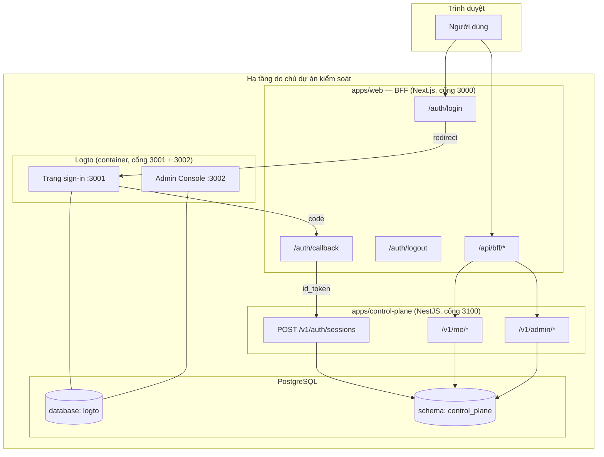
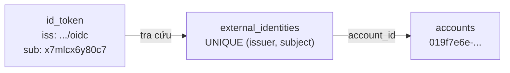
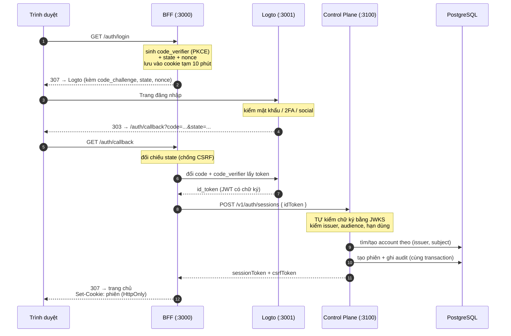
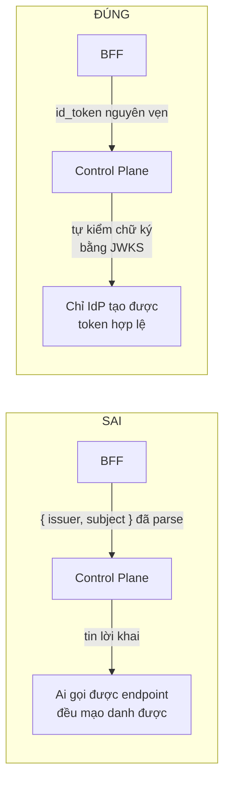
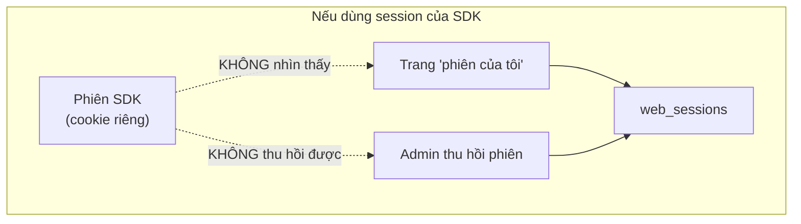
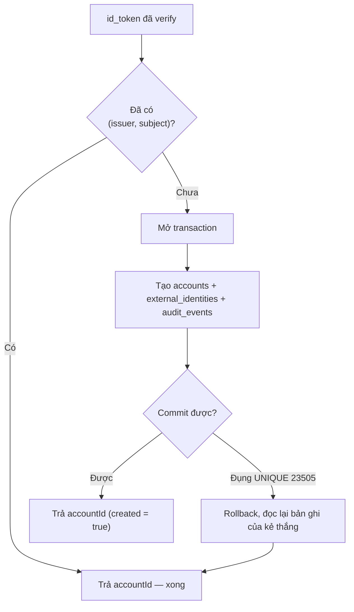

# Identity Provider — Logto

> **Đối tượng đọc:** cả team, không giả định biết trước về OAuth/OIDC.
> **Trạng thái:** đã triển khai và chạy thật ở môi trường development (P2).
> **Quyết định gốc:** [DEC-T22](./build-plan/decision-register.md) — Logto self-host, thay cho Auth0.

---

## 1. Vấn đề mà tài liệu này giải thích

Talosmine là Hub cho khoảng 10 ứng dụng dùng chung một tài khoản. Câu hỏi đầu tiên mọi
request phải trả lời được là: **"người đang gọi là ai, và làm sao ta tin được điều đó?"**

Tài liệu này mô tả cách hệ thống trả lời câu hỏi đó: ai chứng thực danh tính, dữ liệu nào
thuộc về ai, và vì sao ranh giới lại vẽ ở chỗ hiện tại.

---

## 2. Từ điển thuật ngữ

Đọc phần này trước, các phần sau sẽ dùng lại liên tục.

| Thuật ngữ | Nghĩa trong dự án này |
|---|---|
| **IdP** (Identity Provider) | Phần mềm chuyên xác minh danh tính. Ở đây là **Logto**. |
| **OIDC** (OpenID Connect) | Giao thức chuẩn để một ứng dụng hỏi IdP "người này là ai". Xây trên OAuth 2.0. |
| **issuer** (`iss`) | URL định danh IdP đã phát token. Của ta: `http://localhost:3001/oidc`. |
| **subject** (`sub`) | Định danh **không bao giờ đổi** của một người trong IdP. Khoá liên kết thật sự. |
| **id_token** | JWT có chữ ký, do IdP phát, nội dung là "người này là ai". |
| **JWT** | Chuỗi 3 phần `header.payload.signature`. Đọc được bằng mắt, **nhưng không sửa được** vì có chữ ký. |
| **claim** | Một trường trong token (`sub`, `email`, `name`…). |
| **JWKS** | Bộ khoá công khai của IdP, công bố tại `<issuer>/jwks`, dùng để kiểm tra chữ ký. |
| **Authorization Code** | Luồng đăng nhập chuẩn: IdP trả về một "mã đổi thưởng" ngắn hạn, server đổi mã đó lấy token. |
| **PKCE** | Cơ chế chống đánh cắp mã đổi thưởng. Đọc là "pixy". |
| **state** | Giá trị ngẫu nhiên chống CSRF trong luồng đăng nhập. |
| **nonce** | Giá trị ngẫu nhiên chống replay token cũ. |
| **BFF** (Backend for Frontend) | Lớp server đứng giữa trình duyệt và backend, giữ mọi bí mật. Ở đây là `apps/web`. |
| **Control Plane** | Backend nguồn sự thật: account, phiên, quyền, audit. `apps/control-plane`. |
| **session** (phiên) | Trạng thái "đang đăng nhập" **của Talosmine**, lưu ở bảng `web_sessions`. |
| **provisioning** | Việc tạo account nội bộ lần đầu khi một danh tính mới đăng nhập. |

---

## 3. Vì sao dùng IdP thay vì tự viết đăng nhập

Đăng nhập nghe đơn giản, nhưng phần khó nằm ở những thứ ít ai nghĩ tới:

- băm mật khẩu đúng cách (và đổi thuật toán khi tiêu chuẩn thay đổi);
- chống dò mật khẩu, chống nhồi credential từ vụ rò rỉ nơi khác;
- quên mật khẩu, xác minh email, chống chiếm tài khoản qua email;
- 2FA, đăng nhập bằng Google/Facebook;
- xoay khoá ký định kỳ mà không làm gãy phiên đang chạy.

Mỗi món đều có cách làm **sai âm thầm** — chạy vẫn chạy, chỉ không an toàn. Đây là loại
việc nên giao cho phần mềm chuyên dụng đã được nhiều người soi.

### Vì sao Logto chứ không phải Auth0

Auth0 là dịch vụ đám mây, dữ liệu xác thực nằm trên hạ tầng nước ngoài. Với yêu cầu về
nơi lưu trữ dữ liệu người dùng, ta cần IdP **chạy trên hạ tầng do chủ dự án kiểm soát**.

Logto đáp ứng: mã nguồn mở, self-host, dùng chuẩn OIDC. Việc chuyển từ Auth0 sang Logto
**không phá vỡ kiến trúc** vì cả hai đều nói cùng một giao thức — xem mục 6.

> Tài liệu này không phải tư vấn pháp lý. Việc tuân thủ quy định về dữ liệu cá nhân cần
> ý kiến chuyên môn pháp lý riêng.

---

## 4. Bản đồ hệ thống



**Điểm cần nhớ:** hai database tách biệt. Control Plane **không đọc** database `logto`,
và Logto **không đọc** schema `control_plane`. Ranh giới này đã được kiểm chứng cả hai chiều.

---

## 5. Quyền sở hữu dữ liệu

Đây là phần quan trọng nhất của tài liệu. Khi cần sửa gì, câu hỏi đầu tiên luôn là
"dữ liệu này thuộc về ai?"

| Dữ liệu | Chủ sở hữu | Nơi lưu |
|---|---|---|
| Mật khẩu (đã băm) | **Logto** | database `logto` |
| Email + trạng thái xác minh email | **Logto** | database `logto` |
| Cấu hình 2FA, social login | **Logto** | database `logto` |
| Khoá ký token, việc xoay khoá | **Logto** | database `logto` |
| Giao diện trang đăng nhập | **Logto** | database `logto` |
| Account của Talosmine | **Talosmine** | `control_plane.accounts` |
| Liên kết danh tính | **Talosmine** | `control_plane.external_identities` |
| Phiên đăng nhập | **Talosmine** | `control_plane.web_sessions` |
| Quyền quản trị (RBAC) | **Talosmine** | `control_plane.admin_*` |
| Nhật ký kiểm toán | **Talosmine** | `control_plane.audit_events` |

Ranh giới rút gọn thành một câu:

> **Logto trả lời "ai đây?". Mọi thứ sau đó là của Talosmine.**

Lưu ý một hệ quả thực tế: hồ sơ trong `accounts` (email, tên hiển thị) là **bản sao chép
tại thời điểm đăng nhập**, không phải nguồn sự thật. Nguồn sự thật về email là Logto.

---

## 6. `(issuer, subject)` — khoá liên kết danh tính

Đây là quyết định bảo mật cốt lõi, và là lý do việc đổi IdP không phá vỡ gì.



**Liên kết bằng `(issuer, subject)`, KHÔNG BAO GIỜ bằng email.**

Vì sao email không dùng được làm khoá:

1. **Email đổi được.** Người dùng đổi email thì account phải vẫn là account đó.
2. **Email được tái sử dụng.** Một địa chỉ công ty có thể lần lượt thuộc về hai nhân sự
   khác nhau. Liên kết bằng email nghĩa là người thứ hai thừa hưởng account người thứ nhất.
3. **Email có thể chưa được xác minh.** Ai cũng khai được một địa chỉ không thuộc về mình.

Ràng buộc này được thực thi ở tầng database, không phụ thuộc code nhớ đúng:

```sql
CREATE UNIQUE INDEX external_identities_issuer_subject_key
  ON control_plane.external_identities (issuer, subject);
-- KHÔNG có unique nào theo email.
```

Trong `accounts`, cột `email` **cố ý không unique** — đó không phải thiếu sót.

---

## 7. Luồng đăng nhập, từng bước



### Ba giá trị ngẫu nhiên bảo vệ ba thứ khác nhau

Chúng **không thay thế nhau được**:

| Giá trị | Chống lại | Cơ chế |
|---|---|---|
| `code_verifier` (PKCE) | Kẻ chặn được `code` trên đường truyền | Không có verifier thì `code` vô dụng |
| `state` | CSRF — kẻ tấn công ép nạn nhân hoàn tất phiên đăng nhập của **kẻ tấn công** | Callback phải khớp phiên ta khởi tạo |
| `nonce` | Replay — dùng lại một `id_token` cũ đã bắt được | Token phải gắn với đúng request này |

Trong code, việc đối chiếu do thư viện `openid-client` làm (`authorizationCodeGrant`),
**cố ý không tự viết** — một phép so sánh bảo mật viết sai rất khó phát hiện.

---

## 8. Vì sao Control Plane tự kiểm chữ ký

Đây là điểm dễ làm sai nhất trong toàn bộ thiết kế.

BFF gửi **nguyên `id_token`** sang Control Plane, chứ không gửi `issuer`/`subject` đã tự
đọc ra. Control Plane tải khoá công khai từ JWKS của Logto và tự kiểm chữ ký.



Nếu Control Plane tin claim do caller khai, thì bất cứ ai gọi được endpoint đó đều có thể
khai mình là người khác — kể cả admin. **Chữ ký của IdP là bằng chứng duy nhất.**

Nguyên tắc tổng quát: *không tin dữ liệu định danh do client gửi lên, kể cả khi client đó
là hệ thống của chính mình.*

Cài đặt: [`oidc-verifier.ts`](../apps/control-plane/src/modules/identity/oidc-verifier.ts)

---

## 9. Phiên đăng nhập là của Talosmine, không phải của Logto

Logto có SDK quản lý phiên bằng cookie riêng của nó. **Ta cố ý không dùng.**

Lý do: hệ thống đã có bảng `web_sessions` với đầy đủ khả năng thu hồi, liệt kê thiết bị và
ghi audit. Dùng cả hai sẽ tạo **hai hệ thống phiên song song**:



Hậu quả: người dùng bấm "đăng xuất mọi thiết bị" mà thiết bị kia vẫn vào được; admin thu
hồi phiên của tài khoản bị chiếm mà phiên đó vẫn sống. Toàn bộ hạ tầng phiên thành vô dụng.

Vì vậy: **OIDC chỉ làm đúng một việc là định danh.** Xong bước đó, ta tạo phiên của mình
và không dùng gì thêm từ IdP.

### Phiên được lưu như thế nào

| Khía cạnh | Cách làm | Lý do |
|---|---|---|
| Token trong DB | Chỉ lưu **băm SHA-256** | Rò rỉ database không cho phép mạo danh phiên |
| Token trong trình duyệt | Cookie `HttpOnly` | JavaScript không đọc được → XSS không lấy được phiên |
| CSRF token | Cookie **đọc được** + gửi qua header | Kẻ tấn công cross-site gửi được cookie nhưng không đọc được nó |
| Hạn dùng | Tính bằng đồng hồ **database** | Không phụ thuộc lệch giờ giữa các máy chủ |
| Thu hồi | Đánh dấu `revoked_at`, **không xoá row** | Giữ dấu vết để điều tra |

Tiền tố cookie `__Host-` buộc trình duyệt yêu cầu HTTPS, đường dẫn `/`, và **không cho
subdomain ghi đè**.

Cài đặt: [`web-session.ts`](../apps/control-plane/src/modules/identity/web-session.ts)

---

## 10. Provisioning — tạo account lần đầu

Khi một `(issuer, subject)` chưa từng thấy đăng nhập, hệ thống tạo account mới.



Hai điểm đáng chú ý:

**Chống race.** Hai request đồng thời cùng một danh tính mới — ví dụ người dùng bấm hai
lần — sẽ cùng thấy "chưa có account" và cùng thử tạo. Ràng buộc `UNIQUE` ở database quyết
định ai thắng; kẻ thua rollback rồi đọc lại kết quả của kẻ thắng. Kết quả luôn là **đúng
một account**. Việc này có test chạy 8 request song song để chứng minh.

**Audit trong cùng transaction.** Ghi audit nằm chung transaction với việc tạo account.
Nếu ghi audit thất bại, **toàn bộ rollback**. Không bao giờ có thay đổi nào không để lại
dấu vết.

Cài đặt: [`account-provisioning.ts`](../apps/control-plane/src/modules/identity/account-provisioning.ts)

---

## 11. Phân quyền quản trị — vì sao không dùng RBAC của Logto

Logto có sẵn RBAC và API resources. **Ta không dùng**, cùng lý do với phần phiên: đặt
quyền ở hai nơi thì sớm muộn hai nơi lệch nhau, và lúc đó không ai biết bên nào đúng.

Quyền quản trị nằm trong ba bảng của Control Plane, với danh mục **đóng** gồm 6 permission
được khoá bằng ràng buộc database:

```
account:read        tìm và xem account
account:disable     vô hiệu hoá account
account:enable      kích hoạt lại
session:revoke      thu hồi phiên của người dùng
admin_role:manage   quản lý role và phân quyền
audit:read          tra cứu nhật ký kiểm toán
```

Nguyên tắc **deny-by-default**: một route quản trị **không khai báo** permission sẽ bị
**từ chối**, chứ không phải cho qua. Quên khai báo là lỗi lập trình, và mặc định phải
nghiêng về an toàn.

Không có super-admin mặc định. Không có role ngầm.

---

## 12. Hai cổng của Logto — đừng nhầm

```
talosmine-logto (một container)
   ├── :3001  Sign-in + OIDC     ← người dùng cuối
   └── :3002  Admin Console      ← quản trị BẢN THÂN IdP
```

**Admin Console ở `:3002` không phải trang quản trị của Talosmine.**

| | Admin Console Logto `:3002` | Quản trị Talosmine `/admin` |
|---|---|---|
| Quản cái gì | Người dùng, application, connector của IdP | Account, khoá/mở, thu hồi phiên |
| Ai viết | Logto viết sẵn | Team tự viết |
| Phân quyền | Role nội bộ Logto | RBAC 6 permission ở mục 11 |
| Dữ liệu | database `logto` | schema `control_plane` |

> **Cảnh báo vận hành:** cổng `3002` **không được** mở ra internet ở production. Đó là cửa
> quản trị toàn bộ hệ thống danh tính. Hiện tại cả hai cổng chỉ bind vào `127.0.0.1`.

---

## 13. Cấu hình

Tên biến **cố ý trung tính** (`OIDC_*`, không phải `LOGTO_*`): hệ thống chỉ nói chuyện
bằng chuẩn OIDC. Đổi nhà cung cấp = đổi giá trị biến, không sửa code.

| Biến | Dùng ở đâu | Ý nghĩa |
|---|---|---|
| `OIDC_ISSUER_URL` | Control Plane + BFF | Định danh IdP. **Phải khớp chính xác** claim `iss` trong token |
| `OIDC_CLIENT_ID` | Control Plane + BFF | Định danh application |
| `OIDC_CLIENT_SECRET` | **Chỉ BFF** | Bí mật. Không bao giờ tới trình duyệt |
| `APP_BASE_URL` | BFF | Dùng dựng `redirect_uri` |
| `CONTROL_PLANE_BASE_URL` | BFF | Chi tiết nội bộ, không lộ ra client |

Không biến nào mang tiền tố `NEXT_PUBLIC_` — đó là điều kiện để bundler của Next **không
thể** nhúng giá trị vào mã chạy trên trình duyệt.

### Lỗi cấu hình hay gặp nhất

**Redirect URI phải khớp từng ký tự** với `<APP_BASE_URL>/auth/callback`. Thừa một dấu `/`
ở cuối là Logto từ chối, và thông báo lỗi thường không nói thẳng vấn đề nằm ở đâu.

**`ENDPOINT` của Logto phải đúng.** Logto dùng giá trị đó để dựng `issuer`. Nếu nó lệch
với `OIDC_ISSUER_URL` phía ta, việc kiểm chữ ký sẽ thất bại với thông báo khó hiểu.

---

## 14. Vận hành thường ngày

**Thêm cách đăng nhập mới (Google, Facebook…):** cài connector tương ứng trong Admin
Console. **Không phải sửa một dòng code nào** — ta nói chuyện với Logto qua OIDC, Logto lo
phần đi nói chuyện với Google.

Đáng chú ý: đăng nhập bằng Google **không** tạo provider mới trong `external_identities`.
Logto vẫn là `issuer`; Google chỉ là connector phía sau nó. Vì vậy cột `provider` bị khoá
cứng ở giá trị `'logto'`.

**Đổi giao diện trang đăng nhập:** mục Sign-in Experience trong Admin Console.

**Xoay client secret:** tạo secret mới trong Admin Console, cập nhật `OIDC_CLIENT_SECRET`
ở cả `.env.dev` và `apps/web/.env.local`, khởi động lại BFF.

---

## 15. Những gì chưa làm

Ghi lại để không ai tưởng đã có:

- **CAPTCHA / rate limit** — DEC-T23 chưa chốt. Hiện chưa có lớp chống spam đăng ký.
- **Propagate logout từ IdP.** Cột `web_sessions.idp_sid` đã có sẵn cho mục đích này nhưng
  chưa có endpoint nhận tín hiệu back-channel logout từ Logto.
- **Giao diện quản lý phiên.** API đã xong; trang cho người dùng xem và thu hồi phiên
  chưa dựng.
- **HTTPS.** Development chạy HTTP trên loopback. Production bắt buộc HTTPS — cookie
  `__Host-` yêu cầu điều đó.

---

## 16. Đọc code ở đâu

| Việc | File |
|---|---|
| Kiểm chữ ký `id_token` | [`oidc-verifier.ts`](../apps/control-plane/src/modules/identity/oidc-verifier.ts) |
| Tạo account lần đầu | [`account-provisioning.ts`](../apps/control-plane/src/modules/identity/account-provisioning.ts) |
| Tạo / kiểm / thu hồi phiên | [`web-session.ts`](../apps/control-plane/src/modules/identity/web-session.ts) |
| Guard xác thực | [`web-session.guard.ts`](../apps/control-plane/src/modules/identity/web-session.guard.ts) |
| Guard phân quyền admin | [`admin-permission.guard.ts`](../apps/control-plane/src/modules/admin/admin-permission.guard.ts) |
| Endpoint đổi token lấy phiên | [`auth.controller.ts`](../apps/control-plane/src/modules/identity/auth.controller.ts) |
| Luồng OIDC phía BFF | [`oidc.ts`](../apps/web/server/oidc.ts) |
| Route đăng nhập | [`login/route.ts`](../apps/web/app/auth/login/route.ts) |
| Route callback | [`callback/route.ts`](../apps/web/app/auth/callback/route.ts) |
| Route đăng xuất | [`logout/route.ts`](../apps/web/app/auth/logout/route.ts) |

**Tài liệu liên quan:** [`database-schema.md`](./database-schema.md) mục 4 (bảng identity),
[`modular.md`](./modular.md) mục 3 (ranh giới module) và mục 11 (quản trị).
