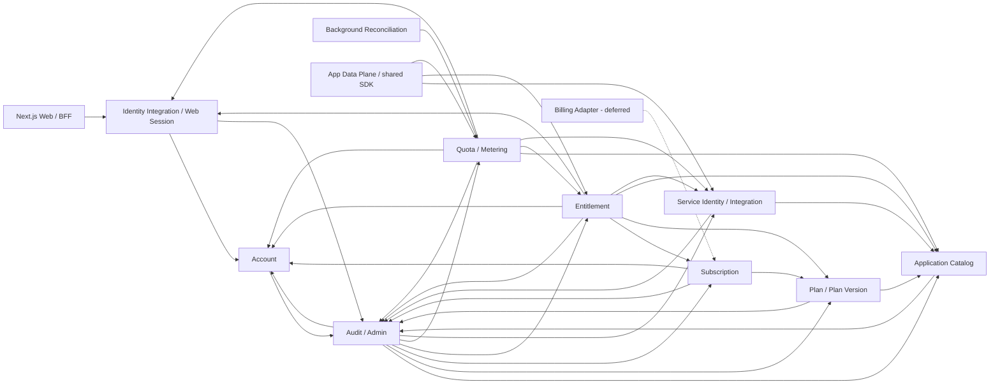

# Đặc tả module Talosmine

> **Trạng thái:** Đặc tả kiến trúc và hành vi để triển khai. Tài liệu này không tuyên bố bất kỳ module, API, bảng dữ liệu hay luồng nào đã được hiện thực.
>
> **Phạm vi:** Control Plane theo mô hình modular monolith, Web/BFF của Hub và ranh giới tích hợp với Data Plane. Tech stack tuân theo [`stack-tech.md`](./stack-tech.md); mô hình dữ liệu vật lý được đối chiếu riêng với `database-schema.md`.

## Mục lục

1. [Nguyên tắc kiến trúc](#1-nguyên-tắc-kiến-trúc)
2. [Ma trận tính năng](#2-ma-trận-tính-năng)
3. [Identity Integration / Web Session](#3-identity-integration--web-session)
4. [Account](#4-account)
5. [Application Catalog](#5-application-catalog)
6. [Plan / Plan Version](#6-plan--plan-version)
7. [Subscription](#7-subscription)
8. [Entitlement](#8-entitlement)
9. [Quota / Metering](#9-quota--metering)
10. [Service Identity / Integration](#10-service-identity--integration)
11. [Audit / Admin](#11-audit--admin)
12. [Background Reconciliation](#12-background-reconciliation)
13. [Billing Adapter — deferred](#13-billing-adapter--deferred)
14. [Luồng xuyên module](#14-luồng-xuyên-module)
15. [REST/OpenAPI surface](#15-restopenapi-surface)
16. [State machine](#16-state-machine)
17. [Ánh xạ module với bảng](#17-ánh-xạ-module-với-bảng)
18. [Phạm vi theo giai đoạn](#18-phạm-vi-theo-giai-đoạn)
19. [Acceptance checklist toàn hệ thống](#19-acceptance-checklist-toàn-hệ-thống)
20. [Quyết định nghiệp vụ còn mở](#20-quyết-định-nghiệp-vụ-còn-mở)

## 1. Nguyên tắc kiến trúc

### 1.1. Ranh giới hệ thống

- **Control Plane** là một NestJS modular monolith chạy trên Node.js, TypeScript strict và Fastify adapter. Mỗi module có domain, application ports và persistence riêng trong cùng process.
- **Web/BFF** dùng Next.js. BFF thực hiện OIDC Authorization Code với Auth0 SDK, PKCE, `state` và `nonce`, giữ session phía server và phát cookie `HttpOnly`, `Secure`, `SameSite` với CSRF protection phù hợp.
- **Data Plane** là backend của từng ứng dụng độc lập. Nó xác thực user, thực thi domain authorization và gọi Control Plane bằng M2M identity riêng để kiểm tra entitlement/quota.
- Data Plane truyền full `issuer + subject` từ user token đã xác minh; internal account reference chỉ được Identity resolve bên trong Control Plane sau exact service resource-scope check.
- **Shared SDK/middleware** chuẩn hóa việc xác thực, gọi API và ánh xạ lỗi tại Data Plane. Đây là boundary tích hợp, **không phải** module sở hữu domain của Control Plane.
- Hub là nơi khám phá và quản lý, không phải gateway bắt buộc. Truy cập trực tiếp URL ứng dụng phải hoạt động qua SSO và enforcement tại backend ứng dụng; traffic nghiệp vụ không bắt buộc đi qua Hub.
- MVP chỉ có subscription cá nhân. Organization, team, pooled quota và chia sẻ subscription không thuộc phạm vi.

### 1.2. Luật phụ thuộc

1. Module chỉ đọc/ghi các bảng mình sở hữu; không import repository, entity persistence hoặc truy vấn table của module khác.
2. Nhu cầu dữ liệu xuyên module phải đi qua **public application port** có input/output ổn định. MVP gọi đồng bộ trong cùng process; không biến lời gọi nội bộ thành HTTP loopback.
3. Controller/BFF chỉ điều phối use case công khai, không gọi thẳng repository.
4. Internal domain/integration event chỉ được phát **sau khi transaction đã commit**. Consumer phải idempotent và không được giả định event là transaction phân tán.
5. Audit bắt buộc không đi qua event bất đồng bộ. Mọi mutation nhạy cảm gọi `AuditAppendPort` đồng bộ trong cùng PostgreSQL transaction/shared Unit of Work; append audit thất bại phải rollback mutation. Caller không đọc Audit repository. Audit record dùng `operationId + sequence` để retry idempotent.
6. Event sau commit không thay thế transaction SQL có kiểm soát của hard quota hoặc audit bắt buộc. Quyết định `reserve` và ghi reservation/bucket/idempotency phải hoàn thành trong cùng ranh giới nguyên tử cần thiết. MVP không thêm outbox.
7. `audit_events` và `usage_events` là append-only. Sửa sai bằng event điều chỉnh hoặc bản ghi mới, không update/delete lịch sử.
8. PostgreSQL là ledger quota. Không dùng Redis hoặc cache phân tán làm nguồn sự thật cho số dư hard quota.
9. Authentication, service resource scope, entitlement rủi ro cao và hard quota mặc định fail-closed khi không thể xác minh.



Các mũi tên liền biểu thị dependency qua public port, gồm cả audit append đồng bộ trong shared Unit of Work. Mũi tên đứt biểu thị capability deferred, không cấp quyền đọc table.

### 1.3. Public application ports chính

| Port | Provider | Consumer chính | Cam kết |
|---|---|---|---|
| `AccountStatusPort` | Account | Identity, Subscription, Entitlement, Quota | Trả trạng thái account theo `accountId`; không lộ persistence model. |
| `AccountProvisioningPort` | Account | Identity | Tạo account `pending` trong shared Unit of Work do Identity orchestration điều khiển; port không tự hứa idempotency ngoài protocol provisioning. |
| `ExternalIdentityResolutionPort` | Identity | Entitlement, Quota | Nhận `issuer + subject` đã được caller xác minh và trả internal account reference; không resolve trước service resource-scope check. |
| `CatalogLookupPort` | Application Catalog | Plan, Entitlement, Quota, Service Identity | Resolve key ổn định và xác minh feature/metric thuộc đúng application. |
| `PlanVersionLookupPort` | Plan / Plan Version | Subscription, Entitlement | Chỉ trả snapshot published/retired theo nhu cầu use case; không cho sửa xuyên module. |
| `ActiveSubscriptionPort` | Subscription | Entitlement | Tính `effective_end` và trả subscription theo canonical DB-time predicate, kể cả `pending` đã tới `starts_at`; không phụ thuộc worker projection. |
| `EntitlementDecisionPort` | Entitlement | Data Plane adapter | Quyết định allow/deny sau exact feature-scope check; không trả tên plan để app suy luận. |
| `EntitlementEligibilityPort` | Entitlement | Quota | Kiểm tra entitlement nội bộ bằng account reference đã resolve sau exact quota metric-scope check; không mở endpoint cho Data Plane. |
| `ServiceScopeAuthorizationPort` | Service Identity | Entitlement, Quota | Xác minh M2M identity DB state, app binding và exact capability/resource scope trước khi đọc trạng thái user. |
| `QuotaReservationPort` | Quota | Data Plane adapter | `reserve`, `commit`, `cancel`, `getStatus` idempotent và fail-closed. |
| `QuotaReconciliationPort` | Quota | Background Reconciliation | List due candidates và thử expire/reconcile dưới transaction lock + state recheck; candidate có thể xuất hiện ở nhiều invocation mà không lộ repository. |
| `AuditAppendPort` | Audit / Admin | Các module có mutation nhạy cảm | Append đồng bộ bằng `operationId + sequence` trong transaction của mutation; lỗi append rollback mutation. |
| `SubscriptionMutationPort` | Subscription | Admin; Billing Adapter tương lai | Thay đổi vòng đời có effective time, source từ authenticated actor/integration, namespaced idempotency và audit context. |

## 2. Ma trận tính năng

| Capability | User | Admin | System / backend ứng dụng |
|---|---|---|---|
| Đăng ký, đăng nhập, đăng xuất | Thực hiện qua Auth0/BFF | Revoke session theo quyền | Xử lý callback, map identity, duy trì session hash |
| Hồ sơ và trạng thái account | Xem/sửa trường được phép | Activate/disable/enable theo transition canonical | Chỉ `active` được cấp quyền; không hard delete |
| Catalog | Khám phá app đang hiển thị | Quản lý app, redirect, feature, metric | Resolve key và kiểm tra ownership |
| Plan/version | Xem thông tin được công bố phù hợp | Soạn, publish, retire | Cung cấp snapshot bất biến |
| Subscription cá nhân | Xem subscription của mình | Tạo/chuyển/hủy theo policy đã chốt | Tính hiệu lực theo database clock |
| Entitlement | Xem quyền hiệu lực của mình | Tạo/revoke override có reason | Quyết định allow/deny cho Data Plane |
| Quota | Xem usage tham khảo | Điều chỉnh limit override có reason | Reserve/commit/cancel/status/expire/reconcile |
| Service identity | Không | Đăng ký, cấp/revoke scope theo exact feature/metric | Mỗi backend có identity riêng; re-authorize từng operation |
| Audit | Chỉ phần lịch sử được policy cho phép | Tra cứu theo quyền | Append đồng bộ cùng sensitive mutation |
| Billing | Chưa có trong MVP | Chưa có trong MVP | Adapter/provider deferred |

## 3. Identity Integration / Web Session

### 3.1. Mục tiêu, trách nhiệm và ngoài phạm vi

Module tích hợp Auth0 với account nội bộ, xử lý callback OIDC của Web/BFF và quản lý vòng đời web session. Khóa mapping duy nhất là cặp `(issuer, subject)` từ token đã xác minh; email chỉ là thuộc tính hồ sơ và không được dùng để liên kết hoặc merge account.

Ngoài phạm vi: lưu password/credential Auth0, tự phát triển identity provider, quyết định entitlement, quản lý phiên cục bộ của từng Data Plane và sở hữu hồ sơ account.

### 3.2. Tính năng

- **User:** bắt đầu signup/login, hoàn tất callback, dùng session Hub, logout; chỉ quay lại redirect URI nằm trong exact allowlist.
- **Admin:** revoke một hoặc toàn bộ web session của account khi có quyền phù hợp; không xem session token thô.
- **System:** xác minh issuer/audience/signature/expiry/`state`/`nonce`/PKCE theo Auth0 SDK; provision mapping race-safe bằng shared Unit of Work; lưu hash session, rotate/revoke và loại bỏ session hết hạn.

### 3.3. Command và query chính

- `HandleOidcCallbackCommand`
- `CreateWebSessionCommand`
- `RotateWebSessionCommand`
- `LogoutWebSessionCommand`
- `RevokeAccountWebSessionsCommand`
- `ResolveExternalIdentityQuery`
- `GetWebSessionQuery`
- `ValidateReturnUrlQuery`

### 3.4. Invariant và authorization

- Unique identity là `(issuer, subject)`; callback lặp không tạo account/mapping thứ hai.
- Không auto-link bằng email, kể cả email đã verified. Quy trình link/merge thủ công chưa được định nghĩa và không thuộc MVP nếu chưa có quyết định riêng.
- Chỉ lưu hash của session identifier/token; giá trị cookie thô không được ghi database hoặc log.
- Session revoked/expired không được khôi phục bằng rotate. Logout phải revoke server-side session liên quan và xóa cookie BFF.
- Return URL phải exact-match một URI đã đăng ký; không dùng prefix, suffix hoặc wildcard ngầm định. `state` và `nonce` không hợp lệ phải fail-closed.
- Callback chỉ tin claims sau khi Auth0 SDK xác minh. Trạng thái account được kiểm tra trước khi tạo/tiếp tục session.

### 3.5. Dependency và port được phép

- Cung cấp `ExternalIdentityResolutionPort.resolveVerifiedIdentity(issuer, subject)` cho Entitlement/Quota; input chỉ được nhận sau khi token user đã được Data Plane xác minh và service resource scope đã được Control Plane chấp thuận.
- Khi mapping chưa tồn tại, Identity orchestration mở một shared PostgreSQL Unit of Work, gọi `AccountProvisioningPort.provisionAccount()` để tạo account `pending`, rồi ghi external identity mapping trong **cùng transaction** dù ownership repository vẫn tách theo module.
- Nếu unique `(issuer, subject)` conflict do race, toàn bộ transaction phải rollback nên không để account orphan. Orchestration mở transaction mới để đọc mapping của transaction thắng; `AccountProvisioningPort` không tự chịu trách nhiệm deduplicate ngoài protocol này.
- Gọi `AccountStatusPort.getAccountStatus()` trước khi tạo/rotate session.
- Gọi `CatalogLookupPort.isAllowedRedirectUri()` khi return URL thuộc application catalog; redirect của chính Hub vẫn phải theo cấu hình BFF được phê duyệt.
- Mutation nhạy cảm append audit đồng bộ qua `AuditAppendPort` trong cùng Unit of Work; lỗi audit rollback mutation. Caller không đọc `accounts`, `applications` hoặc Audit repository trực tiếp.

### 3.6. Domain event / integration effect

Sau commit: `ExternalIdentityLinked`, `WebSessionCreated`, `WebSessionRevoked`, `AccountProvisioningRequested`. Đây là integration/observability event, không thay audit bắt buộc; không event nào được chứa cookie/session token thô.

### 3.7. Dữ liệu sở hữu

`external_identities`, `web_sessions`.

### 3.8. Giai đoạn

MVP Phase 1. Global logout/revoke propagation đến phiên cục bộ của mọi app phụ thuộc revoke SLA còn mở; Phase 5 hardening cơ chế invalidation và vận hành.

### 3.9. Acceptance criteria

- Hai callback đồng thời cùng `(issuer, subject)` tạo đúng một mapping và một account; transaction thua rollback cả account lẫn mapping, rồi transaction mới đọc mapping thắng, không để account orphan.
- Cùng email nhưng khác `(issuer, subject)` không bị tự động merge.
- Callback sai `state`/`nonce`, token sai audience/issuer hoặc return URL không exact-match đều bị từ chối trước khi tạo session.
- Database/log không chứa session token thô; session đã revoke không xác thực được.
- Logout xóa cookie BFF và đánh dấu session server-side đã revoke.

## 4. Account

### 4.1. Mục tiêu, trách nhiệm và ngoài phạm vi

Account là aggregate gốc cho một cá nhân trong MVP, giữ hồ sơ tối thiểu và trạng thái truy cập. Account không bị hard delete; việc vô hiệu hóa phải bảo toàn quan hệ lịch sử và audit.

Ngoài phạm vi: credential/identity mapping, organization/team, subscription, plan, usage ledger và dữ liệu domain của ứng dụng.

### 4.2. Tính năng

- **User:** xem account của mình; cập nhật các trường hồ sơ được cho phép.
- **Admin:** disable/enable account với quyền, reason và audit; xem trạng thái phục vụ hỗ trợ.
- **System:** tạo account `pending` theo shared Unit of Work do Identity orchestration điều khiển; kích hoạt sau khi thỏa policy provisioning đã phê duyệt; cung cấp status cho các quyết định authorization.

### 4.3. Command và query chính

- `ProvisionAccountCommand`
- `ActivateAccountCommand`
- `UpdateOwnProfileCommand`
- `DisableAccountCommand`
- `EnableAccountCommand`
- `GetOwnAccountQuery`
- `GetAccountStatusQuery`

### 4.4. Invariant và authorization

- Account chỉ có `pending`, `active`, `disabled`. Transition hợp lệ là `pending -> active`, `pending -> disabled`, `active -> disabled` và `disabled -> active`.
- `disabled -> active` chỉ qua `EnableAccountCommand` với admin permission, reason và audit đồng bộ. `ActivateAccountCommand` chỉ áp dụng `pending -> active` theo provisioning policy, không dùng để né kiểm soát enable.
- Chỉ account `active` có thể được cấp entitlement/reserve. Account `pending` chưa được cấp quyền; account `disabled` luôn làm entitlement deny và quota reserve deny, bất kể subscription/override còn hiệu lực.
- User chỉ đọc/sửa account của chính mình và chỉ với field allowlist; admin cần permission riêng cho đọc và mutation.
- Disable/enable yêu cầu reason không rỗng, actor và correlation ID để audit.

### 4.5. Dependency và port được phép

Account không đọc domain module khác. Nó cung cấp `AccountProvisioningPort` và `AccountStatusPort`; Identity có thể gọi provisioning port trong shared Unit of Work. Mutation nhạy cảm append audit đồng bộ qua `AuditAppendPort` trong cùng transaction, và audit failure rollback mutation.

### 4.6. Domain event / integration effect

Sau commit: `AccountProvisioned`, `AccountActivated`, `AccountDisabled`, `AccountEnabled`, `AccountProfileUpdated`. `AccountDisabled` là tín hiệu invalidation/revoke; thời gian hội tụ phụ thuộc revoke SLA được phê duyệt.

### 4.7. Dữ liệu sở hữu

`accounts`.

### 4.8. Giai đoạn

Provision/status trong Phase 1; admin lifecycle và hardening hoàn thiện dần Phase 2–5. Organization/team deferred ngoài phạm vi hiện tại.

### 4.9. Acceptance criteria

- Account tạo bởi provisioning bắt đầu ở `pending`; tính duy nhất theo external identity và xử lý race thuộc protocol Identity orchestration, không phải lời hứa idempotency độc lập của Account port.
- Không có API/repository use case hard-delete account.
- Sau disable, entitlement decision và reservation mới đều deny với reason ổn định.
- Account `pending` chưa được cấp entitlement/reserve; chỉ `pending -> active` làm account đủ điều kiện cho các quyết định tiếp theo.
- Mutation của user không sửa được status hoặc field quản trị.
- Mọi transition ngoài `pending -> active`, `pending -> disabled`, `active -> disabled`, `disabled -> active` đều bị từ chối; riêng `disabled -> active` chỉ chạy qua `EnableAccountCommand` có admin permission/reason.
- Disable/enable không chạy khi thiếu permission hoặc reason; audit được append trong cùng transaction và lỗi append rollback transition.

## 5. Application Catalog

### 5.1. Mục tiêu, trách nhiệm và ngoài phạm vi

Catalog đăng ký application, exact redirect URI, feature và usage metric bằng key ổn định để app tích hợp không phụ thuộc tên plan. Metric phải mô tả semantics đã được chủ sản phẩm/chủ app duyệt trước khi được dùng cho hard quota.

Ngoài phạm vi: dữ liệu nghiệp vụ app, routing/proxy traffic app, plan grant, số quota, usage ledger và service credential.

### 5.2. Tính năng

- **User:** xem danh sách/metadata app được phép hiển thị và mở URL app; catalog không tự chứng minh entitlement.
- **Admin:** đăng ký/cập nhật trạng thái app, URI, feature, metric; phê duyệt semantics metric qua quy trình có reason/audit.
- **System:** resolve key, exact-match redirect, xác minh feature/metric thuộc đúng application và cung cấp metadata integration tối thiểu.

### 5.3. Command và query chính

- `RegisterApplicationCommand`
- `UpdateApplicationCommand`
- `SetApplicationStatusCommand`
- `AddRedirectUriCommand`
- `RemoveRedirectUriCommand`
- `RegisterFeatureCommand`
- `RegisterUsageMetricCommand`
- `ApproveUsageMetricSemanticsCommand`
- `ListApplicationsQuery`
- `ResolveFeatureQuery`
- `ResolveUsageMetricQuery`
- `IsAllowedRedirectUriQuery`

### 5.4. Invariant và authorization

- `applicationKey`, `featureKey` và `metricKey` ổn định sau khi được tham chiếu; đổi label không đổi key.
- Feature và metric phải thuộc đúng application; không resolve cặp key chéo app.
- Redirect URI phải exact-match bản ghi active; thay đổi URI là mutation nhạy cảm có reason/audit.
- Metric chưa được duyệt semantics không được gắn quota policy hoặc dùng để reserve. Semantics phải nêu đơn vị và counting point/failure behavior sau khi các quyết định đó được chốt.
- Chỉ admin có permission catalog tương ứng được mutation; user/system chỉ đọc phạm vi cần thiết.

### 5.5. Dependency và port được phép

Catalog không cần đọc module domain khác. Nó cung cấp `CatalogLookupPort`; mutation nhạy cảm append audit đồng bộ qua `AuditAppendPort` trong cùng transaction, và audit failure rollback mutation.

### 5.6. Domain event / integration effect

Sau commit: `ApplicationRegistered`, `ApplicationStatusChanged`, `RedirectUriChanged`, `FeatureRegistered`, `UsageMetricRegistered`, `UsageMetricSemanticsApproved`.

### 5.7. Dữ liệu sở hữu

`applications`, `application_redirect_uris`, `features`, `usage_metrics`.

### 5.8. Giai đoạn

Application/redirect tối thiểu trong Phase 1; feature trong Phase 2; approved usage metric trong Phase 3; onboarding hàng loạt Phase 4.

### 5.9. Acceptance criteria

- Rename label không làm thay đổi key được app sử dụng.
- Feature/metric của app A không resolve được dưới app B.
- URI gần giống nhưng không exact-match bị từ chối.
- Metric chưa duyệt không thể đi vào quota policy/reservation.
- Catalog API không trả hoặc lưu dữ liệu domain của app và không proxy business traffic.

## 5b. Site Content — điều hướng header/footer

> Module ngoài P0–P9, đến từ yêu cầu trực tiếp của chủ dự án. Quyết định nền: DEC-T25
> (i18n), DEC-T26 (cache + fallback), DEC-B15 (danh sách ngôn ngữ).

### 5b.1. Mục tiêu, trách nhiệm và ngoài phạm vi

Đưa **nội dung điều hướng** (nhãn menu header, các cột footer) ra khỏi code để quản trị viên
sửa được mà không deploy.

Ranh giới cốt lõi: **code quyết định CHỖ NÀO có gì, dữ liệu quyết định CHỮ GÌ nằm ở đó.** Bố
cục, số cột, thứ tự section và cấu trúc HTML vẫn nằm trong code và đi qua review.

Ngoài phạm vi: không nhận HTML từ người biên tập (CSP theo nonce sẽ chặn, và nới CSP để chạy
page-builder là đánh đổi tệ nhất trong kiến trúc này); không quản lý bài viết/trang nội dung
(đó là hệ thống blog, xem pending-work D1); không quyết định ai được xem gì.

### 5b.2. Tính năng

Thêm/sửa/xoá/sắp xếp mục điều hướng theo từng vị trí menu; nhãn song ngữ; vòng đời
`draft → active ⇄ inactive`; đọc công khai theo một ngôn ngữ.

### 5b.3. Command và query chính

- `getPublicNav(locale)` — chỉ mục `active`, chỉ ngôn ngữ yêu cầu.
- `listForAdmin()` — mọi trạng thái, mọi ngôn ngữ.
- `create` / `update` / `changeStatus` / `reorder` / `remove`.

### 5b.4. Invariant và authorization

- Vị trí menu là **danh mục đóng**; runtime không tạo/sửa/xoá được vị trí.
- Mục mới **luôn** ở `draft`; không quay lại `draft` sau khi đã phát hành.
- Ba permission tách bạch: `content:read`, `content:manage`, `content:publish`. Tách `publish`
  vì đưa một mục sang `active` là đặt nó lên header/footer của **mọi** trang cho **mọi** khách.
- `href` đi qua chính sách URL trước khi chạm database — đây là bề mặt open redirect.
- Mọi mutation bắt buộc `reason` và ghi audit **đồng bộ trong cùng transaction**.
- Mục thiếu bản dịch bị **bỏ qua** ở ngôn ngữ đó, không rơi về ngôn ngữ khác.

### 5b.5. Dependency và port được phép

Tiêu thụ `WebSessionGuard` (Identity) và `AdminPermissionGuard` (Admin). Dùng
`checkUrlSyntax` của shared url-policy cho `href` ngoài. **Không export gì** — chưa module
nào cần tra cứu điều hướng, và mở service ra ngoài là mời module khác ghi mà không qua
permission guard.

### 5b.6. Domain event / integration effect

Không phát event. Web đọc qua HTTP và tự cache — xem 5b.8.

### 5b.7. Dữ liệu sở hữu

`nav_menus`, `nav_items`, `nav_item_translations` (database-schema mục 10b).

### 5b.8. Giai đoạn

Đã hiện thực: điều hướng header/footer. Kế tiếp: content slot cho tiêu đề/mô tả section, và
SEO theo route (pending-work D0).

Đường đọc phía web có **cache in-process TTL 60 giây** và **fallback bắt buộc** về hằng trong
code. Fallback không phải phòng xa: header/footer nằm trên mọi trang, nên một sự cố Control
Plane không có đường lui sẽ biến lỗi cục bộ thành sự cố toàn site.

### 5b.9. Acceptance criteria

- Đường đọc công khai không cần phiên đăng nhập và không lộ mục `draft`.
- `content:manage` không phát hành được.
- Sắp xếp lại chạy trong một transaction (cần unique `DEFERRABLE`).
- `href` dạng `//host`, `javascript:`, host ngoài allowlist đều bị từ chối.
- Control Plane không phản hồi → trang vẫn render bằng menu dự phòng.

## 6. Plan / Plan Version

### 6.1. Mục tiêu, trách nhiệm và ngoài phạm vi

Plan là danh tính sản phẩm; Plan Version là snapshot grant/quota policy. Vòng đời bắt buộc `draft -> published -> retired`; snapshot published bất biến để subscription cũ không bị thay đổi ngầm.

Ngoài phạm vi: giá/payment provider, subscription lifecycle, effective entitlement và usage ledger. App không nhận tên plan để hard-code policy.

### 6.2. Tính năng

- **User:** xem mô tả plan được phép công bố nếu product scope yêu cầu; dữ liệu này chỉ để trình bày.
- **Admin:** tạo plan/version, cấu hình feature grant/quota policy trên draft, validate, publish và retire.
- **System:** trả snapshot theo ID/version cho Subscription và Entitlement; từ chối mutation snapshot đã publish.

### 6.3. Command và query chính

- `CreatePlanCommand`
- `CreatePlanVersionCommand`
- `SetPlanFeatureGrantCommand`
- `SetPlanQuotaPolicyCommand`
- `PublishPlanVersionCommand`
- `RetirePlanVersionCommand`
- `GetPlanVersionSnapshotQuery`
- `ListPublishedPlansQuery`

### 6.4. Invariant và authorization

- Chỉ transition `draft -> published -> retired`; không quay lại draft và không publish lại retired version.
- Grant/policy chỉ sửa khi version là draft. Sau publish, row cấu thành snapshot không được update/delete; thay đổi tạo version mới.
- Grant và quota policy chỉ tham chiếu feature/metric hợp lệ, đúng application; metric phải có semantics approved.
- Publish yêu cầu snapshot hợp lệ, admin permission, reason và audit.
- Published version có thể tiếp tục phục vụ subscription hiện hữu sau khi retired; retired chỉ ngăn lựa chọn mới, trừ khi policy tương lai quy định khác.

### 6.5. Dependency và port được phép

- Gọi `CatalogLookupPort` để validate feature/metric ownership và trạng thái semantics.
- Cung cấp `PlanVersionLookupPort` cho Subscription/Entitlement.
- Append audit đồng bộ qua `AuditAppendPort` trong cùng transaction cho mutation nhạy cảm; audit failure rollback mutation. Không đọc table catalog/subscription.

### 6.6. Domain event / integration effect

Sau commit: `PlanCreated`, `PlanVersionPublished`, `PlanVersionRetired`. Publish event mang identifier/version, không sao chép toàn bộ policy nhạy cảm nếu consumer có thể query port.

### 6.7. Dữ liệu sở hữu

`plans`, `plan_versions`, `plan_feature_grants`, `plan_quota_policies`.

### 6.8. Giai đoạn

MVP entitlement trong Phase 2; quota policies trong Phase 3; catalog plan trả phí/billing vẫn deferred đến Phase 5.

### 6.9. Acceptance criteria

- API từ chối sửa grant/policy của published hoặc retired version.
- Publish draft thiếu/không hợp lệ hoặc tham chiếu metric chưa duyệt bị từ chối.
- Retire không sửa snapshot và không làm subscription hiện hữu tự chuyển version.
- App tích hợp bằng feature/metric key, không cần biết plan name.
- Hai lần publish retry cùng idempotency context không tạo hai version/trạng thái mâu thuẫn.

## 7. Subscription

### 7.1. Mục tiêu, trách nhiệm và ngoài phạm vi

Subscription gắn một account cá nhân với đúng một published Plan Version trong khoảng thời gian hiệu lực. Các trạng thái canonical duy nhất là `pending`, `active`, `cancel_at_period_end`, `suspended`, `canceled`, `expired`; module ngăn mọi timeline overlap.

Ngoài phạm vi: organization/team subscription, payment/refund processing, tính entitlement trực tiếp, sửa snapshot plan và ledger quota.

### 7.2. Tính năng

- **User:** xem subscription hiện tại/sắp tới của mình; yêu cầu thay đổi plan chỉ khi use case và policy đã được chốt.
- **Admin:** tạo pending subscription, suspend/resume, đặt hoặc bỏ `cancel_at_period_end`, cancel/expire hoặc chuyển version bằng command có effective time, trusted source, reason và audit.
- **System:** tính hiệu lực trực tiếp theo database time, không chờ worker; nhận mutation idempotent từ Billing Adapter trong tương lai và hội tụ state projection nền.

### 7.3. Command và query chính

- `CreateSubscriptionCommand`
- `ChangeSubscriptionCommand`
- `SuspendSubscriptionCommand`
- `ResumeSubscriptionCommand`
- `SetCancelAtPeriodEndCommand`
- `CancelSubscriptionCommand`
- `ExpireSubscriptionCommand`
- `GetActiveSubscriptionQuery`
- `GetSubscriptionTimelineQuery`
- `ListOwnSubscriptionsQuery`

### 7.4. Invariant và authorization

- Chủ thể là một account cá nhân; không có `organizationId` hoặc pooled owner trong MVP.
- Subscription mới chỉ tham chiếu published Plan Version. Retired version không được chọn mới nhưng subscription đã tham chiếu vẫn giữ snapshot.
- `effective_end = LEAST(cancel_at, ends_at)` theo PostgreSQL semantics: `LEAST` bỏ qua operand `NULL`; nếu cả hai đều `NULL` thì `effective_end` là `NULL` và được hiểu là infinity khi so sánh hiệu lực.
- Tại database time `t`, subscription cấp quyền khi và chỉ khi `starts_at <= t`, `t < COALESCE(effective_end, infinity)` và status thuộc `pending|active|cancel_at_period_end`.
- Canonical interval của mọi row, không phân biệt status, là `[starts_at, effective_end)`, với infinity khi `effective_end` là `NULL`. Overlap check không loại `suspended`, `canceled` hoặc `expired`; mutation khóa account để serialize việc kiểm tra. Subscription mới được phép bắt đầu đúng tại `effective_end` của row trước vì end là exclusive.
- `pending` là projection cho hiệu lực tương lai và tự có hiệu lực khi `starts_at` đến; authorization không chờ worker đổi state sang `active`. `suspended`, `canceled`, `expired` không cấp quyền.
- `cancel_at_period_end` bắt buộc có `cancel_at > starts_at`; nếu có `ends_at` thì `cancel_at <= ends_at`. Entitlement ngừng ngay tại `cancel_at` theo predicate dù worker chưa hội tụ state. Khi database time đạt `cancel_at`, worker có thể hội tụ sang `canceled` hoặc `expired` theo business semantics đã phê duyệt; tài liệu này không chọn nhánh.
- Mọi transition sang `canceled` hoặc `expired` phải ghi `ends_at` hữu hạn bằng effective terminal time trong cùng transaction. Terminal row không được giữ interval vô hạn, kể cả khi `cancel_at` hoặc `ends_at` trước đó là `NULL`.
- Account disabled không làm mất bản ghi subscription nhưng Entitlement vẫn deny.
- Upgrade/downgrade/cancel timing chưa được chốt; không tự mặc định immediate hoặc end-of-period.
- User chỉ xem dữ liệu của mình; mutation cần admin permission hoặc source billing đã xác minh trong tương lai.
- Mọi mutation retry-sensitive claim namespace `(trusted source, operation, idempotency key)`, lưu fingerprint và replay outcome. Cùng key/fingerprint replay outcome; cùng key nhưng fingerprint khác conflict. `source` lấy từ authenticated actor/integration, không tin field client tùy ý.
- Lock order canonical của mutation là subscription idempotency record -> account -> subscription.

### 7.5. Dependency và port được phép

- `AccountStatusPort` xác minh account tồn tại; disabled vẫn có thể được lưu lịch sử nhưng không cấp quyền.
- `PlanVersionLookupPort` xác minh version published khi tạo hoặc lập thay đổi có hiệu lực tương lai.
- Cung cấp `ActiveSubscriptionPort`; cung cấp `SubscriptionMutationPort` cho Admin/Billing Adapter.
- Mutation nhạy cảm append audit đồng bộ qua `AuditAppendPort` trong cùng transaction; audit failure rollback mutation.

### 7.6. Domain event / integration effect

Sau commit: `SubscriptionCreated`, `SubscriptionPending`, `SubscriptionActivated`, `SubscriptionCancelAtPeriodEndSet`, `SubscriptionSuspended`, `SubscriptionCanceled`, `SubscriptionExpired`, `SubscriptionPlanVersionChanged`. Đây là integration/observability event; consumer invalidation phải idempotent và event không thay audit trong transaction.

### 7.7. Dữ liệu sở hữu

`subscriptions`, `subscription_idempotency_records`.

### 7.8. Giai đoạn

Subscription thủ công/tối thiểu Phase 2. Lifecycle đầy đủ và paid source Phase 5 sau khi chốt billing policy.

### 7.9. Acceptance criteria

- Tạo subscription với draft/retired version mới bị từ chối.
- Hai canonical interval `[starts_at, effective_end)` cho cùng account không overlap ở bất kỳ status nào; concurrent request được serialize bằng account lock, trong khi row mới bắt đầu đúng tại prior `effective_end` được chấp nhận.
- Query tại biên thời gian tính `effective_end = LEAST(cancel_at, ends_at)` với PostgreSQL NULL semantics và dùng đúng predicate `starts_at <= t AND t < COALESCE(effective_end, infinity)` với status `pending|active|cancel_at_period_end`; kết quả có tối đa một subscription hiệu lực.
- Pending subscription tự cấp hiệu lực khi database time đạt `starts_at` dù worker chưa cập nhật projection; `suspended|canceled|expired` không cấp quyền.
- `cancel_at_period_end` thiếu/không hợp lệ `cancel_at` bị từ chối; entitlement ngừng tại `cancel_at` dù state projection chưa terminal.
- Transition sang `canceled`/`expired` atomically ghi `ends_at` hữu hạn bằng effective terminal time; test xác nhận terminal row không có interval vô hạn và không tự chọn nhánh cuối kỳ khi business semantics chưa được duyệt.
- Cancel/downgrade không tự áp dụng timing khi policy chưa cấu hình/được phê duyệt.
- Retry mutation cùng `(trusted source, operation, key)` và fingerprint replay outcome; fingerprint khác conflict, source do authenticated actor/integration xác lập.
- Concurrent mutation tuân thủ lock order idempotency -> account -> subscription và audit failure rollback mutation.

## 8. Entitlement

### 8.1. Mục tiêu, trách nhiệm và ngoài phạm vi

Entitlement nhận verified `issuer + subject`, resolve internal account reference sau service resource-scope check, rồi tính quyết định dẫn xuất cho `account + application + feature + time/context` từ account, effective subscription, immutable plan grants và override. Module chỉ sở hữu override, không lưu một bảng effective entitlement làm nguồn sự thật.

Ngoài phạm vi: authentication của user, domain authorization trong app, hard quota deduction, plan/subscription mutation và cache dài hạn không có revoke policy.

### 8.2. Tính năng

- **User:** xem quyền hiệu lực của chính mình ở mức không lộ dữ liệu quản trị nhạy cảm.
- **Admin:** tạo/revoke entitlement override có scope, hiệu lực, reason và audit.
- **System/Data Plane:** nhận allow/deny kèm machine-readable reason, decision time, policy/version và cache directive.

### 8.3. Command và query chính

- `CreateEntitlementOverrideCommand`
- `RevokeEntitlementOverrideCommand`
- `DecideEntitlementQuery`
- `ListOwnEntitlementsQuery`
- `ListAccountEntitlementOverridesQuery`

### 8.4. Invariant và authorization

- M2M identity DB state, application binding và exact `entitlement:decide` scope gắn với feature được kiểm tra **trước khi** gọi `ExternalIdentityResolutionPort` hoặc trả bất kỳ user state nào.
- Data Plane gửi full `issuer + subject` lấy từ user token đã xác minh; API không nhận hoặc tin `accountId` do Data Plane/browser khai.
- Chỉ account `active` có thể allow; `pending` hoặc `disabled` luôn deny.
- Không có subscription hiệu lực theo canonical DB-time predicate hoặc grant hợp lệ thì deny; không suy luận từ plan name.
- Deny override đang hiệu lực thắng allow override và plan grant. Override hết hạn không ảnh hưởng quyết định.
- Feature phải thuộc đúng application đã bind với caller.
- App vẫn phải thực hiện domain authorization sau entitlement allow.
- Last-known-good chỉ được dùng cho feature rủi ro thấp khi outage policy/TTL đã được phê duyệt; nếu chưa có policy thì fail-closed.

### 8.5. Dependency và port được phép

- Gọi theo thứ tự: `ServiceScopeAuthorizationPort` cho exact feature, `ExternalIdentityResolutionPort`, `AccountStatusPort`, `CatalogLookupPort`, `ActiveSubscriptionPort`, `PlanVersionLookupPort`.
- Cung cấp `EntitlementDecisionPort` cho Data Plane và `EntitlementEligibilityPort` nội bộ cho Quota sau khi Quota đã kiểm tra exact metric scope và resolve identity.
- Override mutation append audit đồng bộ qua `AuditAppendPort` trong cùng transaction; failure rollback override. Module không đọc repository của các provider.

### 8.6. Domain event / integration effect

Sau commit: `EntitlementOverrideCreated`, `EntitlementOverrideRevoked`. Effect yêu cầu invalidation decision cache theo account/application/feature; hiệu lực ngoài process phải đáp ứng revoke SLA sau khi SLA được chốt.

### 8.7. Dữ liệu sở hữu

`entitlement_overrides`, `quota_limit_overrides`.

`quota_limit_overrides` lưu exception policy do Entitlement quản trị; Quota chỉ nhận effective limit qua public port/decision contract, không đọc bảng này trực tiếp.

### 8.8. Giai đoạn

Decision từ plan grant trong Phase 2; quota limit override được dùng từ Phase 3; cache invalidation/revoke hardening Phase 4–5.

### 8.9. Acceptance criteria

- Caller sai app/feature scope nhận deny trước identity resolution nên không biết external identity/account tồn tại, trạng thái hay plan.
- API từ chối payload chỉ có `accountId`; verified full `issuer + subject` resolve đúng internal account reference.
- Account disabled và deny override đều thắng mọi allow/grant.
- Feature key thuộc app khác bị từ chối.
- Quyết định thay đổi theo subscription hiệu lực/override mà không deploy lại app.
- Override mutation thiếu permission, reason, scope hoặc thời hạn hợp lệ bị từ chối và mutation thành công có audit.

## 9. Quota / Metering

### 9.1. Mục tiêu, trách nhiệm và ngoài phạm vi

Quota thực thi hard limit nguyên tử theo account/application/metric/window bằng PostgreSQL, gồm `reserve`, `commit`, `cancel`, `status`, `expire` và `reconcile`. Ledger event là append-only; mọi retry phải idempotent và khi không xác minh được quota thì fail-closed.

Ngoài phạm vi: business action của app, tự chọn metric/limit/window, Redis ledger, payment và entitlement feature không tiêu hao.

### 9.2. Tính năng

- **User:** xem usage/remaining mang tính hiển thị; giá trị này không cấp quyền cho request sau.
- **Admin:** xem reservation/event, áp dụng adjustment qua command có reason/audit; không sửa/xóa event cũ.
- **System/Data Plane:** reserve trước business action, commit/cancel theo counting policy, query status sau timeout, expire/reconcile reservation treo.

### 9.3. Command và query chính

- `ReserveUsageCommand`
- `CommitUsageCommand`
- `CancelUsageCommand`
- `ExpireReservationCommand`
- `ReconcileReservationCommand`
- `AdjustUsageCommand`
- `GetReservationStatusQuery`
- `GetUsageSummaryQuery`
- `ListDueReconciliationCandidatesQuery`

### 9.4. Invariant và authorization

- Với mọi `reserve`, `commit`, `cancel`, `status`: re-authorize M2M identity từ DB, active state, application binding và exact capability scope gắn với đúng metric **trước khi** resolve external identity hoặc đọc/trả reservation. Capability tương ứng là `quota:reserve`, `quota:commit`, `quota:cancel`, `quota:read`.
- Data Plane gửi full verified `issuer + subject`, không gửi hoặc yêu cầu Control Plane tin internal `accountId`. Sau exact metric-scope check, Quota gọi `ExternalIdentityResolutionPort`; chỉ account `active` và entitlement allow mới có thể reserve.
- Sau identity resolution, commit/cancel/status chỉ được đọc/trả reservation thuộc đúng internal account reference, application và metric đã authorize; mismatch bị deny mà không lộ reservation state.
- Metric phải thuộc đúng app và có approved semantics/effective quota policy.
- Trong một transaction SQL có kiểm soát, reserve chỉ thành công nếu `limit - committed - active_reserved >= requested`; transaction đồng thời không được cùng tiêu lượt cuối.
- `amount` phải hợp lệ theo semantics đã duyệt. Không tự giả định mỗi action bằng một lượt.
- Idempotency scope gồm service/caller, operation và key. Cùng key + cùng fingerprint trả cùng kết quả; cùng key + fingerprint khác trả conflict.
- Commit/cancel lặp không thay đổi số dư lần hai; transition terminal trái ngược bị từ chối rõ ràng. Commit không vượt lượng reserve nếu chưa có policy mở rộng được phê duyệt.
- `usage_events` append-only. Adjustment tạo event mới; không rewrite lịch sử.
- Reservation expiration dùng database clock. TTL, late success và counting failure còn mở, không hard-code ngoài policy đã chốt.
- Không có Redis/local cache nào được quyền chấp thuận reserve. Control Plane/database không sẵn sàng thì reserve fail-closed.
- Lock order canonical cho transaction service-call là service identity/scope -> idempotency -> bucket -> reservation, bỏ qua lock không áp dụng nhưng không đảo thứ tự các lock còn lại. Commit/cancel/status/retry và revoke dùng discipline tương thích để tránh race/deadlock và bảo đảm identity/scope revoked deny request mới.
- Reconciliation không giả mạo M2M caller: system actor chỉ gọi system-only `QuotaReconciliationPort`. List/scan/recompute nằm trong Quota implementation và không lộ table cho Background Reconciliation. Cùng candidate có thể được trả cho nhiều invocation; safety đến từ Quota transaction lock + state recheck, không từ lời hứa exclusive claim.

### 9.5. Dependency và port được phép

- `ServiceScopeAuthorizationPort` cho exact metric capability trước mọi lookup user-sensitive, rồi `ExternalIdentityResolutionPort`.
- `AccountStatusPort`, `CatalogLookupPort` và `EntitlementEligibilityPort` để lấy eligibility/effective policy; Quota không đọc bảng identity/account/catalog/plan/override.
- Cung cấp `QuotaReservationPort` và `QuotaReconciliationPort`.
- Adjustment và mutation nhạy cảm append audit đồng bộ qua `AuditAppendPort` trong cùng transaction; audit failure rollback mutation.

### 9.6. Domain event / integration effect

Sau commit: `UsageReserved`, `UsageCommitted`, `UsageCanceled`, `UsageReservationExpired`, `UsageAdjusted`, `UsageReconciliationFlagged`. Event nội bộ không thay `usage_events` ledger, audit bắt buộc hoặc transaction hard limit.

### 9.7. Dữ liệu sở hữu

`usage_buckets`, `usage_reservations`, `usage_events`, `idempotency_records`.

### 9.8. Giai đoạn

Phase 3 cho toàn bộ hard quota lifecycle; Phase 4 onboard metric từng app; Phase 5 capacity/DR/retention hardening.

### 9.9. Acceptance criteria

- Test đồng thời tại remaining = 1 chỉ cho phép tổng lượng reserve thành công tối đa 1.
- Retry reserve/commit/cancel cùng key và fingerprint trả cùng outcome, không tạo usage lần hai; payload khác cùng key trả conflict.
- Timeout client được phục hồi bằng `status` và retry cùng key, không cần reservation mới.
- Commit/cancel/status re-authorize DB state, app binding và exact metric scope trước khi trả reservation; revoked identity/scope bị deny dù reservation đã tồn tại.
- Commit/cancel/status deny nếu resolved identity, application hoặc metric không khớp reservation và không lộ trạng thái reservation.
- Commit/cancel/expire chỉ đi theo transition hợp lệ; mọi thay đổi tạo append-only usage event.
- Database/entitlement/scope check không sẵn sàng làm reserve bị từ chối và business action chưa được chạy.
- Không thể reserve metric sai app, metric chưa duyệt, account disabled hoặc caller thiếu scope.
- Transaction service-call tuân thủ lock order service identity/scope -> idempotency -> bucket -> reservation; revoke dùng lock discipline tương thích.
- Hai reconciliation invocation cùng nhận một due candidate vẫn chỉ tạo một terminal transition, một bucket change và một usage event nhờ Quota transaction lock + state/expiry recheck.

## 10. Service Identity / Integration

### 10.1. Mục tiêu, trách nhiệm và ngoài phạm vi

Module đăng ký M2M identity riêng cho mỗi backend ứng dụng, bind identity với application và cấp resource-specific scope tối thiểu cho entitlement/quota. Auth0 quản lý credential; Control Plane không lưu client secret.

Ngoài phạm vi: user login/session, phát hành secret, business authorization của app, API gateway và dùng chung identity giữa nhiều backend.

### 10.2. Tính năng

- **User:** không có capability trực tiếp.
- **Admin:** đăng ký identity từ định danh M2M đã provision, cấp/revoke capability cho exact feature/metric, revoke identity, xem metadata không nhạy cảm.
- **System:** authenticate token M2M, map caller, re-check DB active state/app binding/exact resource scope trước mỗi service operation.

### 10.3. Command và query chính

- `RegisterServiceIdentityCommand`
- `GrantServiceScopeCommand`
- `RevokeServiceScopeCommand`
- `RevokeServiceIdentityCommand`
- `AuthorizeServiceScopeQuery`
- `GetServiceScopeQuery`
- `GetServiceIdentityQuery`

### 10.4. Invariant và authorization

- Mỗi backend có service identity riêng; không dùng credential dùng chung cho nhiều app/backend.
- Identity bind với đúng application. Payload `applicationId` không thể mở rộng quyền ngoài binding.
- Scope least privilege, resource-specific và deny-by-default. `entitlement:decide` bind đúng một feature; `quota:reserve`, `quota:commit`, `quota:cancel`, `quota:read` bind đúng một metric trong cùng application.
- Scope có lifecycle `active -> revoked`, lưu reason khi revoke; identity/scope revoked luôn deny request mới. Không có generic entitlement/quota scope không gắn resource.
- Không lưu client secret trong các bảng, source, log hoặc audit. Token phải được xác minh issuer/audience/expiry trước scope check.
- Registration, grant và revoke cần permission, reason và audit. Revoke propagation phải đáp ứng SLA sau khi SLA được chốt.
- Revoke sử dụng lock discipline tương thích lock order của Quota để request mới không vượt qua bằng race với reserve/commit/cancel/status.

### 10.5. Dependency và port được phép

- `CatalogLookupPort` xác minh application/feature/metric tồn tại và ownership khi bind/cấp scope.
- Cung cấp `ServiceScopeAuthorizationPort`.
- Mutation append audit đồng bộ qua `AuditAppendPort` trong cùng transaction; audit failure rollback mutation. Module không đọc table catalog hoặc Audit repository trực tiếp.

### 10.6. Domain event / integration effect

Sau commit: `ServiceIdentityRegistered`, `ServiceScopeGranted`, `ServiceScopeRevoked`, `ServiceIdentityRevoked`. Revoke effect dùng để invalidation auth cache.

### 10.7. Dữ liệu sở hữu

`service_identities`, `service_identity_scopes`.

### 10.8. Giai đoạn

Identity/app binding tối thiểu Phase 1; feature/metric scopes Phase 2–3; rotation/revoke hardening Phase 4–5.

### 10.9. Acceptance criteria

- Backend A không hỏi entitlement/quota của application B bằng cách đổi payload.
- Identity active nhưng thiếu exact feature/metric capability scope vẫn bị deny trước identity resolution hoặc lộ user/reservation state.
- `entitlement:decide` chỉ authorize feature đã bind; từng capability `quota:reserve|commit|cancel|read` chỉ authorize metric đã bind trong cùng application.
- Revoke identity hoặc scope khiến request mới bị deny theo revoke SLA đã cấu hình.
- Database và log không chứa Auth0 client secret.
- Mỗi mutation quản trị thiếu permission/reason bị từ chối; mutation thành công có audit.

## 11. Audit / Admin

### 11.1. Mục tiêu, trách nhiệm và ngoài phạm vi

Module cung cấp admin RBAC theo least privilege và ledger audit append-only cho mutation nhạy cảm, security event và điều tra. Admin API điều phối các public command của module sở hữu domain thay vì sửa table thay chúng.

Ngoài phạm vi: trở thành owner của account/plan/subscription/override/quota/service identity, lưu secret hoặc cho phép super-admin mặc định không kiểm soát.

### 11.2. Tính năng

- **User:** không có admin capability; lịch sử riêng nếu có phải là read model được policy cho phép.
- **Admin:** được gán role/permission tối thiểu, thực hiện mutation qua domain port với reason, tìm audit theo phạm vi được cấp.
- **System:** append đồng bộ actor, action, target, result, reason, timestamp/correlation, `operationId + sequence` và nguồn trong cùng Unit of Work với mutation; giảm thiểu/redact payload nhạy cảm.

### 11.3. Command và query chính

- `CreateAdminRoleCommand`
- `GrantRolePermissionCommand`
- `AssignAdminRoleCommand`
- `RevokeAdminRoleAssignmentCommand`
- `AppendAuditEventCommand`
- `AuthorizeAdminActionQuery`
- `SearchAuditEventsQuery`
- `GetAuditEventQuery`

### 11.4. Invariant và authorization

- Permission deny-by-default và tách read/mutate/sensitive action khi cần; role assignment không tự vượt scope của actor.
- Mọi mutation nhạy cảm phải có reason không rỗng, actor/source và correlation ID trước khi domain command chạy.
- Audit append dùng `operationId + sequence` làm identity idempotent trong một logical operation. Append thất bại phải rollback mutation nhạy cảm, không được chuyển thành retry bất đồng bộ sau khi mutation đã commit.
- Replay cùng `operationId + sequence` chỉ hợp lệ khi audit intent tương đương; nội dung khác phải conflict và rollback Unit of Work.
- `audit_events` chỉ append; không endpoint update/delete. Corrective metadata là event mới liên kết event cũ.
- Audit không chứa password, client secret, session/token thô hoặc dữ liệu nghiệp vụ dư thừa.
- Chỉ admin có permission audit read mới tra cứu; kết quả phải giới hạn scope và phân trang.

### 11.5. Dependency và port được phép

- Cung cấp `AuditAppendPort` và admin authorization port.
- Admin orchestrator gọi public ports của Account, Catalog, Plan, Subscription, Entitlement, Quota và Service Identity; không truy cập table/repository của chúng.
- Domain module gọi `AuditAppendPort` trong shared PostgreSQL transaction/Unit of Work nhưng không đọc Audit repository. Event sau commit chỉ phục vụ integration/observability, không phải nguồn audit bắt buộc. MVP không thêm outbox.
- Mutation role, permission và assignment của chính Audit/Admin cũng append audit record trong cùng transaction; append failure rollback RBAC mutation.

### 11.6. Domain event / integration effect

Sau commit: `AdminRoleChanged`, `AdminRoleAssignmentChanged`. `AuditEventAppended` nếu phát chỉ dùng cho integration/observability và tránh vòng lặp tự audit; bản ghi bắt buộc đã được append trong transaction.

### 11.7. Dữ liệu sở hữu

`admin_roles`, `admin_role_permissions`, `admin_role_assignments`, `audit_events`.

### 11.8. Giai đoạn

Permission/audit tối thiểu đi cùng mutation Phase 1–3; công cụ điều tra, retention và hardening Phase 4–5.

### 11.9. Acceptance criteria

- Admin không permission không thể gọi command dù biết endpoint/target ID.
- Mutation account, plan publish, subscription, override, quota adjustment và service identity thay đổi đều từ chối khi thiếu reason.
- Audit event thành công chứa actor/action/target/reason/correlation/time nhưng không chứa secret/token thô.
- Audit append failure rollback mutation nhạy cảm; không có trạng thái mutation thành công nhưng thiếu audit bắt buộc.
- Không có API update/delete `audit_events`.
- Retry append tương đương cùng `operationId + sequence` không tạo audit duplicate; nội dung khác cùng identity bị conflict, còn sequence khác trong cùng operation biểu diễn các audit record phân biệt.

## 12. Background Reconciliation

### 12.1. Mục tiêu, trách nhiệm và ngoài phạm vi

Worker điều phối expiration và đối soát reservation/kết quả không rõ thông qua public Quota port. Module này không sở hữu table; mọi thay đổi ledger vẫn do Quota thực hiện.

Ngoài phạm vi: tự sửa SQL/bucket, tự quyết late-success policy, thay thế app commit/cancel hoặc dùng worker clock làm nguồn thời gian.

### 12.2. Tính năng

- **User/Admin:** không mutation trực tiếp; admin chỉ xem outcome/anomaly qua audit/operational view được cấp quyền.
- **System:** yêu cầu Quota list/scan/recompute batch candidate đến hạn, thử expire/reconcile idempotent, retry có giới hạn/quan sát và phát hiện reservation cần can thiệp. Nhiều invocation được phép nhận cùng candidate.

### 12.3. Command và query chính

- `RunReservationExpirationCommand`
- `RunUsageReconciliationCommand`
- `ListDueReconciliationCandidatesQuery`
- `GetReconciliationOutcomeQuery`

### 12.4. Invariant và authorization

- Database clock quyết định row đến hạn; không dùng clock cục bộ của worker cho business expiry.
- Quota implementation thực hiện list/scan/recompute. Candidate selection không exclusive: nhiều worker/invocation có thể cùng chọn một reservation.
- Với từng candidate, Quota mở transaction, lấy lock cần thiết và recheck state/expiry dưới lock trước mutation. Chỉ transaction còn thấy state hợp lệ được transition, đổi bucket và append event; transaction còn lại trở thành no-op/outcome đã terminal.
- Mỗi operation idempotent; duplicate selection, crash hoặc timeout có thể retry mà không double-transition, double-release, double-commit hoặc append duplicate transition event.
- Dùng batch nhỏ và backoff khi contention để giảm tranh chấp; đây là kiểm soát vận hành, không phải correctness guarantee.
- Worker chỉ có service permission tối thiểu cho reconciliation port, không truy cập repository/table trực tiếp.
- Khi outcome không thể suy ra theo policy đã chốt, worker đánh dấu/ghi nhận anomaly thay vì đoán commit/cancel.

### 12.5. Dependency và port được phép

Chỉ gọi system-only `QuotaReconciliationPort` và effect quan sát/audit được công bố. Toàn bộ list/scan/recompute, transaction lock và state recheck nằm trong Quota implementation; Background Reconciliation không truy cập trực tiếp `usage_reservations`, `usage_buckets`, `usage_events` hay table module khác.

### 12.6. Domain event / integration effect

Không sở hữu domain event bền vững riêng. Kết quả thành công khiến Quota phát `UsageReservationExpired`/`UsageReconciliationFlagged` sau transaction của Quota.

### 12.7. Dữ liệu sở hữu

Không sở hữu table.

### 12.8. Giai đoạn

MVP Phase 3; scale nhiều worker, alerting và runbook được harden Phase 4–5.

### 12.9. Acceptance criteria

- Hai invocation có thể list cùng candidate; dưới Quota transaction lock + state recheck chỉ một transition/event/bucket change thành công.
- Duplicate candidate selection và worker restart/retry không double-transition, double-release hoặc tạo thêm usage event cho cùng transition logic.
- Batch nhỏ/backoff được áp dụng và kiểm thử dưới contention mà không trở thành điều kiện bảo đảm đúng đắn.
- Test clock skew của worker không làm thay đổi expiry do database clock quyết định.
- Trường hợp late success chưa có policy được đưa vào anomaly/manual path, không tự commit/cancel.
- Worker không có code path đọc/ghi table Quota trực tiếp.

## 13. Billing Adapter — deferred

### 13.1. Mục tiêu, trách nhiệm và ngoài phạm vi

Billing Adapter tương lai cô lập payment provider và chuyển payment event đã xác minh thành command subscription idempotent. Provider, payment/refund policy và physical integration chưa được chọn.

Ngoài phạm vi hiện tại: checkout, invoice, webhook endpoint thật, refund behavior, giá và cấp quyền trực tiếp từ client success page/webhook chưa xác minh.

### 13.2. Tính năng

- **User/Admin:** chưa có capability billing trong MVP.
- **System tương lai:** verify provider event, deduplicate, map sang `SubscriptionMutationPort`, reconcile payment/subscription và audit source.

### 13.3. Command và query chính

Chỉ định nghĩa interface deferred: `HandleVerifiedBillingEventCommand`, `ReconcileBillingStateCommand`, `GetBillingEventStatusQuery`. Chưa cố định payload phụ thuộc provider.

### 13.4. Invariant và authorization

- Không cấp entitlement trực tiếp; chỉ Subscription hợp lệ mới dẫn xuất quyền.
- Client redirect báo thanh toán thành công không phải bằng chứng.
- Provider event phải được xác minh, idempotent và có source/effective time trước mutation.
- Upgrade/downgrade/cancel/refund behavior chỉ được triển khai sau quyết định nghiệp vụ.

### 13.5. Dependency và port được phép

Tương lai chỉ gọi `SubscriptionMutationPort` và `AuditAppendPort`; audit bắt buộc nằm trong transaction của subscription mutation. Adapter không sửa `subscriptions` hoặc entitlement/quota table trực tiếp.

### 13.6. Domain event / integration effect

Deferred: `BillingEventVerified`, `BillingReconciliationFlagged`. Subscription vẫn là module phát lifecycle event có hiệu lực.

### 13.7. Dữ liệu sở hữu

Chưa có table canonical; không tạo table trước khi chọn provider và đặc tả retention/idempotency.

### 13.8. Giai đoạn

Deferred đến Phase 5 sau quyết định riêng về provider, payment và refund.

### 13.9. Acceptance criteria

- Trước Phase 5, không endpoint/logic nào giả vờ checkout hoặc tự cấp paid entitlement.
- Interface không chứa identifier/semantics độc quyền của provider chưa chọn.
- Khi triển khai tương lai, duplicate verified event không tạo duplicate subscription transition.
- Unverified webhook/client callback không thể thay đổi subscription.

## 14. Luồng xuyên module

### 14.1. Signup/provision qua Auth0 callback

1. BFF bắt đầu Authorization Code flow bằng Auth0 SDK với PKCE, `state`, `nonce` và return URL đã validate.
2. Auth0 callback về BFF; Identity Integration chỉ tiếp tục sau khi SDK xác minh code/token và anti-replay context.
3. Identity resolve `(issuer, subject)`. Nếu chưa có, orchestration mở shared Unit of Work, gọi `AccountProvisioningPort` tạo account `pending` và ghi `external_identities` trong cùng transaction; email không dùng làm identity key.
4. Nếu unique `(issuer, subject)` conflict do callback race, transaction thua rollback cả account lẫn mapping. Một transaction mới đọc mapping thắng; không reuse transaction bị abort và không để account orphan.
5. Quy tắc default plan/subscription **chưa được quyết định**. Callback không tự gán plan nếu chưa có policy đã phê duyệt. Account chỉ chuyển `pending -> active` qua activation policy đã phê duyệt.
6. Nếu account active, Identity tạo `web_sessions` với session hash và BFF set secure cookie; nếu pending/disabled thì fail-closed.
7. Audit bắt buộc của mutation nhạy cảm được append đồng bộ trong transaction; integration/observability event chỉ phát sau commit và không chứa token thô.

### 14.2. Login, logout, web session và revoke

1. Login với mapping đã có resolve account và kiểm tra status trước khi tạo/rotate session.
2. Mỗi request Hub đọc cookie qua BFF, hash/resolve session server-side và từ chối expired/revoked hoặc account không còn `active` (`pending`/`disabled`).
3. Logout revoke session server-side rồi xóa cookie; retry logout an toàn.
4. Admin revoke yêu cầu permission/reason, có thể revoke một hoặc mọi Hub session của account.
5. Phiên cục bộ tại Data Plane phải hội tụ theo revoke SLA; lifetime/invalidation cụ thể còn mở, không được tuyên bố logout tức thời toàn hệ thống khi chưa chốt SLA.

### 14.3. Mở app từ Hub và từ URL trực tiếp

1. Hub hiển thị catalog; việc ẩn/hiện tile không thay backend enforcement.
2. Từ Hub, return URL được exact-match allowlist trước redirect. Direct URL không cần đi qua Hub.
3. Nếu Data Plane chưa có local session, app bắt đầu OIDC flow cho đúng audience/callback của app qua Auth0; không chia sẻ cookie Hub tùy tiện xuyên domain.
4. Backend app xác thực user token/session, sau đó domain authorization và entitlement tại điểm được bảo vệ.
5. App chỉ cho phép hành động sau các check bắt buộc; hành động tốn lượt tiếp tục sang reservation workflow.

### 14.4. Entitlement decision

1. Data Plane xác minh user token rồi gọi bằng M2M identity riêng, gửi stable application/feature key, full `issuer + subject` và correlation ID; không gửi/trust internal `accountId`.
2. Service Identity re-authorize DB active state, app binding và exact `entitlement:decide` scope cho feature **trước khi** identity resolution hoặc đọc user state.
3. Entitlement gọi `ExternalIdentityResolutionPort`, rồi kiểm tra account active, effective personal subscription theo canonical DB-time predicate, feature ownership, published snapshot và override hiệu lực.
4. Deny override thắng; account pending/disabled, missing grant hoặc không có subscription hiệu lực đều deny với reason code không lộ dữ liệu thừa.
5. Allow không thay domain authorization. App không suy luận từ plan name và không dùng frontend claim làm nguồn sự thật.

### 14.5. `reserve -> business action -> commit/cancel`

1. Backend app xác thực user, domain authorization và tạo một idempotency key ổn định cho logical action.
2. App gọi reserve với caller, full verified `issuer + subject`, application, metric, amount, key, request fingerprint và correlation; không gửi internal `accountId`.
3. Quota re-authorize M2M DB state, app binding và exact `quota:reserve` metric scope trước khi gọi `ExternalIdentityResolutionPort`; sau đó kiểm tra account active, metric ownership/semantics, entitlement và effective limit.
4. Trong transaction SQL theo lock order service identity/scope -> idempotency -> bucket -> reservation, Quota tính committed + active reservations và atomically tạo reservation/idempotency/event/bucket effect cần thiết nếu còn đủ.
5. Chỉ sau reserve thành công app mới chạy business action.
6. Tại counting point đã được duyệt, app commit; nếu không đạt và failure policy cho phép hoàn, app cancel. Nếu policy chưa chốt, app đó chưa đủ điều kiện bật quota production.
7. Commit/cancel idempotent và append event; remaining trả về chỉ dùng hiển thị.

### 14.6. Timeout, status và retry cùng key

1. Nếu reserve timeout, app không biết action đã được giữ hay chưa và **không** tạo key/reservation mới.
2. App gọi status bằng logical key/reservation ID hoặc retry cùng command/key/fingerprint. Mỗi status/commit/cancel re-authorize M2M DB state, app binding và exact `quota:read|commit|cancel` metric scope trước khi đọc/trả reservation.
3. Kết quả đã chốt được trả lại; fingerprint khác cùng key trả `IDEMPOTENCY_CONFLICT`.
4. Nếu trạng thái vẫn không xác minh được, app fail-closed và chưa chạy business action.
5. Timeout commit/cancel cũng dùng status/retry cùng operation key; không chuyển sang terminal state đối nghịch chỉ vì network timeout.

### 14.7. Expiration và reconciliation

1. System actor gọi system-only `QuotaReconciliationPort`; Quota implementation list/scan/recompute candidate đến hạn theo database clock. Background Reconciliation không đọc table.
2. Nhiều invocation có thể nhận cùng candidate. Với từng candidate, Quota lấy transaction lock và recheck state/expiry; chỉ một transaction được transition, cập nhật bucket/reservation và append usage event, còn invocation trễ nhận no-op/outcome terminal.
3. Worker dùng batch nhỏ và backoff để giảm contention; correctness không phụ thuộc exclusive claim hay việc candidate chỉ xuất hiện một lần.
4. Late success chỉ commit/cancel theo policy đã chốt; nếu không đủ bằng chứng hoặc policy chưa có, tạo anomaly cho xử lý có audit.
5. Duplicate selection/retry/crash không được double-transition, giải phóng hoặc tính usage hai lần.

### 14.8. Subscription lifecycle

1. Actor được phép yêu cầu create/change/cancel với target account, published plan version, effective time, reason và idempotency key. Trusted `source` lấy từ authenticated actor/integration, không từ field client tùy ý.
2. Subscription claim namespace `(trusted source, operation, idempotency key)`, so fingerprint/replay outcome, rồi khóa theo thứ tự subscription idempotency -> account -> subscription. Dưới account lock, module kiểm tra overlap bằng canonical interval `[starts_at, effective_end)` cho **mọi** status; start mới bằng prior end là hợp lệ.
3. Tính `effective_end = LEAST(cancel_at, ends_at)` theo PostgreSQL NULL semantics, rồi tại DB time `t` dùng predicate `starts_at <= t`, `t < COALESCE(effective_end, infinity)`, status `pending|active|cancel_at_period_end`. Pending tự effective tại `starts_at`; không chờ worker. `suspended|canceled|expired` không cấp quyền.
4. Với `cancel_at_period_end`, `cancel_at` phải hợp lệ; entitlement dừng tại đó dù worker chưa hội tụ. Khi hội tụ terminal, worker dùng nhánh `canceled` hoặc `expired` từ business semantics đã phê duyệt và ghi `ends_at` hữu hạn bằng effective terminal time trong cùng transaction.
5. Mọi mutation và audit bắt buộc commit cùng transaction; event chỉ phát sau commit để invalidation entitlement cache. Transition terminal trực tiếp cũng phải ghi finite `ends_at`; không terminal row nào giữ interval vô hạn.
6. Entitlement query tiếp theo tính lại từ timeline và immutable plan snapshot.
7. Timing upgrade/downgrade/cancel, lựa chọn `canceled` hay `expired` cuối kỳ, xử lý usage vượt limit mới và dữ liệu feature bị mất quyền còn mở; không tự chọn hành vi.

### 14.9. Admin entitlement/quota override

1. Admin được xác thực và `AuthorizeAdminActionQuery` kiểm tra permission/scope.
2. Request phải có target, application/feature hoặc metric, effect/limit, validity period, reason và correlation.
3. Entitlement validate catalog ownership; deny override có precedence. Quota limit override không trực tiếp sửa bucket/event lịch sử.
4. Mutation và audit append bằng `operationId + sequence` commit trong cùng transaction; audit failure rollback mutation. Integration effect sau commit được xử lý idempotent và cache liên quan bị invalidation theo SLA.
5. Override hết hạn tự ngừng ảnh hưởng theo database clock; không xóa lịch sử để “thu hồi”.

### 14.10. Service identity registration/revoke

1. M2M client được provision trong Auth0 theo quy trình vận hành; client secret chỉ chuyển đến backend đích qua cơ chế secret management ngoài phạm vi tài liệu này.
2. Admin đăng ký issuer/client subject metadata không bí mật, bind đúng application và cấp resource-specific scope đã validate với Catalog: `entitlement:decide` cho exact feature hoặc `quota:reserve|commit|cancel|read` cho exact metric.
3. Backend dùng token M2M audience cụ thể; Control Plane map token sang service identity active.
4. Grant/revoke cần reason; audit append cùng transaction. Scope có lifecycle active/revoked/reason và revoke dùng lock discipline tương thích Quota. Không backend nào dùng chung identity để đại diện app khác.
5. Revoke identity/scope làm request mới deny theo revoke SLA; cache không được sống lâu hơn policy đó.

### 14.11. Billing tương lai

1. Phase 5 mới chọn provider và định nghĩa verify webhook/event.
2. Billing Adapter deduplicate event đã xác minh rồi gọi `SubscriptionMutationPort`; không ghi table Subscription trực tiếp.
3. Subscription áp dụng effective time/lifecycle policy và phát event sau commit.
4. Entitlement thay đổi từ subscription hợp lệ, không từ client success page.
5. Refund/payment failure/reconciliation theo quyết định nghiệp vụ còn mở và luôn có audit/source.

## 15. REST/OpenAPI surface

### 15.1. Quy ước chung

- REST JSON có version, ví dụ prefix `/v1`; toàn bộ public/service/admin operation phải được mô tả bằng OpenAPI 3.1.
- Web OIDC routes của BFF (`login`, `callback`, `logout`) là browser flow, vẫn phải tài liệu hóa redirect, cookie, CSRF và lỗi dù không phải JSON CRUD thuần.
- User API dùng BFF session; service API dùng Auth0 M2M token; admin API cần user identity cộng admin permission. Không nhận actor/account từ field browser rồi tin trực tiếp.
- Mutation retry-sensitive nhận `Idempotency-Key`; request fingerprint khác với key đã dùng trả conflict. `X-Correlation-Id` được nhận/khởi tạo và truyền xuyên luồng.
- Service entitlement/quota request mang full `issuer + subject` từ user token đã được Data Plane xác minh; contract không nhận internal `accountId` làm user identity.
- Service authorization là resource-specific: entitlement decision cần `entitlement:decide` cho exact feature; reserve/commit/cancel/status lần lượt cần `quota:reserve`, `quota:commit`, `quota:cancel`, `quota:read` cho exact metric. Mỗi operation re-authorize DB state và binding.
- Subscription mutation lấy trusted source từ authenticated actor/integration và dùng namespace idempotency `(source, operation, key)`; client không được tự khai source đáng tin cậy.
- Subscription contract dùng canonical interval `[starts_at,effective_end)`, trong đó `effective_end = LEAST(cancel_at, ends_at)` theo PostgreSQL NULL semantics. `cancel_at_period_end` phải có valid `cancel_at`; terminal mutation phải chốt finite `ends_at`.
- Timestamp dùng định dạng chuẩn trong API; business effective/expiry dựa database clock.
- Không trả plan name, secret hoặc chi tiết account tồn tại nếu caller chưa qua service scope.

### 15.2. Endpoint groups dự kiến

Đây là nhóm capability để frontend/backend/tester thống nhất contract; path cuối cùng phải được khóa trong OpenAPI trước implementation.

| Group | Capability tiêu biểu | Audience |
|---|---|---|
| `/auth/*` | login, callback, logout | Browser/BFF |
| `/v1/me/account` | xem/cập nhật hồ sơ của mình | User session |
| `/v1/me/sessions` | xem/revoke Hub session được phép | User session |
| `/v1/me/subscriptions` | xem timeline/current subscription | User session |
| `/v1/me/entitlements` | xem effective feature access | User session |
| `/v1/me/usage` | xem summary tham khảo | User session |
| `/v1/applications` | catalog app public/authorized | User session |
| `/v1/service/entitlement-decisions` | quyết định entitlement | M2M scoped |
| `/v1/service/usage-reservations` | reserve | M2M scoped |
| `/v1/service/usage-reservations/{id}/commit` | commit | M2M scoped |
| `/v1/service/usage-reservations/{id}/cancel` | cancel | M2M scoped |
| `/v1/service/usage-reservations/{id}` | status | M2M scoped |
| `/v1/admin/accounts` | status/disable/enable | Admin scoped |
| `/v1/admin/catalog/*` | app/redirect/feature/metric | Admin scoped |
| `/v1/admin/plans/*` | plan/version/grant/policy/publish/retire | Admin scoped |
| `/v1/admin/subscriptions/*` | create/change/suspend/resume/set-cancel-at-period-end/cancel/expire | Admin scoped |
| `/v1/admin/overrides/*` | entitlement/quota override | Admin scoped |
| `/v1/admin/service-identities/*` | registration/scope/revoke | Admin scoped |
| `/v1/admin/audit-events` | search/detail | Admin audit-read scoped |

Endpoint internal cho worker reconciliation không được public ra Internet; worker gọi application port trong cùng runtime/process hoặc deployment boundary nội bộ đã được phê duyệt.

### 15.3. Error và reason convention

Response lỗi có cấu trúc ổn định gồm `code`, `message` an toàn cho caller, `correlationId` và `details` allowlist; không trả stack trace, secret hoặc existence signal vượt scope. HTTP status và reason code là hai lớp khác nhau.

| HTTP | Reason code tiêu biểu | Ý nghĩa |
|---|---|---|
| `400` | `VALIDATION_FAILED`, `METRIC_SEMANTICS_NOT_APPROVED`, `SUBSCRIPTION_PERIOD_INVALID`, `SUBSCRIPTION_CANCEL_AT_INVALID` | Input/policy hoặc temporal shape không hợp lệ. |
| `401` | `AUTHENTICATION_REQUIRED`, `TOKEN_INVALID`, `SESSION_REVOKED` | Không xác thực được user/service. |
| `403` | `ACCOUNT_NOT_ACTIVE`, `ACCOUNT_DISABLED`, `ENTITLEMENT_DENIED`, `SERVICE_RESOURCE_SCOPE_DENIED`, `SERVICE_IDENTITY_REVOKED`, `ADMIN_PERMISSION_DENIED` | Đã xác thực nhưng không được phép. |
| `404` | `RESOURCE_NOT_FOUND`, `EXTERNAL_IDENTITY_NOT_FOUND` | Chỉ dùng sau exact service scope check và khi caller được phép biết resource; nếu không, ưu tiên deny không lộ tồn tại. |
| `409` | `IDEMPOTENCY_CONFLICT`, `INVALID_STATE_TRANSITION`, `SUBSCRIPTION_OVERLAP`, `RESERVATION_ALREADY_TERMINAL` | Xung đột identity/state/concurrency. |
| `422` | `QUOTA_EXHAUSTED`, `INSUFFICIENT_QUOTA`, `POLICY_UNRESOLVED` | Hiểu request nhưng không thể thực hiện theo policy. |
| `503` | `DEPENDENCY_UNAVAILABLE`, `QUOTA_DECISION_UNAVAILABLE` | Không xác minh được; hard quota fail-closed. |

Entitlement decision có `decision: allow|deny` và machine reason ngay cả khi transport request thành công. Reserve denial không được biến thành HTTP success mơ hồ; OpenAPI phải quy định rõ outcome và retryability. `retryAfter` chỉ trả khi hệ thống biết từ policy, không đoán reset time.

## 16. State machine

### 16.1. Account

```text
pending --activate(policy)-------------------------------> active
pending --disable(reason)-------------------------------> disabled
active  --disable(reason)-------------------------------> disabled
disabled --EnableAccountCommand(permission/reason/audit)-> active
```

Không có hard-delete transition. `disabled -> active` chỉ qua `EnableAccountCommand` có admin permission, reason và audit trong cùng transaction.

### 16.2. Plan Version

```text
draft --publish(valid snapshot)--> published --retire--> retired
```

Không có transition ngược; chỉ draft được sửa cấu hình.

### 16.3. Subscription

```text
pending --projection convergence--> active --set valid cancel_at--> cancel_at_period_end
   |                                  |
   +--cancel------------------------> canceled
   |
   +--suspend--> suspended --cancel--> canceled
                       |--resume--> active

active --expire(finite ends_at)--> expired
suspended --expire(finite ends_at)--> expired
cancel_at_period_end --at cancel_at; policy--> canceled OR expired
cancel_at_period_end --undo(policy); clear cancel_at--> active
```

Chỉ dùng `pending`, `active`, `cancel_at_period_end`, `suspended`, `canceled`, `expired`. `pending` tự cấp quyền tại `starts_at` theo predicate DB-time, không chờ mũi tên hội tụ projection. `cancel_at_period_end` ngừng cấp quyền tại valid `cancel_at`, cũng không chờ worker. Terminal target cuối kỳ là `canceled` hoặc `expired` theo semantics còn phải chốt; cả hai nhánh và mọi transition terminal khác đều atomically ghi `ends_at` hữu hạn bằng effective terminal time.

Mọi row, kể cả terminal, tham gia overlap bằng `[starts_at, effective_end)` với `effective_end = LEAST(cancel_at, ends_at)` theo PostgreSQL NULL semantics. Account lock serialize overlap check; endpoint exclusive cho phép row kế tiếp bắt đầu đúng tại prior `effective_end`.

### 16.4. Usage Reservation

```text
                 commit
reserved ----------------------> committed
   |  
   |   \ cancel
   |    -----------------------> canceled
   |
   +---- expire/reconcile -----> expired
```

`committed`, `canceled`, `expired` là terminal đối với command thông thường. Late success không tự mở lại transition nếu chưa có policy riêng được phê duyệt.

### 16.5. Service Identity

```text
active --revoke(reason)--> revoked
```

Scope có lifecycle grant/revoke riêng; revoke không được undo âm thầm. Rotation/provision credential diễn ra ở Auth0 và không tạo nơi lưu client secret trong Control Plane.

## 17. Ánh xạ module với bảng

Đây là ownership canonical để đối chiếu `database-schema.md`. Foreign key logic không cấp quyền cho module consumer đọc table owner; consumer vẫn phải gọi port.

| Module owner | Bảng canonical |
|---|---|
| Account | `accounts` |
| Identity Integration / Web Session | `external_identities`, `web_sessions` |
| Application Catalog | `applications`, `application_redirect_uris`, `features`, `usage_metrics` |
| Plan / Plan Version | `plans`, `plan_versions`, `plan_feature_grants`, `plan_quota_policies` |
| Subscription | `subscriptions`, `subscription_idempotency_records` |
| Entitlement | `entitlement_overrides`, `quota_limit_overrides` |
| Service Identity / Integration | `service_identities`, `service_identity_scopes` |
| Quota / Metering | `usage_buckets`, `usage_reservations`, `usage_events`, `idempotency_records` |
| Audit / Admin | `admin_roles`, `admin_role_permissions`, `admin_role_assignments`, `audit_events` |
| Background Reconciliation | Không sở hữu table |
| Billing Adapter | Deferred; chưa có table canonical |

## 18. Phạm vi theo giai đoạn

Phase 0 trong kiến trúc tổng quan là điều kiện chuẩn bị: inventory app/feature/metric, threat model và chốt business decisions liên quan trước khi code. Mapping triển khai module từ Phase 1–5:

| Phase | Module/capability trong phạm vi | Exit criteria module hóa |
|---|---|---|
| **Phase 1 — SSO với app mẫu** | Identity/Web Session, Account tối thiểu, Catalog app/redirect, Service Identity app binding, audit bảo mật tối thiểu, BFF và Data Plane auth adapter | Hub/direct URL đều login được; callback exact allowlist; app mẫu không bypass auth; session hash/revoke và identity mapping được test. |
| **Phase 2 — Entitlement** | Catalog feature, Plan/Version grant, Subscription cá nhân, Entitlement decision/override, resource scope `entitlement:decide` theo exact feature, admin RBAC/audit | Đổi quyền qua published snapshot/subscription/override mà không deploy app; service sai feature scope bị deny trước identity resolution. |
| **Phase 3 — Hard quota** | Catalog approved metric, plan quota policy, quota limit override, Quota lifecycle, Reconciliation worker, resource scopes `quota:reserve|commit|cancel|read` theo exact metric | Concurrency không double-spend; mỗi operation re-authorize scope; retry idempotent; expiration/reconcile và fail-closed được kiểm chứng. |
| **Phase 4 — Onboard app còn lại** | Shared SDK/middleware boundary, catalog/service identity riêng từng app, inventory/metric/route checklist, revoke/cache/observability hardening | Mỗi app qua test direct URL, domain authorization, entitlement, quota, timeout, revoke và rollback trước khi bật. |
| **Phase 5 — Paid subscription và hardening** | Billing Adapter sau quyết định provider; lifecycle paid/refund; DR, backup/PITR, rotation, retention, capacity và đánh giá gateway dựa số liệu | Payment event đã xác minh/idempotent mới đổi subscription; RPO/RTO/revoke/retention có tiêu chí và runbook được kiểm thử. |

Không kéo Billing vào Phase 1–4, không hard-code default plan/quota để “hoàn tất” phase, và không onboard metric chưa được duyệt semantics.

## 19. Acceptance checklist toàn hệ thống

### Kiến trúc và ownership

- [ ] Mỗi table chỉ có một module owner đúng mapping canonical; không repository/query xuyên module.
- [ ] Internal call đi qua public application port; không HTTP loopback trong modular monolith MVP.
- [ ] Data Plane/shared SDK không sở hữu hoặc sao chép plan/quota domain.
- [ ] Internal event chỉ phát sau commit và consumer idempotent; hard quota/audit bắt buộc không phụ thuộc event. Sensitive mutation và audit append dùng chung transaction, audit failure rollback mutation; MVP không thêm outbox.
- [ ] Hub/direct URL đều được hỗ trợ; không có giả định traffic nghiệp vụ phải qua Hub/gateway.

### Identity, security và authorization

- [ ] Identity mapping dùng `(issuer, subject)`, không auto-link bằng email.
- [ ] Provision race dùng shared Unit of Work qua module ports; unique conflict rollback account + mapping rồi transaction mới đọc winner, không có account orphan.
- [ ] Session chỉ lưu hash, hỗ trợ expiry/revoke; callback dùng PKCE/`state`/`nonce` và exact redirect allowlist.
- [ ] Account chỉ có `pending|active|disabled` với bốn transition canonical; `disabled -> active` chỉ qua `EnableAccountCommand` có permission/reason/audit, và không hard delete lịch sử.
- [ ] Service DB state/app binding/exact resource scope được kiểm tra trước identity resolution hoặc lộ user/reservation state; mỗi backend có M2M identity riêng và Control Plane không lưu client secret.
- [ ] Data Plane gửi verified full `issuer + subject`; Entitlement/Quota resolve qua `ExternalIdentityResolutionPort` và không tin internal `accountId` từ request.
- [ ] Backend app thực hiện authentication, entitlement, domain authorization và quota; frontend hiding không phải security control.

### Catalog, plan và subscription

- [ ] Application/feature/metric key ổn định; ownership chéo app bị từ chối.
- [ ] Metric semantics được duyệt trước quota; counting/window/amount không bị hard-code khi chưa quyết định.
- [ ] Plan Version chỉ `draft -> published -> retired`; published snapshot bất biến.
- [ ] Subscription tính `effective_end = LEAST(cancel_at, ends_at)` theo PostgreSQL NULL semantics và áp dụng predicate `starts_at <= t < COALESCE(effective_end, infinity)` cho status `pending|active|cancel_at_period_end`.
- [ ] Overlap dùng `[starts_at,effective_end)` cho mọi status dưới account lock; terminal row có finite `ends_at`, và subscription mới bắt đầu đúng tại prior `effective_end` được chấp nhận.
- [ ] `pending` tự effective tại `starts_at`; valid `cancel_at_period_end` ngừng entitlement tại `cancel_at` dù worker chưa hội tụ; nhánh terminal `canceled`/`expired` chỉ theo business semantics đã duyệt.
- [ ] Subscription mutation dùng `subscription_idempotency_records`, trusted source namespace/fingerprint/replay và lock order idempotency -> account -> subscription.
- [ ] App không nhận/tin plan name, `isPremium` hoặc quota từ browser/token để quyết định quyền.

### Entitlement và quota

- [ ] Effective entitlement được dẫn xuất; deny override thắng; account disabled luôn deny.
- [ ] Reserve atomically tính committed + active reserved trong PostgreSQL và fail-closed khi không quyết định được.
- [ ] Reserve/commit/cancel/status/expire/reconcile có state transition và idempotency test; same key/different fingerprint bị conflict.
- [ ] Reserve/commit/cancel/status re-authorize exact metric scope và dùng lock order service identity/scope -> idempotency -> bucket -> reservation; revoke dùng discipline tương thích.
- [ ] `usage_events` append-only; adjustment là event mới; không Redis/local ledger cho hard quota.
- [ ] Timeout được phục hồi bằng status/retry cùng key; Quota list/scan/recompute theo database clock qua system-only port và worker không đọc table.
- [ ] Duplicate reconciliation candidate selection được phép; Quota transaction lock + state recheck bảo đảm chỉ một transition/event/bucket change, không double-release. Batch nhỏ/backoff chỉ giảm contention.

### Admin, audit và vận hành

- [ ] Admin RBAC deny-by-default/least privilege; mutation nhạy cảm yêu cầu reason và append audit bằng `operationId + sequence` trong cùng transaction.
- [ ] `audit_events` append-only, không chứa secret/token thô và query được giới hạn scope.
- [ ] Revoke/cache/outage behavior có test theo SLA/policy đã được phê duyệt; nếu chưa có thì đường rủi ro cao fail-closed.
- [ ] OpenAPI 3.1 mô tả endpoint, auth, idempotency, reason code và state conflict; contract test bao phủ Data Plane adapter.
- [ ] Không tuyên bố paid capability trước Phase 5; unverified client/webhook không đổi subscription.
- [ ] Backup/PITR/restore, monitoring và runbook của Supabase self-hosted được kiểm thử theo RPO/RTO sau khi các mục tiêu này được chốt.

## 20. Quyết định nghiệp vụ còn mở

Các mục dưới đây cần chủ sản phẩm/chủ vận hành phê duyệt trước phase liên quan. Implementation, test fixture và tài liệu API không được tự tạo “default” để lấp chỗ trống.

| Quyết định cần chốt | Ảnh hưởng trực tiếp | Cần đầu ra có thể kiểm thử |
|---|---|---|
| **Default plan/entitlement khi signup** | Identity callback, Subscription, Hub UX | Có/không tự tạo subscription; version nào; effective time; migration rule. |
| **Quota amount và metric từng app** | Catalog, Plan, Quota, Data Plane | Stable metric key, unit, amount/action, limit theo plan/override. |
| **Counting point và failure behavior** | Commit/cancel path | Mốc tính lượt; lỗi user/app/dependency/timeout có commit hay cancel. |
| **Calendar hay rolling window, timezone** | Bucket key, reset display, boundary tests | Loại window, mốc bắt đầu/kết thúc, timezone/DST rule. |
| **Reservation TTL và late success** | Expiration/reconciliation | TTL theo metric/workload; long-running rule; bằng chứng và transition cho late success. |
| **Upgrade/downgrade/cancel** | Subscription/Entitlement/Quota | Immediate/end-of-period; proration nếu có; xử lý usage vượt limit mới và dữ liệu feature. |
| **Revoke SLA** | Session/token/cache/service identity | Thời gian tối đa cho account disable, logout, downgrade và credential revoke trên mọi app. |
| **Retention/privacy** | Session, usage, idempotency, audit, log | Loại dữ liệu, mục đích, thời hạn, anonymization/deletion, legal hold và quyền đọc. |
| **Payment/refund** | Billing Adapter, Subscription | Provider, verified event model, payment failure, refund có thu hồi quyền/usage hay không. |
| **RPO/RTO** | Backup, WAL/PITR, restore, topology | Mục tiêu mất dữ liệu/khôi phục, tần suất test restore, degraded-mode/runbook. |

Ngoài ra cần chốt outage policy/last-known-good theo mức rủi ro từng feature, session lifetime/global logout behavior và idempotency retention/retry window. Cho đến khi được phê duyệt, authentication, entitlement rủi ro cao và hard quota phải fail-closed; không được bịa reset time, quota hay quyền mặc định.
