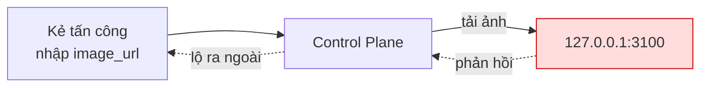
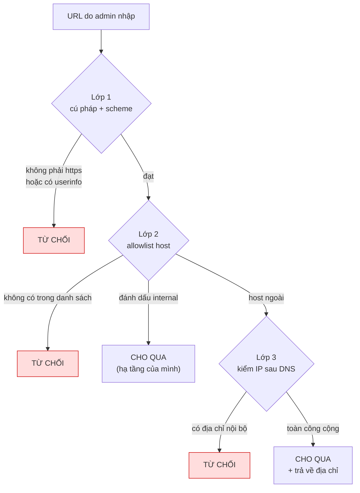

# Chính sách URL

> **Đối tượng đọc:** cả team, không giả định biết trước về SSRF.
> **Trạng thái:** đã hiện thực và có test (P3, 2026-07-21).
> **Quyết định gốc:** DEC-T12 · Cài đặt: [`url-policy.ts`](../apps/control-plane/src/shared/url-policy.ts)

---

## 1. Vấn đề

Quản trị viên nhập URL vào danh mục ứng dụng. Hai loại, **rủi ro khác hẳn nhau**:

| Trường | Ai dùng URL này | Rủi ro chính |
|---|---|---|
| `launch_url` | **Trình duyệt** người dùng điều hướng tới | Lừa đảo, dẫn người dùng ra chỗ lạ |
| `image_url` | **Máy chủ** có thể tải về | **SSRF** |

Phân biệt này quyết định lớp kiểm nào áp cho URL nào. Gộp chung sẽ vừa thừa vừa thiếu.

---

## 2. Từ điển

| Thuật ngữ | Nghĩa trong dự án này |
|---|---|
| **SSRF** | Server-Side Request Forgery — lừa máy chủ tự gửi request tới nơi kẻ tấn công chọn |
| **Allowlist** | Danh sách host được phép. Khớp **chính xác**, không wildcard |
| **Canonicalize** | Chuẩn hoá URL về một dạng duy nhất để so khớp không trượt |
| **DNS rebinding** | Đổi bản ghi DNS giữa lúc kiểm và lúc dùng |
| **TOCTOU** | Time-Of-Check to Time-Of-Use — khe hở giữa "kiểm" và "dùng" |
| **Userinfo** | Phần `user:pass@` trong URL |
| **Link-local** | Dải `169.254.0.0/16` — chứa endpoint metadata của máy chủ đám mây |
| **CGNAT** | `100.64.0.0/10` — dải NAT của nhà mạng, vẫn là mạng nội bộ |

---

## 3. Ba mối đe doạ

### 3.1. SSRF — máy chủ bắn vào chính mạng nội bộ

Máy chủ có quyền truy cập mà internet không có. Nếu nó tải một URL do người khác nhập:

```
http://127.0.0.1:3100/v1/admin/…        → gọi Control Plane từ bên trong, bỏ qua mọi guard
http://169.254.169.254/latest/meta-data/ → lấy credential IAM của máy chủ đám mây
http://10.0.0.5:5432                     → dò cổng mạng nội bộ
```



Điểm mấu chốt: **kẻ tấn công mượn quyền truy cập của máy chủ**. Họ không vào được mạng nội bộ, nhưng máy chủ thì vào được.

### 3.2. DNS rebinding — kiểm một đằng, tải một nẻo

```
T1  kiểm:  evil.com → 1.2.3.4      (công cộng, hợp lệ) → cho qua
T2  tải:   evil.com → 127.0.0.1     (DNS đã đổi, TTL đặt 1 giây)
```

Kẻ tấn công điều khiển DNS của chính họ. Đây là **TOCTOU** — khe hở giữa lúc kiểm và lúc dùng.

**Cách chống:** phân giải **một lần**, kiểm địa chỉ, rồi kết nối bằng **chính địa chỉ đó**. Không để hệ thống phân giải lại.

Đó là lý do `checkResolvedAddresses` **trả về danh sách địa chỉ** thay vì chỉ trả `ok`.

### 3.3. Redirect hop

`https://ok.example` trả `302 → http://127.0.0.1`. URL đầu sạch, đích cuối thì không.

Phải kiểm **từng chặng**, không chỉ chặng đầu.

---

## 4. Ba lớp kiểm



**Lớp 1 — cú pháp và scheme.** Bắt buộc `https:`. Từ chối `javascript:`, `data:`, `file:`. Từ chối userinfo.

**Lớp 2 — allowlist host, khớp chính xác.** Danh sách rỗng nghĩa là từ chối tất cả.

**Lớp 3 — kiểm địa chỉ sau khi phân giải DNS.** Kiểm **mọi** địa chỉ trả về, không phải địa chỉ đầu tiên.

---

## 5. Các cách qua mặt — phần quan trọng nhất

Đây là những cách một hàm kiểm URL viết vội sẽ dính. Mỗi mục đều có test riêng.

### 5.1. IPv4 nhúng trong IPv6

```
::ffff:127.0.0.1     ← loopback
::ffff:7f00:1        ← cùng địa chỉ, viết dạng hex
```

Mọi phép kiểm IPv4 thuần đều **không thấy** chúng. Phải chuyển dải `::ffff:0:0/96` về IPv4 rồi mới kiểm.

### 5.2. Nhiều bản ghi DNS

Một host trả về **cả** IP công cộng lẫn `127.0.0.1`. Kiểm mỗi địa chỉ đầu tiên là lọt.

### 5.3. Userinfo giả mạo

```
https://talosmine.vn@evil.com/
```

Đọc lướt thấy `talosmine.vn`, nhưng trình duyệt đi tới `evil.com`. Phần trước `@` là tên đăng nhập, không phải tên miền.

### 5.4. Wildcard trong allowlist

`*.example.com` cho phép kẻ tấn công đăng ký `evil.example.com` rồi lọt allowlist. **Không dùng wildcard.**

### 5.5. Chặn theo hostname là vô dụng

Chặn chuỗi `"localhost"` không có tác dụng gì: `lvh.me` và vô số domain khác trỏ về `127.0.0.1`.

Việc chặn thật **chỉ có thể** làm sau khi phân giải DNS ra địa chỉ IP.

### 5.6. IP viết dạng số

`http://2130706433/` chính là `127.0.0.1`. Lớp `URL` của Node chuẩn hoá được, nhưng ta vẫn kiểm chứ không tin.

---

## 6. Dải địa chỉ bị chặn

Dựa trên dải dành riêng của IANA, không phải "những gì nhớ được".

| Dải | Vì sao chặn |
|---|---|
| `0.0.0.0/8` | "This network" |
| `10.0.0.0/8` | Mạng riêng |
| `100.64.0.0/10` | CGNAT — vẫn là mạng nội bộ |
| `127.0.0.0/8` | Loopback |
| **`169.254.0.0/16`** | Link-local **và endpoint metadata đám mây** |
| `172.16.0.0/12` | Mạng riêng |
| `192.168.0.0/16` | Mạng riêng |
| `192.0.0.0/24` | Dành riêng cho IETF |
| `198.18.0.0/15` | Benchmark |
| `224.0.0.0/4` trở lên | Multicast, dành riêng, broadcast |
| `::1`, `::` | Loopback, unspecified |
| `fc00::/7` | Unique local |
| `fe80::/10` | Link-local |
| `::ffff:0:0/96` | IPv4-mapped — quy về IPv4 rồi kiểm |

Chuỗi **không phải IP hợp lệ** cũng bị coi là không an toàn. Thà từ chối nhầm còn hơn cho qua nhầm.

---

## 7. Ngoại lệ `!internal`

DEC-T12 chốt ảnh nằm trong **Supabase Storage trên private network**. Điều này mâu thuẫn với lớp 3 nếu áp dụng máy móc.

Giải quyết: allowlist đánh dấu được host là hạ tầng của chính dự án.

```
CATALOG_ALLOWED_HOSTS=app.talosmine.vn, storage.internal!internal
```

Host có `!internal` **bỏ qua lớp 3** — thậm chí không gọi DNS.

**Lý do:** lớp 3 tồn tại để chặn URL *lạ*. Hạ tầng của chính mình thì ta biết nó ở đâu.

> **Cảnh báo:** đánh dấu `!internal` cho một host không thuộc quyền kiểm soát của dự án là **mở lại đúng lỗ SSRF**. Vì vậy cờ này phải viết tường minh trong cấu hình — hệ thống không bao giờ suy đoán từ tên host.

---

## 8. Vì sao ở tầng application, không phải database

Ràng buộc `CHECK` của PostgreSQL **không làm được** hai việc:

1. Phân giải DNS
2. Đọc danh sách cấu hình

Nên database cố ý **chấp nhận** `http://127.0.0.1/admin`. Có test ghi lại chủ đích này để không ai tưởng là thiếu sót:

```ts
it('KHÔNG kiểm scheme URL ở tầng DB — đó là việc của application layer', …)
```

Quy tắc chung của dự án (`modular.md` mục 5.4): database kiểm những gì nó kiểm được — danh mục đóng, non-empty, quan hệ. Phần cần biết bối cảnh bên ngoài thuộc tầng application.

---

## 9. Cách dùng

```ts
import { checkUrlSyntax, checkResolvedAddresses, parseAllowedHosts } from './url-policy.js';

const options = { allowedHosts: parseAllowedHosts(env.CATALOG_ALLOWED_HOSTS) };

// Bước 1 — rẻ, không chạm mạng. Chạy trước.
const syntax = checkUrlSyntax(rawUrl, options);
if (!syntax.ok) return reject(syntax.code, syntax.message);

// Bước 2 — chỉ khi máy chủ sẽ TẢI url này.
const resolved = await checkResolvedAddresses(hostname, options, resolveDns);
if (!resolved.ok) return reject(resolved.code, resolved.message);

// LƯU `syntax.canonical`, không lưu chuỗi gốc.
// KẾT NỐI bằng `resolved.addresses`, không để hệ thống phân giải lại.
```

Hàm `resolve` được **tiêm vào** thay vì gọi thẳng `node:dns` — nhờ vậy test kiểm được các tình huống không dựng thật được.

### Mã lỗi

| Mã | Nghĩa |
|---|---|
| `MALFORMED` | Không đọc được thành URL |
| `SCHEME_NOT_ALLOWED` | Không phải `https` |
| `USERINFO_NOT_ALLOWED` | Có `user:pass@` |
| `HOST_NOT_ALLOWED` | Không nằm trong allowlist |
| `PRIVATE_ADDRESS` | Phân giải ra địa chỉ nội bộ |
| `DNS_FAILED` | Không phân giải được, hoặc không có bản ghi nào |

Client bắt theo `code`, **không** theo `message` — thông điệp có thể đổi.

---

## 10. Canonicalize — vì sao cần

Hai chuỗi khác nhau có thể trỏ cùng một nơi:

```
HTTPS://App.Example.COM:443/x#section
https://app.example.com/x
```

Nếu lưu nguyên văn, việc so khớp allowlist redirect sẽ **trượt ở chỗ không ai ngờ**.

Chuẩn hoá: hạ chữ thường host và scheme, bỏ cổng mặc định, bỏ fragment.

**Không** hạ chữ thường `path` — nhiều máy chủ coi `/Admin` và `/admin` là hai tài nguyên khác nhau.

---

## 11. Cấu hình

```bash
# Định dạng: host hoặc host!internal, phân cách bằng dấu phẩy
CATALOG_ALLOWED_HOSTS=app.talosmine.vn, storage.internal!internal
```

**Để trống = từ chối mọi URL ngoài.** Chưa cấu hình không có nghĩa là cho phép tất cả.

Nội dung cụ thể (host nào) chờ **DEC-B01** — danh sách ứng dụng của Hub. Cơ chế thì đã sẵn sàng.

---

## 11b. `outboundFetch` — đường ra Internet DUY NHẤT (2026-07-31, DEC-T27)

Trước DEC-B17, Control Plane không gọi ra Internet ở bất kỳ đâu: `url-policy.ts` chỉ dùng để kiểm URL **trước khi lưu**. Vì vậy `checkResolvedAddresses` — phần chống SSRF nặng nhất của file này — đã viết xong, có test, mà **chưa từng được gọi**, và cờ `!internal` trên thực tế vô tác dụng.

DEC-B17 cho phép Hub tự gọi API nhà cung cấp thứ ba (ứng dụng `hosted`). Kể từ đó, mọi lời gọi ra ngoài **bắt buộc** đi qua [`outbound-fetch.ts`](../apps/control-plane/src/shared/outbound-fetch.ts). Gọi `fetch` thẳng từ service là vi phạm — nó bỏ qua toàn bộ bốn lớp dưới đây:

| Lớp | Chặn gì | Chạm mạng? |
|---|---|---|
| 1 | Cú pháp, `https`, userinfo, allowlist host | Không |
| 2 | DNS phân giải ra dải nội bộ (kiểm **mọi** địa chỉ) | Có, nhưng chưa gửi gì |
| 3 | Timeout, và **`redirect: 'manual'`** | Có |
| 4 | Trần kích thước phản hồi, đếm byte thật | Có |

**`redirect: 'manual'` là bắt buộc, không phải tuỳ chọn.** Để `fetch` tự đi theo redirect nghĩa là đích cuối cùng KHÔNG đi qua lớp 1 và 2 — một endpoint hợp lệ trả `302` sang `http://169.254.169.254/` là đi thẳng vào metadata endpoint. Đây chính là mục 12 gạch đầu dòng đầu tiên bên dưới, giải quyết theo hướng "không đi theo redirect" thay vì "kiểm từng hop".

**URL dùng thẳng địa chỉ IP:** `dns.resolve4('127.0.0.1')` coi chuỗi đó là tên miền và tra thất bại. `outboundFetch` nhận diện IP literal và coi chính nó là kết quả phân giải, nên nó vẫn đi qua `isPrivateAddress` — bị chặn vì ĐÚNG lý do (địa chỉ nội bộ) thay vì vì một lỗi DNS gây hiểu nhầm.

---

## 12. Những gì chưa làm

Ghi lại để không ai tưởng đã có:

- ~~**Kiểm từng redirect hop.**~~ **Đã giải quyết theo hướng khác (2026-07-31):** `outboundFetch` KHÔNG đi theo redirect nào cả — endpoint phải là địa chỉ cuối cùng. Đơn giản hơn và không có hop nào để lọt.
- ~~**Timeout, giới hạn kích thước**~~ — đã có trong `outboundFetch`. **Kiểm `content-type` khi tải ảnh** thì vẫn chưa (đường tải ảnh chưa tồn tại).
- ~~**Nối vào Catalog module.**~~ **Đã nối (2026-07-31):** `checkUrlSyntax` được gọi từ đường tạo/sửa application, redirect URI, site nav/settings và `hosted-binding`; `checkResolvedAddresses` được gọi từ `outboundFetch`.
- **DNS rebinding.** `outboundFetch` kiểm địa chỉ rồi vẫn `fetch` theo hostname, chưa kết nối thẳng tới địa chỉ đã kiểm — còn một khe hẹp giữa lúc kiểm và lúc nối. Đóng hẳn cần dispatcher tuỳ biến của `undici`. Xem `pending-work.md` mục F11.

---

## 13. Đọc thêm

| Nội dung | Nơi |
|---|---|
| Cài đặt | [`url-policy.ts`](../apps/control-plane/src/shared/url-policy.ts) |
| Test (31 ca, phần lớn là negative) | [`url-policy.test.ts`](../tests/unit/url-policy.test.ts) |
| Quyết định gốc | `build-plan/decision-register.md` — DEC-T12 |
| Ranh giới DB / application | [`modular.md`](./modular.md) mục 5.4 |
| Bảng catalog | [`database-schema.md`](./database-schema.md) mục 5 |
